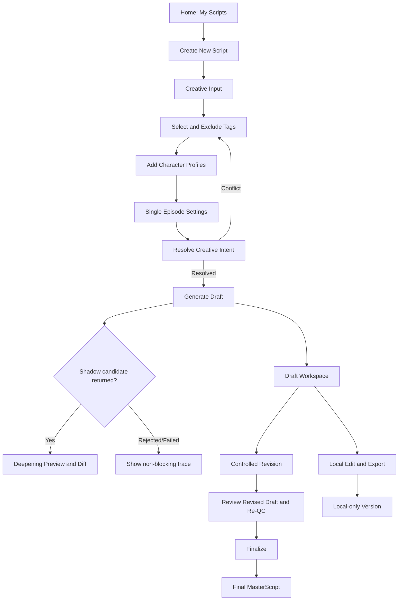

# AI Comic Content OS Frontend MVP Architecture

## 1. Status And Purpose

```yaml
document_type: frontend_mvp_design_and_implementation_boundary
implementation_status: usable_episode_authoring_workflow
backend_change: compatible_extension
api_change: compatible_internal_step_endpoints
authentication: excluded
primary_runtime_scope: bounded_staged_episode_authoring
```

The Frontend MVP is a creator workspace over the existing Script Generation Box. Its purpose is to make the current capabilities usable without presenting research-only or shadow behavior as production features.

The product experience combines:

- ChatGPT-style project history and quick switching;
- Notion-style document editing and structured blocks;
- AI writing-tool controls for intent, characters, generation, comparison, revision and export.

The MVP is not a commercial account system, a multi-user platform, a production dashboard or a video editor.

### 1.1 Phase 1 Implementation Status

Phase 1 is implemented under `frontend/` with Next.js App Router and TypeScript:

- the editorial application shell and responsive project sidebar;
- home and project-authoring routes;
- local project create, select and rename behavior;
- IndexedDB local-first persistence plus versioned PostgreSQL Workspace Snapshot sync;
- active backend Ontology tag loading with an explicitly labeled local-authoring fallback;
- dedicated local character create/edit routes plus character-card delete actions;
- English/Chinese UI switching with browser-local preference and stable language-neutral project data;
- a typed API client and same-origin backend proxy.

The frontend connects Creative Intent Resolution, episode-context Draft Generation, edit review, AI modification candidates, controlled Revision and Finalization through a same-origin Next.js proxy. Projects save immediately to IndexedDB and, when PostgreSQL is configured, synchronize a versioned complete Workspace Snapshot. Sequential mode generates one confirmed episode at a time. Full mode is executed through bounded batches; users may update inputs and add an optional stage instruction before continuing. Creative Deepening code is retained but hidden and blocked by the current frontend/backend feature flag. This is not a Story Planning runtime and does not claim series-level blueprint quality.

The frontend currently orchestrates existing step APIs. This makes the product usable but does not mean `ScriptGenerationFacade`, formal `ScriptGenerationRequest / Result`, or `generate_script()` has been implemented.

## 2. Backend Capability Assessment

### 2.1 Directly Usable Today

- Resolve `CreativeIntentInput` into `ContentSpec + ResolvedCreativeContext`.
- List controlled Ontology tags and Platform Profiles.
- List versioned Generation Strategies.
- Generate one structured `DraftMasterScript` with Scene Causality.
- Retain an optional Creative Deepening shadow candidate contract; current runtime flag disables generation and the explicit API.
- Build or consume the generated `RevisionPlan`.
- Run one controlled revision and Re-QC.
- Finalize through the existing full-lineage Finalization Gate.
- List and retrieve finalized `MasterScript` objects for the current backend process.

### 2.2 Not Available As Backend Product APIs

- Authentication-scoped or multi-user project ownership and collaboration.
- Character CRUD independent of `CreativeIntentInput`.
- Draft update or version persistence.
- Fine-grained edit history and Artifact audit/restore UI; confirmed Draft / Revised / Final milestones are persisted independently.
- Story Blueprint or Episode Planning runtime.
- Server-side multi-episode transaction/facade; current Full mode is bounded frontend orchestration.
- Trending-tag recommendations from Data Intelligence.
- Authentication or user ownership.

Current repositories are in memory. Backend restart can invalidate stored ContentSpec, Strategy or MasterScript IDs. The frontend must not imply durable cloud persistence.

## 3. MVP Product Boundary

### Supported

- Local creation and management of multiple script projects.
- Structured Creative Intent form with selected/excluded tags.
- Local Character Builder mapped deterministically to current `CharacterContext`.
- Sequential and bounded full-framework generation through existing APIs plus optional episode context.
- Source Draft reading, local editing and export.
- Bounded staged generation with editable inputs between stages and local batch lineage.
- Controlled Revision and Finalization using an unchanged generated lineage.
- Local version snapshots and project status.

### Still Disabled / Deferred

- Story Blueprint / Episode Planning runtime.
- Creative Deepening UI and backend execution while the feature flag remains disabled.
- Deepen All as one server transaction.
- Fine-grained server-side editing history beyond the current milestone artifacts and workspace snapshot.

### Explicitly Excluded

- Authentication, payment, community and social features.
- Admin tools, analytics dashboard and Data Intelligence dashboard.
- Story Planning, RAG, Knowledge management UI and Prompt editing.
- Video, Storyboard, Voice, Animation and Seedance workflows.
- Automatic application of Deepening shadow candidates.

## 4. Information Architecture

Recommended routes:

```text
/
/projects/new
/projects/:projectId
/projects/:projectId/characters/new
/projects/:projectId/characters/:characterId
/projects/:projectId/workspace
```

Character routes may render as modal routes on desktop and full pages on mobile.

### 4.1 App Shell

Desktop uses a three-region workspace:

```text
Project Sidebar | Main Document Canvas | Context Inspector
```

- Sidebar: project history, status and create action.
- Main canvas: Creative Input or Script document.
- Inspector: tags, characters, generation settings, QC evidence or version metadata.

Mobile uses one active panel at a time with a bottom switcher:

- Projects
- Create/Script
- Details

### 4.2 Visual Direction

The interface should feel editorial rather than like a generic SaaS dashboard:

- Display/editorial type: `Newsreader` or an equivalent serif.
- UI/data type: `IBM Plex Sans`.
- Warm paper canvas, charcoal text, vermilion action color and muted moss status accents.
- Subtle manuscript grid or paper texture instead of a flat white background.
- One meaningful generation animation: progress moves through Resolve → Generate → Deepening Shadow → QC.
- Avoid purple gradients, excessive cards and decorative AI sparkle effects.

## 5. Page Structure

### 5.1 Home Page

Purpose: manage local script projects.

Layout:

- Persistent `My Scripts` sidebar.
- Primary `Create New Script` action.
- Recent-project document list in the main area.
- Empty state with one example workflow, not fake generated projects.

Each project row shows:

- editable project title;
- primary genre/tag;
- status;
- created and last-updated time;
- latest available version;
- local/backend-session warning when applicable.

Initial title behavior:

1. Use user-entered title when present.
2. Otherwise derive a short local title from the first Creative Prompt sentence.
3. After generation, offer the generated script title as a rename suggestion.
4. Never rename automatically after the user has manually renamed the project.

Home data comes from the frontend project store, not `GET /content-specs`, because ContentSpec is not a project aggregate.

### 5.2 Create Script Page

The page uses four ordered document sections and a sticky generation summary.

#### Section A: Creative Input

- Large optional story-idea textarea.
- Live character count against the backend 240-character free-prompt limit.
- Project remains invalid when prompt, tags and characters are all empty.
- Current backend requires at least one selected/added tag, so the UI must guide the user to select a tag before Resolve.
- `Custom Instructions` map to `CreativeBrief.generation_notes`, not directly to the Master Prompt.

The user-facing prompt can be empty, but the current backend contract requires `free_creative_prompt` to contain 5-240 characters. When the user provides tags/characters but no prompt, the frontend mapper may compose a deterministic one-sentence intent from selected genre/elements and the protagonist goal. This sentence must be shown in `Resolution Preview` and confirmed by the user; it must never be inserted silently.

The same frontend adapter supplies visible MVP defaults for backend-required authoring fields not exposed in the primary textarea:

- local/derived project title → request `title`;
- selected Audience tags or a visible configured fallback → `audience_goal`;
- configured continuation goal → `commercial_goal`;
- selected approved profile → `platform_goal`;
- Advanced Settings → `quality_level`, `budget_level` and `creative_brief`;
- selected existing tags → `selected_tag_ids`.

The Resolution Preview shows this complete request before submission. Defaults are product configuration, not AI inference.

#### Section B: Tag Selection

Controls:

- Category tabs plus an `Add My Tag` dialog.
- Selectable chips.
- Selected-tag tray with remove action and category label.
- Excluded-tag tray visually separated from positive intent.
- Suggested/trending area with `Suggested` badges.

Categories:

- Genre
- Story Element
- Emotion
- Audience
- Trending Suggestions
- My Tags

MVP rules:

- Canonical selectable tags come from `GET /ontology-nodes`.
- Frontend groups by `OntologyNode.category`; it does not create a second tag system.
- Trending suggestions remain a future Data Intelligence signal. Local suggestions may support disconnected authoring but are explicitly non-runtime until they match active Ontology IDs.
- A suggested tag has no effect until the user selects it.
- A selected tag cannot also be excluded.
- User-created `My Tags` are stored as project creative keywords and mapped to generation notes; they do not masquerade as Ontology IDs and do not replace the required canonical ContentSpec classification tag.
- Maximum 12 active and 20 excluded tags follows the backend contract.

#### Section C: Character Builder

The project page shows compact character cards with Edit and Delete actions.

Required authoring fields:

- Name

Optional current fields:

- Appearance
- Role
- Age
- Gender
- Background
- Description

The current backend has no structured Age, Gender, Background or Appearance fields. The
frontend retains optional values in `CharacterDraft` and deterministically composes only
non-empty values into a bounded backend `description`. If Role is empty, the frontend supplies
`Protagonist` for the first character or `Supporting Character` for later characters and marks
that field as inferred rather than user-provided. Empty optional fields are omitted from
`CharacterContext`; they must never become invalid empty strings or fabricated character facts.
The `Generation Context Preview` shows what reaches the model.

Mapping:

```text
CharacterDraft.name             -> CharacterContext.name
CharacterDraft.role             -> CharacterContext.role, or an inferred positional default
age/gender/background/
appearance/personality/secret   -> bounded CharacterContext.description
motivation                      -> CharacterContext.motivation
desire                          -> CharacterContext.desire
fear                            -> CharacterContext.fear
belief                          -> CharacterContext.belief
contradiction                   -> CharacterContext.contradiction
decisionPattern                 -> CharacterContext.decision_pattern
moralBoundaries                 -> CharacterContext.moral_boundaries
locked UI fields                -> CharacterContext.locked_fields when supported
```

All authored values use `user_provided` provenance. The frontend must not claim AI inference unless a future backend capability actually returns it.

This composition is a compatibility compromise, not the future Character Profile schema. It is lossy for server round trips, so the full `CharacterDraft` remains in local project state.

#### Section D: Generation Settings

- Mode selector.
- Output language.
- Target duration.
- Desired scene count, constrained to 2-8.
- Custom instructions.

Mode states:

| Mode | MVP state | Behavior |
|---|---|---|
| Sequential Generation | Enabled | Generate and confirm one episode, then optionally guide the next episode |
| Full Generation | Enabled, staged | Generate a bounded batch, review or update the brief, then explicitly continue later batches |

The user does not choose internal Prompt IDs, bundle IDs or model provider. The frontend maps product settings to an approved GenerationStrategy configured for the environment.

### 5.3 Script Workspace

Header:

- editable local project title;
- project status;
- selected tags;
- character avatars/initials;
- export and version-history actions.

Episode actions in MVP:

- Every generated episode supports View, structured Edit, Save and Confirm.
- AI modification creates a separate candidate that requires explicit user application; Creative Deepening is currently hidden and backend-disabled.
- Sequential `Generate Next Episode` accepts an optional instruction; skipping continues from confirmed context.
- Full mode switches among generated episodes; at the batch boundary it opens an optional stage-instruction dialog before generating the next bounded batch.
- Per-episode and whole-series Markdown/JSON export are enabled; global `Deepen All` remains deferred.

Main tabs:

#### Draft

- Displays the authoritative source `DraftMasterScript`.
- Scene blocks expose purpose, Goal/Conflict/Outcome, actions and dialogue.
- User can edit a local working copy.
- Export supports Markdown and JSON in MVP.

Manual-edit boundary:

- Draft/version persistence remains browser-local.
- Confirm calls deterministic `review-draft` so edited content receives current Story QC and RevisionPlan before later quality-loop actions.
- Local edits create a `local_edit` version only.
- The Finalize action must not silently submit edited text against stale generation/QC lineage.
- A confirmed edited Draft can enter the existing controlled Revision, Re-QC and Finalization Gate only after `review-draft` has refreshed its QC and RevisionPlan lineage.

#### Deepening

- Available only when `creative_deepening_run.candidate_draft_master_script` exists.
- Always labelled `Shadow Preview - not selected`.
- Side-by-side or inline diff for allowed expressive fields.
- Shows change trace, preservation checks, QC dimension deltas, token and latency.
- If rejected, shows the preservation reason and keeps candidate read-only.
- If technical failure occurred, shows a non-blocking failure state.

The compatible internal `deepen-draft` endpoint now creates a bounded candidate on demand. It remains non-authoritative: the frontend exposes `Apply Deepening`, then re-runs deterministic Draft review before the candidate becomes the confirmed episode source.

#### Final

- Empty until controlled Revision and Finalization complete.
- Displays only a `MasterScript` returned by `POST /master-scripts/finalize`.
- Includes lineage summary and warning that Story QC remains experimental.
- Final content is read-only in MVP; further edits create a local derivative rather than mutating the Final artifact.

### 5.4 Version History

Local version entries:

- `initial_draft`
- `local_edit`
- `deepening_shadow`
- `revised_draft`
- `final_master_script`

Each version records parent version, timestamp, artifact ID, origin and whether it is authoritative.

Example:

```text
v1  Initial Draft          authoritative source
v2  Local dialogue edit    local only
v3  Deepening Preview      shadow, not selected
v4  Controlled Revision    backend lineage
v5  Final MasterScript     finalized
```

Version numbering belongs to the local project UX and must not overwrite backend schema or Prompt versions.

当前生成保护规则：

- 项目已有 `episodes[]` 后，Project Settings 不再显示直接覆盖式“生成剧本”
- 主操作改为返回剧本工作区
- 需要重新生成时复制为新的本地项目版本，原剧本继续保留
- 新增角色只影响后续生成或显式 AI 操作，不静默改写历史分集

### 5.5 Bilingual Reading and Continuity

- 中文界面查看英文剧本时，通过 `BilingualScriptView` 显示原文下方的中文对照
- 双语视图按 Draft ID 缓存在本地项目中，不污染正式 `MasterScript`
- 英文界面不显示中文译文
- 工作区提供“分集剧本”和“故事线与人物关系”两个项目视图
- 故事线与关系网是可编辑 continuity artifact，不是 Story Planning runtime

## 6. Component Hierarchy

```text
App
├── AppShell
│   ├── ProjectSidebar
│   │   ├── CreateProjectButton
│   │   ├── ProjectSearch
│   │   └── ProjectHistoryItem
│   ├── RouteOutlet
│   └── GlobalErrorBoundary
├── HomePage
│   ├── RecentProjects
│   └── EmptyWorkspaceState
├── CreateScriptPage
│   ├── CreativeInputEditor
│   ├── TagSelector
│   │   ├── TagCategoryTabs
│   │   ├── TagSearch
│   │   ├── TagChip
│   │   ├── SelectedTagTray
│   │   └── SuggestedTagPanel
│   ├── CharacterCollection
│   │   ├── CharacterCard
│   │   └── CharacterEditorModal
│   ├── GenerationSettingsPanel
│   ├── ResolutionPreview
│   └── GenerateActionBar
└── ScriptWorkspacePage
    ├── ScriptHeader
    ├── VersionTabs
    │   ├── DraftDocument
    │   │   ├── ScriptOverviewBlock
    │   │   └── SceneEditor
    │   ├── DeepeningComparison
    │   │   ├── ScriptDiff
    │   │   ├── ChangeTracePanel
    │   │   ├── PreservationChecks
    │   │   └── QCComparisonPanel
    │   └── FinalDocument
    ├── EpisodeActionBar
    ├── VersionHistoryDrawer
    └── ExportMenu
```

## 7. State Management Design

Use four distinct state classes.

### 7.1 Local-First Project State

Persist the complete project record in IndexedDB. UI language preference may use
localStorage, but generated script content must not depend on localStorage.

Contains:

- project metadata and local title;
- Creative Intent authoring form;
- full CharacterDraft records;
- selected/excluded tag IDs;
- generation settings;
- every `EpisodeWorkspace`, including the generated framework and local working copy;
- AI modification and Creative Deepening candidates;
- confirmed Draft, Revision/Re-QC result and FinalMasterScript snapshot when available;
- backend artifact lineage required by the current quality-loop calls.

IndexedDB is required because generated scripts and lineage objects can exceed safe localStorage size.
Writes for the same project are serialized so a slower older snapshot cannot overwrite a
newer multi-episode or edited snapshot. At application startup, project records are loaded,
migrated when necessary and ordered by `updatedAt`. Home and sidebar links open projects
with generated episodes directly in the script workspace.

When PostgreSQL is configured, the complete record is also synchronized as a versioned
`StoryProjectWorkspaceSnapshot`. Startup merges local and remote copies by `updatedAt`;
optimistic project/workspace revisions reject stale writes instead of silently selecting a
winner. IndexedDB remains the immediate cache and offline fallback. A backend restart can
still expire temporary ContentSpec lineage, so restored scripts remain readable and
exportable while later generation actions may require lineage regeneration.

### 7.2 Server Resource State

Use a query/cache layer for:

- Ontology nodes;
- Platform Profiles;
- Generation Strategies;
- ContentSpec resolution mutation;
- generation, revision and finalization mutations;
- finalized MasterScript retrieval.
- Story Project and Workspace Snapshot synchronization, restore and soft archive.

Do not duplicate server request state into a global UI store. Cache keys should include resource IDs and strategy versions.

### 7.3 Form State

Keep transient form validation close to each page/modal. Validate backend limits before API submission and preserve unsaved text while navigating between characters.

### 7.4 Generation State Machine

```text
idle
→ resolving_intent
→ ready_to_generate
→ generating_source
→ generating_shadow_optional
→ qc_comparison_optional
→ draft_ready
→ revising
→ ready_to_finalize
→ finalizing
→ final
```

Any step may enter `recoverable_error`. A Deepening technical failure transitions to `draft_ready`, not global failure.

## 8. Frontend Data Contracts

Conceptual TypeScript interfaces:

```ts
type ProjectStatus =
  | "idea"
  | "ready"
  | "generating"
  | "draft"
  | "deepening_preview"
  | "revision_ready"
  | "final"
  | "error";

interface ScriptProject {
  projectId: string;
  title: string;
  titleSource: "derived" | "generated" | "user";
  status: ProjectStatus;
  creativeIntent: CreativeIntentForm;
  characters: CharacterDraft[];
  generationSettings: GenerationSettings;
  contentSpecId?: string;
  episodes: EpisodeWorkspace[];
  versions: ProjectVersion[];
  createdAt: string;
  updatedAt: string;
}

interface EpisodeWorkspace {
  episodeNumber: number;
  generationRun?: ScriptGenerationDraftRunSnapshot;
  localWorkingDraft?: unknown;
  revisionRun?: ScriptRevisionRunSnapshot;
  finalMasterScriptId?: string;
  status: "idea" | "generating" | "draft" | "revision_ready" | "final" | "error";
}

interface CreativeIntentForm {
  freePrompt: string;
  selectedTagIds: string[];
  excludedTagIds: string[];
  excludedPatterns: string[];
  hook: string;
  tone: string;
  pacing: string;
  targetEmotion: string;
  customInstructions: string[];
}

interface CharacterDraft {
  characterId: string;
  name: string;
  role: string;
  age: string;
  gender: string;
  background: string;
  description: string;
  appearance?: string;
  personality?: string;
  motivation?: string;
  desire?: string;
  fear?: string;
  belief?: string;
  contradiction?: string;
  decisionPattern?: string;
  moralBoundaries: string[];
  secret?: string;
  lockedFields: string[];
}

interface GenerationSettings {
  mode: "single_episode" | "sequential" | "full";
  outputLanguage: string;
  desiredSceneCount: number;
  targetDurationSeconds: number;
  prepareDeepeningPreview: boolean;
  customInstructions: string[];
}

interface ProjectVersion {
  versionId: string;
  parentVersionId?: string;
  type: "initial_draft" | "local_edit" | "deepening_shadow" | "revised_draft" | "final";
  artifactId?: string;
  episodeNumber: number;
  authoritative: boolean;
  snapshot: unknown;
  createdAt: string;
}
```

Frontend interfaces are view/authoring contracts, not replacements for backend Pydantic models. API adapters must explicitly map and validate both directions.

## 9. API Integration Mapping

| Frontend action | Existing API | MVP behavior |
|---|---|---|
| Load tags | `GET /ontology-nodes` | Filter active nodes and group by category |
| Load platform choices | `GET /platform-profiles` | MVP selects the active runtime profile; current default is `cn_mainland`, while TikTok is retained but disabled |
| Load runtime strategies | `GET /generation-strategies` | App config selects approved normal/shadow strategy |
| Resolve intent | `POST /content-specs/resolve-creative-intent` | Returns and saves ContentSpec plus resolved context |
| Reload ContentSpec | `GET /content-specs/{id}` | Works only while backend repository retains ID |
| Generate episode framework | `POST /script-generation/generate-draft` | Sends ContentSpec ID, strategy ID, language, scene count, resolved context and optional episode context |
| Confirm edited episode | `POST /script-generation/review-draft` | Recomputes current Story QC and RevisionPlan without another LLM call |
| Request AI modification | `POST /script-generation/modify-draft` | Returns a separate complete replacement candidate; user must apply it explicitly |
| Request Deepening | `POST /script-generation/deepen-draft` | Returns a bounded non-authoritative candidate and preservation trace |
| Build replacement plan | `POST /script-generation/build-revision-plan` | Only for an unchanged compatible Draft/QC payload |
| Run controlled revision | `POST /script-generation/revise-draft` | Stores `ScriptRevisionRun` and Re-QC |
| Finalize | `POST /master-scripts/finalize` | Sends full generation and revision lineage |
| Load Final | `GET /master-scripts/{id}` | Displays returned Final MasterScript |
| List backend finals | `GET /master-scripts` | Optional recovery aid, not project history |

### 9.1 No-Endpoint Actions

These remain frontend-local:

- create/rename/delete project;
- save character drafts;
- save local script edits;
- local version history;
- mock trending suggestions;
- export Markdown/JSON.

### 9.2 Error Mapping

- `404`: backend session/resource missing; offer to resolve and regenerate, never silently substitute IDs.
- `409`: tag conflict or inactive Ontology choice; return user to Tag Selector with exact conflict highlighted.
- `422`: form/schema/Knowledge applicability or Finalization-chain problem; retain all local work.
- `503`: model/provider unavailable; allow retry with the same frozen inputs.

Deepening failure inside a successful generation response is a warning, not a page-level error.

## 10. User Flow



## 11. AI Suggestion Panel Evaluation

Include a small deterministic suggestion panel only if it remains transparent:

- Suggestions derive from currently selected tag combinations or mock recommendation fixtures.
- Each suggestion names why it appeared.
- `Add` explicitly selects the corresponding existing Ontology tag.
- `Dismiss` has no generation effect.
- Suggestions never modify Character Context, exclusions or Creative Prompt automatically.

Example:

```text
Selected: Forbidden Love
Suggested: Hidden Identity
Reason: optional mock pairing for testing creator control
[Add] [Dismiss]
```

Do not label mock suggestions as trending market intelligence.

## 12. UX Safety And Accessibility

- Keyboard navigation for all tag chips, tabs and modal actions.
- Visible focus states and non-color status indicators.
- Autosave indicator distinguishes server-synced, local/offline and conflict states.
- Confirmation before deleting a project or character.
- Generation cancellation affects only UI waiting; do not claim provider cancellation unless supported.
- Preserve form state on API errors.
- Show `Shadow`, `Placeholder QC` and `Local only` labels wherever relevant.
- Never expose API keys, raw provider secrets or unrestricted Prompt internals.

## 13. Implementation Status

Implemented:

1. App shell, IndexedDB project store and Home Page.
2. Ontology-driven Creative Input and Character Builder.
3. Creative Intent API adapter and resolution preview.
4. Single-episode Draft generation and editable workspace.
5. Deepening shadow tab and comparison code retained but hidden while the feature flag is disabled.
6. Local editing, version snapshots and export.
7. Controlled Revision, Re-QC, Acceptance shadow display and Finalization flow.
8. Responsive bilingual UI, frontend type checking and production build validation.
9. Local-first Project + Workspace Snapshot server synchronization, recovery, conflict reporting and revision-protected soft deletion.

Still pending:

- browser-level automated interaction coverage;
- Artifact audit/restore UI and fine-grained intermediate editing versions;
- standalone re-QC for locally edited Drafts;
- multi-episode planning and generation.

Do not start with multi-episode orchestration or a frontend-specific backend facade.

## 14. Future Extension Points

- Durable Project API and authenticated ownership.
- Character Profile formal schema and independent Character Library.
- Relationship Context authoring.
- Standalone re-QC/rebase for manually edited Drafts.
- Standalone Deepening request and an evidence-approved apply decision.
- Story Blueprint, Episode Plans and sequential/full generation.
- Real trending recommendations from Data Intelligence.
- Knowledge suggestion explanations and bundle coverage across genres.
- Production handoff adapters after FinalMasterScript.

## 15. MVP Acceptance Criteria

The frontend MVP is usable when a creator can:

1. create and reopen a local project;
2. enter intent, select/exclude controlled tags and author characters;
3. resolve a valid ContentSpec without losing local authoring detail;
4. generate one structured episode;
5. inspect Scene Causality and source Story QC;
6. view a clearly labelled Deepening shadow candidate and change evidence;
7. run the existing controlled revision/finalization chain when lineage is unchanged;
8. view and export Draft or Final output;
9. understand which artifacts are local, shadow, placeholder or finalized;
10. recover local work after an API failure without assuming backend persistence.

The MVP is not complete if the UI implies that Deepening is applied, that a local edit has been re-QC'd, that multi-episode generation works, or that project history is durably stored by the backend.
