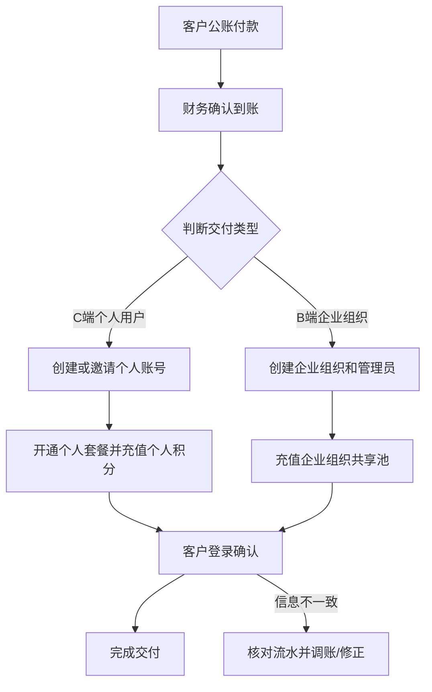
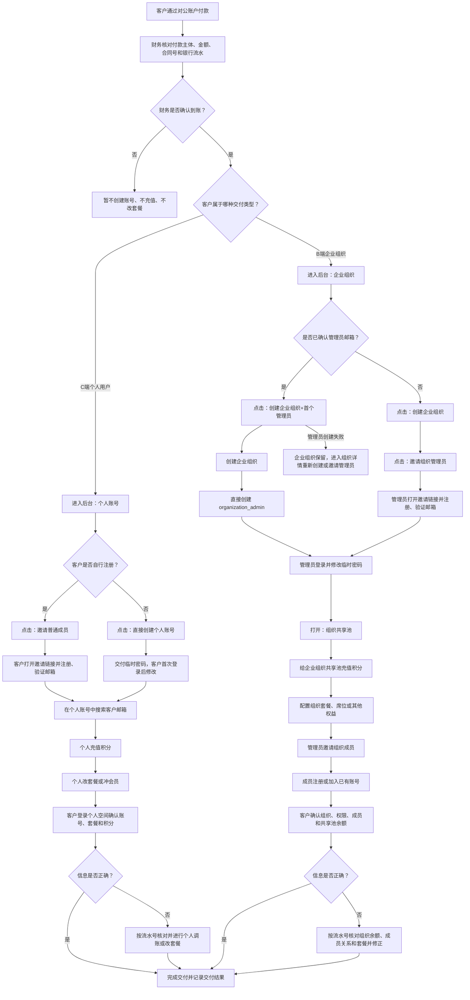

# 公账付款后的账号交付操作指南

本文面向运营、财务、客服和实施人员，说明客户通过对公账户付款后，平台如何交付账号、套餐和积分，以及客户收到账号后如何开始使用。

## 1. 适用范围

本指南只覆盖线下收款后的人工交付流程，包括：

- C 端个人用户：一个自然人账号独立使用套餐和积分。
- B 端企业组织：一个企业、团队或项目组共用企业组织、组织管理员、组织成员和组织共享积分池。

线下公账付款不会自动触发 Stripe webhook，也不会自动开通套餐或充值积分。必须由财务确认到账后，再由 owner 或超级管理员在后台手动交付。

## 2. 交付前先判断客户类型

| 判断项       | C 端个人用户                                         | B 端企业组织                                                   |
| ------------ | ---------------------------------------------------- | -------------------------------------------------------------- |
| 使用人数     | 通常 1 人                                            | 多人或团队                                                     |
| 付款主体     | 个人、公司代付都可以                                 | 企业、机构、项目组                                             |
| 额度归属     | 个人账号                                             | 企业组织共享池                                                 |
| 管理权限     | 无组织管理                                           | 有组织管理员和组织成员                                         |
| 后台主入口   | 个人账号                                             | 企业组织                                                       |
| 常用交付动作 | 邀请普通成员、直接创建个人账号、个人充值、个人改套餐 | 创建企业组织、创建首个组织管理员、企业共享池充值、邀请组织成员 |

判断原则：

- 如果付款给一个人使用，即使付款主体是公司，也按 C 端个人用户交付。
- 如果客户需要多人共用额度、统一管理成员、管理员邀请成员，必须按 B 端企业组织交付。
- B 端付款不要充值到组织管理员个人账号，应充值到企业组织共享池。

## 3. 通用交付前核对

财务确认到账后，运营需要先记录并核对：

- 付款主体：公司名称或个人名称。
- 到账金额：和合同、订单、报价单一致。
- 付款流水：银行回单号、合同号、订单号或内部收款编号。
- 购买内容：套餐、会员期限、积分数量、席位数量。
- 客户联系人：姓名、邮箱、手机号或企业微信。
- 交付类型：C 端个人用户或 B 端企业组织。
- 开票信息：如客户需要发票，确认抬头、税号、邮箱和邮寄信息。

后台调账、充值、改套餐时，原因字段必须写明付款流水或合同号，例如：

```text
对公到账，合同 HT-2026-0812-001，银行回单 202608120001，购买企业积分 5000
```

不要在备注、聊天或工单里记录明文密码、邮箱验证码、邀请码 token、Cookie、API Key。

## 4. C 端个人用户交付流程

### 4.1 推荐方式：邀请普通成员

适用场景：

- 客户自己注册账号。
- 不希望运营接触客户密码。
- 标准个人用户购买套餐或积分。

我们在后台的操作：

1. 财务确认到账。
2. 进入后台 `个人账号`。
3. 点击 `邀请普通成员`。
4. 填写客户邮箱并创建邀请。
5. 将邀请邮件或邀请链接交给客户。
6. 客户完成注册后，进入 `个人账号` 搜索客户邮箱。
7. 给该个人账号执行：
   - 个人充值积分。
   - 改套餐或冲会员。
   - 必要时设置账号状态。
8. 告知客户登录确认套餐和积分。

客户收到后的操作：

1. 打开邀请邮件或邀请链接。
2. 使用自己的邮箱注册或登录。
3. 完成邮箱验证。
4. 登录后进入个人空间。
5. 在个人空间查看套餐、会员状态和积分余额。
6. 开始创建项目或使用生成能力。

交付确认：

- 客户邮箱正确。
- 客户能登录。
- 客户看到的是个人空间，不是企业组织。
- 个人积分到账。
- 套餐或会员状态正确。

### 4.2 备选方式：直接创建个人账号

适用场景：

- 客户明确要求平台代建账号。
- 客户不方便自行注册。
- 内部运营需要快速交付测试账号。

我们在后台的操作：

1. 进入后台 `个人账号`。
2. 点击 `直接创建个人账号`。
3. 填写邮箱、姓名、初始临时密码。
4. 身份选择：
   - 普通客户选择 `普通成员`。
   - 内部普通管理员选择 `管理员`，只用于平台运营人员。
5. 创建成功后，系统会为普通成员自动创建个人空间。
6. 进入 `个人账号` 搜索该账号。
7. 完成个人充值、改套餐或冲会员。
8. 通过安全渠道把登录方式交给客户。

客户收到后的操作：

1. 打开登录页。
2. 使用邮箱和初始临时密码登录。
3. 按系统要求修改自己的新密码。
4. 重新进入个人空间。
5. 检查套餐和积分。

安全要求：

- 不推荐用微信、短信或邮件长期保留明文密码。
- 初始密码只作为临时交付手段。
- 交付后应要求客户首次登录立即修改密码。
- 如果客户反馈密码泄露或误发，后台应立即 `设置密码` 并撤销旧 session。

### 4.3 C 端异常处理

| 问题           | 处理方式                                               |
| -------------- | ------------------------------------------------------ |
| 客户没收到邀请 | 检查邮箱拼写，重新发送或重新生成邀请，提醒检查垃圾邮件 |
| 客户已经注册过 | 在 `个人账号` 搜索邮箱，确认是否已有个人空间           |
| 充值到错误账号 | 用账单调账扣回错误账号，再给正确账号充值，备注原流水号 |
| 套餐开错       | 在 `个人账号` 的改套餐或冲会员入口修正，并记录原因     |
| 客户要求退款   | 财务确认退款后，按退款金额扣减个人积分或取消对应权益   |

## 5. B 端企业组织交付流程

### 5.1 推荐方式：一步创建企业组织和首个管理员

适用场景：

- 企业客户已经付款。
- 客户已经指定企业管理员邮箱。
- 运营需要一次性交付企业组织和首个管理员。

我们在后台的操作：

1. 财务确认到账。
2. 进入后台 `企业组织`。
3. 点击 `创建企业组织+首个管理员`。
4. 填写：
   - 企业组织名称。
   - 管理员邮箱。
   - 管理员姓名。
   - 初始临时密码。
5. 提交后系统会先创建企业组织，再创建首个 `组织管理员`。
6. 进入新企业组织详情。
7. 打开 `组织共享池`，给企业组织充值积分。
8. 如果购买了组织级套餐或席位，按合同配置对应权益。
9. 告知客户管理员登录并检查企业组织。

客户管理员收到后的操作：

1. 打开登录页。
2. 使用管理员邮箱和初始临时密码登录。
3. 按系统要求修改新密码。
4. 进入企业组织。
5. 检查企业组织名称、组织共享池余额、管理员权限。
6. 邀请企业内部成员加入组织。
7. 组织成员加入后，使用企业组织共享池额度。

交付确认：

- 企业组织名称正确。
- 首个组织管理员能登录。
- 管理员看到的是企业组织，不是个人空间。
- 组织共享池余额正确。
- 管理员可以邀请组织成员。
- 普通组织成员加入后能使用组织额度。

### 5.2 备选方式：先创建企业组织，再邀请组织管理员

适用场景：

- 不希望平台创建管理员密码。
- 客户希望管理员自己注册。
- 企业管理员邮箱尚需客户自行确认。

我们在后台的操作：

1. 进入后台 `企业组织`。
2. 点击 `创建企业组织`。
3. 创建成功后，在企业组织行或详情中点击 `邀请组织管理员`。
4. 填写客户指定的管理员邮箱。
5. 客户管理员接受邀请并注册。
6. 回到 `企业组织`，打开 `组织共享池` 给该组织充值积分。
7. 配置企业套餐、席位或其他权益。

客户管理员收到后的操作：

1. 打开邀请邮件或邀请链接。
2. 使用自己的邮箱注册或登录。
3. 完成邮箱验证。
4. 加入企业组织并成为组织管理员。
5. 检查组织共享池余额。
6. 邀请组织成员。

### 5.3 企业组织成员交付

企业组织建立后，有三种成员交付方式：

| 场景                 | 后台入口           | 说明                                   |
| -------------------- | ------------------ | -------------------------------------- |
| 新成员自行注册       | `邀请组织成员`     | 推荐给客户员工，成员自己设置密码       |
| 新成员由平台代建     | `直接创建组织账号` | 适合客户要求平台一次性建号             |
| 已有平台账号加入企业 | `加入已有账号`     | 适合客户已有个人账号，需要加入企业组织 |

客户组织管理员也可以邀请组织成员。平台运营只需要在首交付、异常处理或客户明确委托时代操作。

### 5.4 企业共享池充值

B 端企业款项的积分应充值到企业组织共享池：

1. 进入后台 `企业组织`。
2. 找到对应企业组织。
3. 点击 `组织共享池`。
4. 输入充值积分数。
5. 原因填写合同号、银行回单号、订单号和购买内容。
6. 提交后让客户管理员刷新页面确认余额。

不要把企业款项充值到组织管理员个人账号。组织管理员只是管理者，不代表企业余额属于管理员个人。

### 5.5 B 端异常处理

| 问题                   | 处理方式                                                                    |
| ---------------------- | --------------------------------------------------------------------------- |
| 一步向导第二步失败     | 企业组织会保留，进入该组织详情后重新 `直接创建组织账号` 或 `邀请组织管理员` |
| 管理员邮箱填错         | 如果账号未使用，禁用错误账号或撤销邀请，再创建或邀请正确邮箱                |
| 企业积分误充到个人账号 | 先扣回个人积分，再充值到企业组织共享池，备注原流水号                        |
| 客户要更换管理员       | 在企业组织详情中更换负责人，或新增组织管理员后禁用旧管理员                  |
| 员工已有个人账号       | 使用 `加入已有账号`，不要重复创建同邮箱账号                                 |
| 客户退款或降级         | 财务确认后，从组织共享池扣减积分，必要时调整套餐和席位                      |

## 6. 客户沟通模板

### 6.1 C 端个人用户交付通知

```text
您好，您的款项已确认到账。我们已为您开通个人账号权益。

登录方式：
1. 如果您收到邀请链接，请打开链接完成注册和邮箱验证。
2. 如果我们已为您代建账号，请使用交付给您的邮箱和临时密码登录，并在首次登录后修改密码。

请登录后确认：
- 是否进入个人空间
- 套餐/会员状态是否正确
- 积分余额是否正确

如信息不一致，请把付款流水号和注册邮箱发给我们核对。
```

### 6.2 B 端企业组织交付通知

```text
您好，贵司款项已确认到账。我们已完成企业组织交付。

请企业管理员登录后确认：
- 企业组织名称是否正确
- 是否拥有组织管理员权限
- 组织共享池余额是否正确
- 是否可以邀请组织成员

后续企业成员请通过组织管理员邀请加入。企业成员加入后，将使用企业组织共享池额度。

如信息不一致，请把合同号、付款流水号和管理员邮箱发给我们核对。
```

## 7. 内部交付验收清单

C 端个人用户：

- 财务已确认到账。
- 客户邮箱已确认。
- 已完成普通成员邀请或直接创建个人账号。
- 个人空间存在。
- 个人积分已充值。
- 套餐或会员已开通。
- 客户已确认能登录和使用。

B 端企业组织：

- 财务已确认到账。
- 企业名称和合同主体已确认。
- 企业组织已创建。
- 首个组织管理员已创建或已接受邀请。
- 企业组织共享池已充值。
- 套餐、席位或权益已配置。
- 客户管理员已确认组织、余额和成员邀请能力。

## 8. 权限和边界

- owner 和超级管理员可以执行平台级交付操作。
- 组织管理员只能管理自己企业组织内的成员和组织范围内能力。
- 普通管理员用于平台运营，不等同于企业组织管理员。
- 普通成员是 C 端个人用户身份。
- 组织成员是 B 端企业组织内成员身份。
- `账号归属` 用于排查一个用户属于哪些空间，不作为日常交付主入口。

## 9. 最重要的交付原则

- C 端交付到个人账号和个人空间。
- B 端交付到企业组织和组织共享池。
- 公账付款后必须先财务确认，再手动开通权益。
- 所有充值、扣减、改套餐都必须记录合同号或付款流水。
- 不要把企业款充到管理员个人账号。
- 不要把个人用户混入企业组织交付流程。
- 不要长期传播或保存明文密码。

## 10. 交付流程图

### 10.1 概括流程



### 10.2 详细流程


