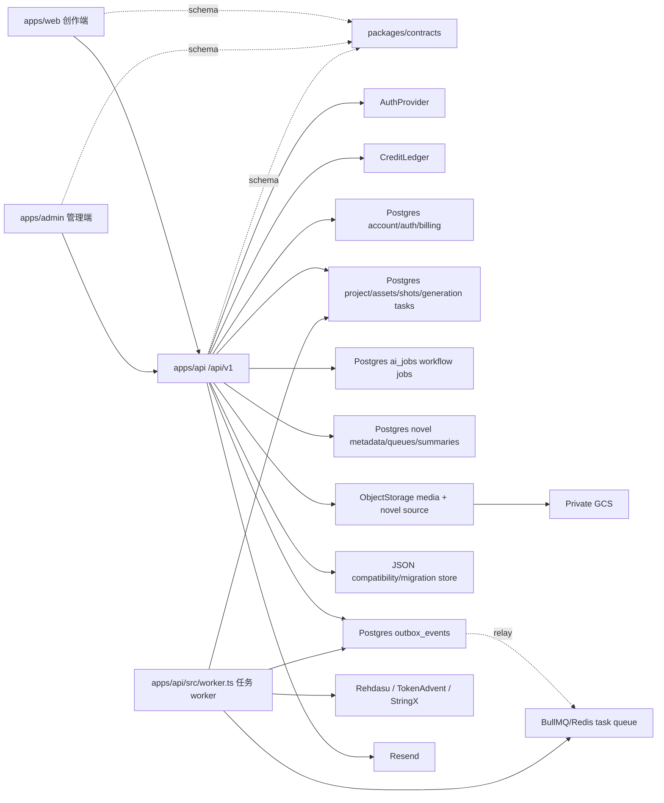

# 总体架构

> 当前基线：2026-08-03。产品开放状态和生产实例以 [当前状态](CURRENT_STATE.md) 与 [生产运维手册](OPERATIONS_RUNBOOK.md) 为准；本文只定义长期架构和代码边界。

## 目标

架构面向当前三人团队，优先保证边界清楚和修改成本低。前后端独立部署，共享契约但不共享业务实现；管理员能力、认证、计费和异步任务都有替换接口，不提前引入微服务复杂度。



## 边界

### 创作端

只负责交互、编辑状态和展示。它可以根据 `/auth/me` 返回的权限改善界面，但不能决定用户是否真的有权限或积分。

### API

所有外部接口使用 `/api/v1` 前缀。模块拥有自己的路由、服务和仓储接口；路由只处理协议与校验，服务编排业务，适配器处理数据库和外部系统。

后端业务边界正式分为 8 个，详细职责和禁止跨界规则见 [后端边界](BACKEND_BOUNDARIES.md)：

- Identity & Access
- Organizations
- Billing
- Creative Projects
- Jobs/Workers
- Media Storage
- Admin Console
- Observability/Ops

```text
apps/api/src/
  core/          认证、错误、任务、媒体、可观测性等跨模块能力
  modules/       8 个后端边界的业务模块和兼容模块
  infra/         Postgres migration、JSON Store、对象存储
  app.ts         依赖装配与路由注册
  server.ts      进程启动和优雅退出
```

### 共享契约

`packages/contracts` 是角色、权限、请求和响应结构的唯一来源。它不能依赖任何 UI 或服务端框架，也不能包含数据库实体。

### 管理员端

管理员端是独立应用，可以使用不同域名、发布节奏和安全策略。它只复用契约与设计令牌，不复用创作端页面；后端管理接口统一位于 `/api/v1/admin/*`。当前生产将构建产物挂载在 `/admin/`，Caddy `forward_auth` 和 API 角色权限形成双层边界。

当前独立 `apps/admin` 是唯一后台边界；创作端只保留个人资料、组织切换和个人 session 管理。独立管理员端优先消费 `GET /api/v1/admin/console` 聚合接口，再按需要调用用户、组织、账单、session 和审计子接口。

## 多组织

产品对外统一称为“组织”。认证主体始终包含 `userId`、`tenantId` 和 `roles`，并在兼容响应中提供 `organizationId`；仓储查询必须显式带入主体并按 `tenantId` 过滤。客户端传入的组织 ID 不可信，不能用于数据隔离。当前数据库表和历史字段仍保留 `tenant*` 命名，详见 [组织概念迁移说明](ORGANIZATION_MIGRATION.md)。

当前账号、组织、账单、项目、AI Job 和小说域边界由 Postgres 中的 `users`、`auth_identities`、`tenant_memberships`、`sessions`、`billing_accounts`、`billing_ledger_entries`、`projects`、`assets`、`shots`、`generation_tasks`、`ai_jobs`、`novel_documents`、`novel_chapters`、`novel_boundaries`、`novel_summary_queues`、`novel_summary_queue_items`、`novel_chapter_summaries` 和 `novel_story_bibles` 承载。项目、AI Job 和小说仓储查询必须保留 `tenantId` 条件；JSON 只作为本地兼容、历史数据迁移输入和备份。

## 数据持久化

- Postgres：账号、身份、session、组织 membership、账单账户、账单流水、密码重置 token、审计日志、项目、资产、分镜、图片/视频生成任务、通用 AI Job，以及小说元数据、章节 offset、边界、摘要队列、章节摘要和故事圣经。
- Outbox：`outbox_events` 和业务写入在同一个 Postgres 事务里提交，用于保证任务记录、扣费和队列触发不会出现“DB 成功但 Redis 入队失败”的裂缝。Relay 以租约方式扫描未发送事件，投递 BullMQ 成功后标记 `sent`，失败后按 `next_attempt_at` 指数退避重试。
- Redis/BullMQ：任务触发队列；API 和 worker 通过 Outbox relay 投递触发消息，worker 进程消费并执行 `GenerationTaskRunner.tick()` 和 `AiJobRunner.tick()`。`generation_tasks` 承载图片、视频和当前剧本生成/续写/资产建议文本任务；`ai_jobs` 承载小说摘要等通用长工作流。
- JSON Store：本地媒体索引、历史兼容数据、小说迁移输入和本地 Demo 备份状态；不再作为配置完整基础设施时的小说主写入源。
- ObjectStorage：上传文件、生成图片、视频、尾帧、完整成片预览和小说正文。小说正文不落 Postgres，数据库只保存 `content_storage_key`、`content_sha256`、offset 和章节元数据。

Postgres 模式下不允许 `AppStore` runtime snapshot 反写核心业务表。Repository 写入必须先落 Postgres，再显式镜像到本进程 runtime cache；普通 `store.mutate()` 只服务 JSON 本地兼容数据，不承载项目、任务或 AI Job 的新业务事实。

Migration 文件位于 `apps/api/src/infra/migrations`。dev/test 启动时可以自动迁移；production 启动只检查是否最新，部署前必须运行 `pnpm --filter @seqora/api db:migrate`。

## 当前运行拓扑

生产是单机 Docker Compose：`web/Caddy`、`api`、`worker`、`postgres`、`redis`。浏览器只访问同域 `/api/v1`；API 写 Postgres 和 Outbox，Relay 投递 BullMQ，独立 Worker claim 数据库任务后调用外部 Provider。Redis 不是业务事实源，丢失 Redis 时应从数据库 Outbox/任务恢复，不能以队列状态覆盖数据库终态。

当前 Provider 路由：

- 默认文本：Rehdasu OpenAI 兼容接口，`glm-5.2`，服务端变量 `REHDASU_*`。
- GPT 文本和图片：TokenAdvent；图片只实现 GPT Image 2，Nano Banana 尚无 Provider。
- 视频：StringX Seedance；Volc Ark 是可配置的显式回滚。Aideos 只剩历史适配器源码/测试，当前 `VIDEO_PROVIDER` 枚举不再装配它。
- 可信人像：StringX MaaS Assets OpenAPI，使用独立 AK/SK，不复用 Seedance Bearer Token。
- 邮件：Resend，负责验证码、邮箱验证、邀请和密码重置。

生产媒体使用私有 GCS，通过鉴权 API 或短期签名地址读取。Provider 密钥只能存在 API/Worker 环境，不得进入 Web、文档、日志或任务元数据。

## 可替换端口

- `AuthProvider`：当前生产路径为本地账号 + 签名 HttpOnly Cookie + Postgres session；`demo` header 只允许开发/测试。企业 SSO 可替换为 OIDC/JWT。
- `GenerationTaskRepository`：当前通过 Postgres 持久化生成任务；API 队列操作直接写 DB 并镜像 runtime cache。图片/视频 runner 的 Store 写回路径仍是后续需要彻底仓储化的剩余风险。
- `AiJobRepository`：通用 AI/工作流任务层，字段包括 `kind`、`input`、`output`、`provider`、`cost_credits`、`client_request_id`、状态和 lease；claim、heartbeat、complete、fail 和失败退款在 Postgres 中完成。文本类长任务不要直接散落在各 service 里，应通过该层创建、扣费、入队、执行和写回。
- `CreditLedger`：当前已支持 Postgres billing ledger，扣费、退款、grant 和 adjustment 在数据库事务中完成。
- `TaskDispatcher`：生产默认 `bullmq`。配置 Postgres 时，Repository 在创建/恢复 `generation_tasks` 或 `ai_jobs` 的同一事务中写 `outbox_events`，API 侧 dispatcher 只唤醒 relay；worker 消费 BullMQ 后再从 DB claim 任务并执行对应 runner。`inline` 仅用于测试或临时本地回退。新增长工作流优先使用 `ai_jobs`；需要进入统一生成队列、复用媒体输出或现有文本任务 UI 时使用 `generation_tasks`。两者都必须遵守 `Route -> DB record + reserve credits + outbox -> Worker claim -> Provider -> writeback/refund`，路由不能同步承担长任务。

应用启动装配集中在 `src/runtime/*`：`database.ts` 负责 store/database 初始化，`storage.ts` 负责对象存储，`providers.ts` 负责 Provider 创建，`services.ts` 负责 repository/service 实例化，`queues.ts` 负责 Worker/dispatcher，`routes.ts` 负责 Auth、健康检查和业务路由注册。`app.ts` 只保留生命周期、插件和这些工厂调用。

业务服务只依赖这些接口，因此替换基础设施时不需要修改路由或前端。

## 暂不拆微服务

用户、项目、资产、计费和生成模块先保留在一个 API 进程中。只有出现独立扩缩容、独立故障域或团队所有权边界后再拆服务，拆分时继续沿用现有模块与契约边界。
