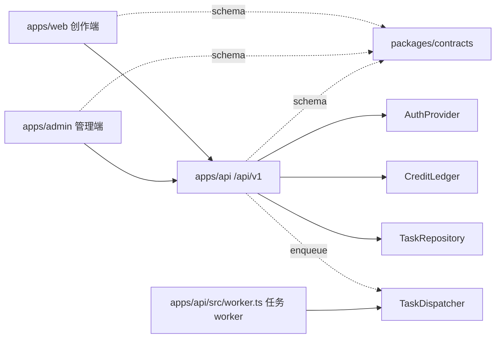

# 总体架构

## 目标

架构面向当前三人团队，优先保证边界清楚和修改成本低。前后端独立部署，共享契约但不共享业务实现；管理员能力、认证、计费和异步任务都有替换接口，不提前引入微服务复杂度。



## 边界

### 创作端

只负责交互、编辑状态和展示。它可以根据 `/auth/me` 返回的权限改善界面，但不能决定用户是否真的有权限或积分。

### API

所有外部接口使用 `/api/v1` 前缀。模块拥有自己的路由、服务和仓储接口；路由只处理协议与校验，服务编排业务，适配器处理数据库和外部系统。

```text
apps/api/src/
  core/          认证、错误、任务分发等跨模块能力
  modules/       auth、generation、billing、admin 等业务模块
  app.ts         依赖装配与路由注册
  server.ts      进程启动和优雅退出
```

### 共享契约

`packages/contracts` 是角色、权限、请求和响应结构的唯一来源。它不能依赖任何 UI 或服务端框架，也不能包含数据库实体。

### 管理员端

管理员端保留为独立应用，未来可使用不同域名、发布节奏和安全策略。它只复用契约与设计令牌，不复用创作端页面；后端管理接口统一位于 `/api/v1/admin/*`。

## 多租户

认证主体始终包含 `userId`、`tenantId` 和 `roles`。仓储查询必须显式带入主体并按 `tenantId` 过滤。客户端传入的租户 ID 不可信，不能用于数据隔离。

## 可替换端口

- `AuthProvider`：当前 Demo Header，未来替换为 OIDC/JWT 验证。
- `GenerationTaskRepository`：当前内存，未来替换为 PostgreSQL。
- `CreditLedger`：当前空实现，未来执行幂等、原子积分预占。
- `TaskDispatcher`：API 侧默认 no-op；worker 进程里的 `GenerationTaskRunner` 负责执行，未来可替换 Redis、SQS 或 RabbitMQ。

业务服务只依赖这些接口，因此替换基础设施时不需要修改路由或前端。

## 暂不拆微服务

用户、项目、资产、计费和生成模块先保留在一个 API 进程中。只有出现独立扩缩容、独立故障域或团队所有权边界后再拆服务，拆分时继续沿用现有模块与契约边界。
