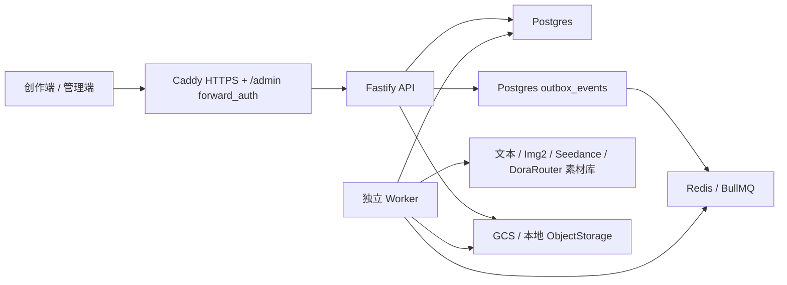

# 序幕TV 当前状态

> 代码核对日期：2026-09-08。本文描述当前工作分支，不代表本次改动已经发布到 `https://xumutv.com`。生产快照保留各自核对日期；若与历史开发记忆冲突，以 contracts、Service、Repository、实际 UI 和本文为准。

## 产品定位

序幕TV 是面向网剧、广告和短片的傻瓜式 AIGC 视频制作 Agent。内部代码和技术标识仍使用 `SEQORA`，当前可用主流程：

```text
8 位邀请码 + 邮箱验证码注册
  -> 项目库
  -> 智能生成/修改剧本
  -> 资产建议与资产定稿
  -> 分镜/分集
  -> Seedance 视频队列
  -> 分集或全片预览
```

当前适合封闭客户测试和小团队联合开发，不是正式商用 SaaS，也不是带剪辑、配音、正式字幕和交付编码的完整后期系统。项目库另有已接后端的“一句成片”AgentStudio：需求与参数确认后，按阶段执行制作；它与手动创作流程共用项目、任务和 Provider。

## 功能矩阵

| 模块           | 用户状态               | 后端状态                     | 说明                                                                                          |
| -------------- | ---------------------- | ---------------------------- | --------------------------------------------------------------------------------------------- |
| 登录与会话     | 已开放                 | Postgres session             | HttpOnly Cookie、退出、恢复、设备 session、强制改密                                           |
| 账号中心       | 已开放                 | Postgres + 本地兼容          | 身份与邮箱验证、实时积分和月度用量、个人/组织空间、设备 session；组织负责人可邮件邀请组织成员 |
| 邀请注册       | 已开放                 | 已生产验证                   | 新邀请码固定 8 位数字；6 位邮箱验证码；Resend 投递；邀请码一次性使用                          |
| 忘记密码       | 已开放                 | 已生产验证                   | 邮件发送重置链接；生产不返回 token                                                            |
| 邮箱验证       | 已开放                 | 已生产验证                   | 注册/账号验证邮件和待验证页面                                                                 |
| 项目库         | 已开放                 | Postgres                     | 新建、打开、改名、归档删除、预览封面、内容类型/风格、任务摘要                                 |
| 一句成片 Agent | 已接工作流             | Agent plan/run + Worker      | 需求与参数确认、预算估算、阶段执行、暂停/恢复及失败重试；不是仅有 UI 预览                     |
| 图片工作台     | 已开放                 | 图片批次专用接口             | 序幕 image2 工作台，按引用图、比例、清晰度和张数提交                                          |
| 剧本大师       | 外部模块等待接入       | 未接正式创作流程             | 不得把入口展示当成长剧本能力已交付                                                            |
| 短剧本         | 已开放                 | 后台任务                     | 智能生成、重新生成、修改意见、续写下一段/集、模型选择、保存                                   |
| 资产建议       | 已开放                 | 后台任务                     | 从当前剧本提取人物/场景/物品/服装；用户编辑后再写入资产                                       |
| 小说上传与章节 | 页面标记开发中         | API/Repository 实验能力存在  | 不作为客户正式入口；真实样本回归需手工显式执行                                                |
| 长剧本创作     | 占位                   | 尚未完成编排 Agent           | 计划是输入 -> 3-5 个大纲 -> 用户确认 -> 世界观/人物关系/分集等                                |
| 资产管理       | 已开放                 | Postgres + ObjectStorage     | 人物、场景、物品、服装；音频仅支持上传/配置，不支持 AI 音频生成                               |
| 图片生成       | 已开放                 | TokenAdvent GPT Image 2      | 直接导入、参考图再生成、纯文本生成；混元图片模型未配置且禁用                                  |
| 人物定稿       | 已开放                 | Worker 图片任务              | 面部、全身、三视图，支持人种/肤色/瞳色/发色、腿部优化、造型版本                               |
| 可信人像       | 已开放                 | DoraRouter 素材库 Worker     | AI 虚拟人入库、状态刷新、已有 AIGC/真人资源查询和绑定；旧 VolcArk 可显式回退                  |
| 分镜与分集     | 已开放                 | Postgres                     | 默认按场次时长与有序叙事单元规划，保留动作细拆、30-300 秒自动分集、视频直预览和历史版本       |
| 视频生成       | 已开放                 | DoraRouter Seedance 兼容接口 | 图片非必需；资产/文本可直接生成；480p/720p/1080p；单镜音频开启；StringX/Ark 可显式回退        |
| 连续生成       | 已开放                 | 依赖 + 尾帧                  | 分段并发、全片串联、全部独立；链内等待上一镜真实尾帧                                          |
| 生成队列       | 已开放                 | Postgres + Outbox + BullMQ   | 后台运行、排队、暂停等待任务、按 Provider 能力取消、软归档、失败退款                          |
| 消息中心       | 已开放但非持久通知系统 | 基于任务轮询                 | 完成/失败提示、跳回项目和失败重试；刷新后的通知历史能力有限                                   |
| 成片预览       | 已开放                 | Worker + FFmpeg              | 分集/全部剧集、已完成片段、完整预览、历史版本、播放和下载                                     |
| 正式后期       | 未完成                 | 基础有声预览已实现           | 合成保留单镜音轨，无音轨镜头补静音；正式配音、混音、字幕、转场时间线和母版输出仍未完成        |
| 积分账本       | 已开放                 | Postgres ledger              | 扣费、退款、充值、调账、月度用量；部分通用任务价格仍来自客户端                                |
| Stripe 支付    | 沙箱/代码能力          | 未正式商用                   | 正式价格、webhook endpoint、税务、发票、通知和对账运营未完成                                  |
| 管理员端       | 已部署                 | `/api/v1/admin/*`            | 生产路径 `/admin/`；账号、组织、角色、账单、session、审计与风险视图                           |

## 当前创作逻辑

### 项目与剧本

- 项目内容类型固定为 `short-drama`、`advertisement`、`animation`，界面显示网剧、广告、短片。
- 项目视觉风格在新建时确定并传入资产和视频提示词；资产级风格字段保留兼容，但 API 会按项目风格归一。
- 网剧自动使用 `web-series` 剧本模式；每次生成 1 集，场次数和内容预算随目标时长调整。60 秒单集建议从 5 场起草，允许 3～8 场并由剧情变化决定实际结构；各场可长短不同，不固定为三场两镜。已有结构化原稿的改写仍保持场次数量、编号与顺序，除非用户明确提出数量调整。
- 剧本默认模型是 `deepseek-v4-flash`。模型下拉框依次展示 DeepSeek V4 Flash、DeepSeek V4 Pro、GLM 5.2、序幕-5.6；当前 GLM Key 未获得模型授权，因此 UI 保留位置但禁用选择。配置 `DASHSCOPE_API_KEY` 后 DeepSeek V4 优先路由到阿里云百炼（Flash 使用 `deepseek-v4-flash-0731`），未配置时保留旧 `DEEPSEEK_V4_*` 中转回滚路径。序幕-5.6 实际路由到 `gpt-5.6-sol`，旧 `seqora-5.6` 任务也映射到 Sol。
- 剧本生成、续写和资产建议创建 `generation_tasks.kind=text` 后台任务；用户离开页面不会中断，完成后 Worker 写回项目或任务结果。
- 项目库停留期间不预加载首个项目的完整工作区。进入项目概览先加载裁剪后的任务摘要，进入剧本、资产、分镜、成片或图片工作台时再加载完整任务详情，避免历史任务拖慢项目首屏。
- 剧本输出强制使用简体中文；大量英文句子会触发同任务自动校正，连续异常时阻止覆盖。已有多场结构化原稿改写时保持场次数量、编号和顺序。
- 网剧正文采用场次标题、自然动作段落和穿插对白，导演级构图/光影/运镜交给分镜层。编剧规则要求目标、阻力、选择、代价与可见结果，后场承接前场新后果；短片和快速剧本复用因果推进原则，广告要求每段承担新的传播任务和可见证明。
- 不再以每镜四句对白为硬指标；对白长度服从可表演时长，允许无对白段落使用现场声音。系统提示重复对白或口播过密，不会为了凑数补写固定的内心独白。规则能提高下限，但不能证明模型已理解或满足戏剧因果。
- 本次编剧和分镜调整未增加模型规划轮次：仍沿用现有文本生成与必要修复路径，分镜规划为本地确定性计算。

### 创作端界面

- 创作端默认深色，可切换浅色并在浏览器保存主题选择；登录、项目与创作工作区使用同一套主题规则。
- 登录采用全屏实景照片缓慢运镜与交叉转场，可暂停并遵循系统减少动态效果设置；并非视频素材。
- 首页优先展示「一句成片」想法输入与项目库，同时保留手动新建项目。想法转入独立的新创作，不会覆盖历史 Agent 任务。
- 侧栏放置全局工具、当前项目与账号入口；进入项目后，顶部固定导航展示概览、剧本、资产、分镜、队列、成片六个阶段。下一步指引根据当前内容与有效视频版本计算，不阻止用户自由切换。
- 剧本采用正文与修改意见分栏；资产编辑采用制作/提示词标签页；分镜生成参数逐步展开；队列提供状态筛选；成片以播放器、版本选择与镜头顺序为主。
- 独立 `apps/admin` 管理员端未纳入本次界面修改。
- 设计、素材来源与验收边界见 [CREATOR_UI_REDESIGN.md](CREATOR_UI_REDESIGN.md)。

### 资产

- 图片来源分为直接使用原图、参考图再生成和纯提示词生成。
- 场景、物品和服装最多 3 张参考图；人物面部固定 1:1，三视图设定表固定 16:9。
- 高级提示词 UI 以完全覆盖为主；contracts 中 `append | replace` 仍为旧数据兼容，不应在新 UI 重新暴露追加选择。
- 人物只有确认面部基准后才允许创建 StringX AI 人像资源。入库走 Worker，不依赖编辑器保持打开。
- 可信人像必须到 `active` 才能在仿真人视频里使用。`processing` 不能当成功，`failed` 必须展示上游错误。
- 物品/服装提示词必须排除人、人体和局部肢体；场景提示词根据项目/剧本时代推断，结构化模板不是唯一事实源。

### 分镜、视频和成片

- 按场次规划优先读取已有导演镜头规格；没有规格时，按场次标注时长与可用叙事单元确定镜数，单镜最长 15 秒。短场次保留标注时长，长场次不再最多三镜；内容只有一个动作时不会为了凑镜数虚构另一版动作。无时长的旧格式场次保留单镜兼容路径。
- 自然剧本先解析成有序动作、对白和声音，再按动作与发声负载分组；对白和现场音跟随触发它们的动作，不再分别均分。长自然场景不在进入规划前复制成多份带相同对白的块；每镜只保留本镜内容，场尾结果仅交给末镜。
- 用户仍可选择按明确动作拍点细拆，逗号不自动作为切镜点。旧结构化字段没有记录对白发生位置时，只能保留原顺序进行规则分配，无法恢复未提供的表演时机。
- 完整规划超过请求镜数上限时返回 `SHOT_LIMIT_EXCEEDED`，保留原分镜，避免静默丢失后续剧情。动作细拆不再最多保留四个动作，剩余对白跟随末镜；超长对白仍需审阅。“一句成片”复用场次规划，保持已确认的镜数预算，超限时停止该阶段而不自动增加付费任务。
- 当前规划不调用导演模型，景别、机位和节奏仍是确定性推断，不等同于完整语义导演、连续性账本或生成后质检。超长单句对白、缺少动作边界和原稿自身的重复仍需人工审阅；详见 `DIRECTOR_PIPELINE_AUDIT.md`。
- 网剧镜头时长按 3 到 15 秒规范化，其他项目按 4 到 15 秒规范化。
- 分镜图片可单独生成或上传，但不是 Seedance 视频的硬前置。
- 视频引用的本站上传图、生成图无论使用相对还是绝对地址，均由服务端按组织、项目校验并读取后内联提交；上传图支持数据库回查，生成图依赖保留在任务运行缓存中。引用缺失、越权或图片内容为空时，在调用模型前失败；普通公网图片仍按原地址提交。
- `continue` 镜头等待上一镜视频完成并使用其末帧；如果同时有当前分镜图，则以首/尾帧配对提交。只有首帧时会降级为普通参考图，避免 StringX 的成对校验错误。
- “分段并发”把镜头拆成最多套餐槽位数量的连续链；链之间并发，链内串行。“全片串联”是一条连续链。“全部独立”速度最快但主动放弃尾帧连续性。
- 图片与视频的有效套餐并发目前是免费 1、会员 3；每个账号另有 1 个文本任务保底槽位，剧本不会被长耗时媒体任务堵塞，同一账号的第二个文本任务仍按提交时间排队。`compose.demo.yml` 中旧演示不限并发变量没有进入账单摘要，不能作为已实现功能。
- 单镜头任务设置 `generateAudio=true`，Provider 可能返回对白/现场声。完整预览 FFmpeg 已保留源音轨，统一为 48 kHz 双声道，补齐或裁剪到镜头时长；无音轨输入补静音，再拼接并编码 AAC。这是原分支已有行为，旧文档的 `-an` / 无声描述有误，不属于本次新增功能。
- 成片任务按源视频任务 ID 判定版本是否过期。新分镜或重生镜头后保留上一版预览，并提示重新合成。

## 认证与注册事实

生产默认 `AUTH_MODE=local`：

- 密码使用 scrypt 哈希；普通注册/改密最少 8 位，最大 128 位。
- 生产 bootstrap 密码配置仍要求至少 12 位，这是运维强度要求，不是用户表单下限。
- 新邀请码由管理端创建，当前固定为 8 位数字；数据库只保存 SHA-256 哈希。
- 开放邀请码可以先不绑定邮箱；第一次请求验证码时原子绑定邮箱。
- 验证码是 6 位数字，10 分钟有效；同一入口有冷却、尝试次数和 IP 频率限制。
- 邀请消费后不可重复注册。
- 显示名不唯一，可以重名；账号唯一标识是规范化邮箱。
- 如果邮箱已经存在，接受另一个组织邀请不会创建第二个账号。注册页密码用于验证原账号；忘记时必须先走密码重置，再用重置后的密码完成邀请。
- 每个普通创作者默认属于“个人创作空间”，账号中心会明确显示“组织：个人”；这不是空组织状态。`organization_admin` 是组织负责人，可通过邮件邀请 `organization_member`，但不能创建或提权其他组织负责人。平台 `owner` 与组织负责人是两层不同权限。
- 无 Docker 的本地 JSON 模式保留“个人创作空间”和“当前浏览器”账户接口，方便创作端联调；真实多组织、成员邀请、跨设备 session 撤销只在 Postgres 运行时可用，不能把本地回退误认为生产组织能力。
- 生产邮件 Provider 是 Resend，负责注册验证码、邮箱验证、密码重置和邀请。密钥和发件人只存在生产 secret/env。

## 运行架构



Postgres 是账号、组织、账单、项目、资产、分镜、生成任务、AI Job 和小说域的业务来源。Redis/BullMQ 只承载触发队列。JSON Store 仍承载本地媒体索引、兼容缓存和迁移输入，不能重新扩大为核心业务数据库。

## 生产快照

- 域名：`https://xumutv.com`
- 云平台：阿里云 ECS
- 公网地址：`123.57.14.233`
- 部署目录：`/opt/seqora`
- 当前形态：单机 Docker Compose，Postgres、Redis、API、Worker、Web/Caddy 五个服务。
- 当前线上主机为 8 核、16 GB；2026-09-07 已通过只读 SSH 核验，与用户说明一致。
- 数据盘：约 99 GB 系统盘；2026-09-04 核对使用率约 3%。
- API `8787` 不对公网开放；公网只开放 80/443，HTTPS 由 Caddy 处理。
- 管理端随 Web 镜像构建到 `/admin/`，未授权访问由 Caddy 和 API 双层拒绝。
- 2026-09-04 核对：健康接口 `status=ok`、readiness 为 true，Postgres、Redis、API、Worker 和 Web 均正常运行。

生产凭据、邀请码和用户信息不得写进本文。具体巡检和发布见 `OPERATIONS_RUNBOOK.md`。

## 已知风险

### P0：扩大外测前

1. 通用 `generation_tasks.estimatedCredits` 仍可由客户端提交，需要服务端定价表和报价确认，避免伪造低价格。
2. 完整预览已有音轨归一、拼接及无音轨静音兜底，但对白/环境声实际质量、响度、跨镜声音连续性与混音仍需验收。
3. 注册、重置和邮件投递虽已生产可用，仍需投递失败告警、退信处理和运营可见状态。
4. CI/CD 工作流代码已存在，但在没有看到目标仓库最近一次成功生产发布前，运维不得假设自动发布一定可用。
5. 备份恢复、Redis 故障、Worker 重启、重复 Outbox 投递和三路并发需要定期生产演练。

### P1：正式收费前

1. Stripe 正式价格、webhook、支付失败通知、退款运营、税务与发票。
2. 用户协议、隐私政策、版权授权、数据导出和删除。
3. 持久消息中心、任务邮件通知和管理员告警。
4. 正式音频、字幕、粗剪时间线、转场和交付预设。
5. Provider 成本、延迟、错误码和额度的可观测仪表盘。

### P2：规模化

1. Worker 横向扩缩容、按任务类型队列和独立合成 Worker。
2. 托管 Postgres/Redis、CDN、对象生命周期和跨区备份。
3. 一句成片 Agent 已有参数规划、预算确认与阶段恢复；仍需完善逐阶段审核、质量门禁和人工接管体验。
4. 长篇小说的大纲多方案、Story Bible、分集和单集重生完整产品化。

## 下一位开发者建议

沿用现有 Agent plan/run 和阶段执行链完善工作流，不要从功能栈 UI 再造第二套编排。优先完善服务端定价、阶段审核、恢复与质量门禁；保留已有音轨的基础上验证对白和环境声质量，不能把“文件含音轨”当作完整声音交付。

## 序幕 image2

`image-studio` 已切换为正式的 `序幕 image2` 工作台。前端只负责提示词、引用图、比例、清晰度和张数，批次提交走服务端专用接口，浏览器不再保存 provider key，也不再直接信任估算积分。

## 网剧分集剧本

- 网剧使用 `script_episodes` 作为正式数据模型；广告和短片仍使用单一 `projects.script`。
- `content` 是已保存正式稿，`draft_content` 是生成或改写候选稿。模型任务完成只更新草稿，用户点击“保存本集”后才进入正式制作链路。
- `projects.script` 是兼容聚合字段，仅由已保存剧集按集号聚合，集间使用 `【强制下一集】` 连接。草稿不得进入资产分析或正式分镜。
- 续写只从最后一个已保存剧集开始，上下文为“最后一集全文 + 更早剧集摘要”，不传全部历史全文。
- 改写只作用于当前打开的剧集；未打开时由页面自动选择最近编辑的剧集。生成、改写和续写均通过后台文本任务流式回传。
- 只有最后一集可删除；中间集不显示删除入口。删除中间剧情必须从末集依次删回，或使用“清空全部”。有运行任务时服务端拒绝删除。
- 分镜通过 `shots.script_episode_id` 关联正式剧集。指定集重生分镜时只替换该集；删除末集会同步删除其关联分镜并重排全局镜号。
