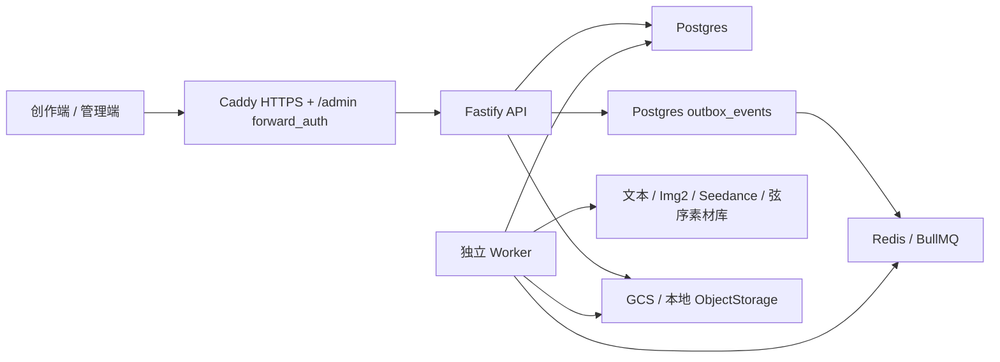

# 序幕TV 当前状态

> 2026-09-20 整合候选源码版本：主站与配套剧本服务的版本分支、固定配套提交及验证边界见 [版本说明](INTEGRATION_SNAPSHOT_2026-09-20.md)。以下本地开发记录按时间保留；Git源码推送不代表线上部署。运行中的本地预览及其他验收进程保持不变。

> 2026-09-20 本地返修与恢复补齐：已有分镜后重交付修改稿，可明确选择「保存修订并更新分镜」，在原项目原剧集保留旧正文、旧分镜及媒体关联；仅能可靠匹配且衔接依赖未变的镜头复用，新镜头不继承旧媒体。分镜页提供折叠的「制作修订历史」，当前仅供查看。生成任务入队与返修使用同一项目锁，并在扣费前复查镜头。快速页增加已保存/已检查进度、最后保存时间、只读找回与刷新入口；未知请求仍保留最长20分钟保护，关闭页面不后台续写。相关API回归87项、跨仓业务11项通过，尚未实测真实模型和PostgreSQL并发。5181未切换，未推送或部署，详见工作区 `work/quick-script-revision-recovery.md`。

> 2026-09-20 本地快速剧本衔接复查：修复旧素材继承、恢复与编辑死路、修改正文后的资产依据过期；主站资产页直接提供已交付剧本的快速提取和确认入口；修复长场次转分镜时动作/对白遗漏与重复。修订稿省略过期信息索引后仍正确解析场景、对白人物和分镜；仅动作叙述中的人物/道具可能需手动补充。隔离真实业务链路10项通过，覆盖交接、资产写入、分镜生成和参考匹配；已有分镜后覆盖正文仍受保护，制作修订副本尚未实现。仅本地候选，未重启5181、推送或部署，见支持工作区 `work/quick-script-handoff-review.md`。

> 2026-09-20 本地快速剧本候选：主项目中的新中文作品收敛为「梗概 → 创作安排 → 剧本正文」，两次创作确认后顺序生成、保存和检查，再明确交付主站资产设计。旧项目不自动迁移，独立剧本大师及海外标准流程保留。首版限中文一万有效正文字以内；真实模型的质量与速度尚未验收，未推送或部署。实现及限制见支持仓库 `script-master-update/deploy/QUICK_SCRIPT_2026-09-20.md`。

> 2026-09-20 本地语言修复：大陆与海外的剧本交互、思考/摘要及说明统一要求简体中文；海外正式台词保留英文原句＋逐句中文翻译。剧本请求增加统一语言合同，实时和历史过程增加展示保护，不改写已保存正文。后端相关 138 项、前端相关 21 项、双语 7 项及桌面/手机 6 项验证通过；3190 与 8190 已更新，5181 代理保持原进程。仅本地修改，未推送或部署，详见支持工作区 `work/language-policy-update.md`。

> 2026-09-20 本地提速第二轮：人物资料在单次请求内复用；剧本大师交接已保存正文时可携带显式人物、场景、道具依据，主站验证正文哈希后存入既有剧集 metadata 并复用。完整清单（含明确为空）不再靠模型补猜；缺失或失效依据仍按正文提取。仅外观变化也会刷新建议。合成 24 集的重复快速分析中位值从上一轮 178.62 ms 降到 2.36 ms，仅为本地解析测量，不代表模型或全流程耗时。契约、双方调用及隔离交接测试通过；未推送或部署，5181 主站仍是示例 API。逐集自动分镜没有新增，详见 [结构化交接与人物资料复用](SERIES_CREATION_FLOW.md)。

> 2026-09-20 本地 UI 简化：创作流程内的剧本使用「故事设定 → 分集大纲 → 剧本正文」三个阶段，故事资料与原审核状态归入阶段内；内容目录按需展开。分集大纲保留按集浏览修改，取消逐集确认，改为一次「确认大纲并进入正文」，系统统一检查完整性、来源、场次及剧情衔接，失败不批准阶段。主站「制作稿」入口降为次级「已交付版本」，草稿保存与交付仍是独立动作。仅本地适配，未推送或部署，见 [网剧创作流程](SERIES_CREATION_FLOW.md)。

> 2026-09-20 本地入口分工：功能栈恢复第三项「剧本大师」，标记「测试中」，提供保留分镜与文件导出的独立完整工作台；无主项目时也可进入。创作流程内的网剧剧本工作区专注梗概、总纲、规划与正文，保存后交接剧本文字并进入主站资产设计；此入口不提供剧本大师分镜生成或最终文件导出。分镜能力是否迁入主站后续单独设计。两种入口沿用既有绑定与票据，尚未推送或部署，见 [网剧创作与独立工作台](SERIES_CREATION_FLOW.md)。

> 本轮预览边界：5181 主站仍使用示例 API；新版资产交接前端和主站建议刷新逻辑已加载到本地预览，3190 最新使用 `.next-language-policy`，8190 已加载中文交互修复，5181 代理保留原进程。主站 API 提速通过隔离真实业务代码验收，未接入此示例预览。无项目启动的预览代理变更尚未重启加载，试用请先进入示例项目。已同步过分镜的旧制作稿发生正文变更时仍受既有导入保护限制，不会强行覆盖旧分镜。详见上述流程文档。

> 2026-09-20 本地适配：网剧创作宿主采用紧凑标题和次级「已交付版本」入口，创作区按桌面或手机顶栏高度占满剩余视窗。尚未推送或部署，见 [网剧统一创作流程](SERIES_CREATION_FLOW.md)。

> 2026-09-20 本地导入兼容修复：新版剧本大师的纯正文导入在主站生成镜头时，识别正式正文中的 INT./EXT. 场景，排除导出元信息；保留动作、对白与集边界，制作稿原文不变。隔离文件存储与真实 Fastify 路由验证已通过；不代表生产 PostgreSQL 或真实模型全流程验收，见 [网剧统一创作流程](SERIES_CREATION_FLOW.md)。

> 本地 UI 试验分支于 2026-09-18 将网剧生成统一到主站页内的长剧本创作，保留主站导航，短片与广告保留原生成方式；尚未部署，详见 [网剧统一创作流程](SERIES_CREATION_FLOW.md)。以下生产说明不代表该预览已上线。

> 核对日期：2026-09-04。本文描述当前发布分支和 `https://xumutv.com` 的产品状态。若与历史开发记忆冲突，以 contracts、Service、Repository、实际 UI 和本文为准。

## 产品定位

序幕TV 是面向网剧、广告和短片的傻瓜式 AIGC 视频制作 Agent。内部代码和技术标识仍使用 `SEQORA`，当前可用主流程：

```text
8 位邀请码 + 邮箱验证码注册
  -> 项目库
  -> 智能生成/修改剧本
  -> 资产建议与资产定稿
  -> 分镜/分集
  -> Seedance 视频队列
  -> 分集或全片预览
```

当前适合封闭客户测试和小团队联合开发，不是正式商用 SaaS，也不是带剪辑、配音、字幕和交付编码的完整后期系统。

## 功能矩阵

| 模块           | 用户状态               | 后端状态                                               | 说明                                                                                          |
| -------------- | ---------------------- | ------------------------------------------------------ | --------------------------------------------------------------------------------------------- |
| 登录与会话     | 已开放                 | Postgres session                                       | HttpOnly Cookie、退出、恢复、设备 session、强制改密                                           |
| 账号中心       | 已开放                 | Postgres + 本地兼容                                    | 身份与邮箱验证、实时积分和月度用量、个人/组织空间、设备 session；组织负责人可邮件邀请组织成员 |
| 邀请注册       | 已开放                 | 已生产验证                                             | 新邀请码固定 8 位数字；6 位邮箱验证码；Resend 投递；邀请码一次性使用                          |
| 忘记密码       | 已开放                 | 已生产验证                                             | 邮件发送重置链接；生产不返回 token                                                            |
| 邮箱验证       | 已开放                 | 已生产验证                                             | 注册/账号验证邮件和待验证页面                                                                 |
| 项目库         | 已开放                 | Postgres                                               | 新建、打开、改名、归档删除、预览封面、内容类型/风格、任务摘要                                 |
| 功能栈三入口   | 左侧独立分组 UI        | 一句成片暂未开放，图片大师已接入；剧本大师独立服务接入 | 位于项目库下、创作流程上；剧本大师保留 `final2` 独立前后端，通过宿主启动票据进入              |
| 短剧本         | 已开放                 | 后台任务                                               | 智能生成、重新生成、修改意见、续写下一段/集、模型选择、保存                                   |
| 资产建议       | 已开放                 | 后台任务                                               | 从当前剧本提取人物/场景/物品/服装；用户编辑后再写入资产                                       |
| 小说上传与章节 | 页面标记开发中         | API/Repository 实验能力存在                            | 不作为客户正式入口；真实样本回归需手工显式执行                                                |
| 长剧本创作     | 独立工作台接入         | `project111-final2` 独立 FastAPI/Next.js               | 通过 Script Master 启动接口进入；长剧本结果交接到主项目前必须经过版本化导入契约               |
| 资产管理       | 已开放                 | Postgres + ObjectStorage                               | 人物、场景、物品、服装；音频仅支持上传/配置，不支持 AI 音频生成                               |
| 图片生成       | 已开放                 | TokenAdvent GPT Image 2                                | 直接导入、参考图再生成、纯文本生成；混元图片模型未配置且禁用                                  |
| 人物定稿       | 已开放                 | Worker 图片任务                                        | 面部、全身、三视图，支持人种/肤色/瞳色/发色、腿部优化、造型版本                               |
| 可信人像       | 已开放                 | 弦序 MaaS 素材库 Worker（volc-ark）                    | 新上传 AI 入库到 Active 已验收；DoraRouter 用 AI 面部原图，暂不支持真人 H5 或真人素材视频     |
| 分镜与分集     | 已开放                 | Postgres                                               | 默认一场一镜、高级动作细拆、30-300 秒自动分集、卡片视频直预览、手工编辑、参考图、前一版本历史 |
| 视频生成       | 已开放                 | DoraRouter Seedance 兼容接口                           | 图片非必需；资产/文本可直接生成；480p/720p/1080p；单镜音频开启；StringX/Ark 可显式回退        |
| 连续生成       | 已开放                 | 依赖 + 尾帧                                            | 分段并发、全片串联、全部独立；链内等待上一镜真实尾帧                                          |
| 生成队列       | 已开放                 | Postgres + Outbox + BullMQ                             | 后台运行、排队、暂停等待任务、按 Provider 能力取消、软归档、失败退款                          |
| 消息中心       | 已开放但非持久通知系统 | 基于任务轮询                                           | 完成/失败提示、跳回项目和失败重试；刷新后的通知历史能力有限                                   |
| 成片预览       | 已开放                 | Worker + FFmpeg                                        | 分集/全部剧集、已完成片段、完整预览、历史版本、播放和下载                                     |
| 正式后期       | 未完成                 | 未实现                                                 | FFmpeg 当前移除音轨；无配音、混音、字幕、转场时间线和母版输出                                 |
| 积分账本       | 已开放                 | Postgres ledger                                        | 扣费、退款、充值、调账、月度用量；部分通用任务价格仍来自客户端                                |
| Stripe 支付    | 沙箱/代码能力          | 未正式商用                                             | 正式价格、webhook endpoint、税务、发票、通知和对账运营未完成                                  |
| 管理员端       | 已部署                 | `/api/v1/admin/*`                                      | 生产路径 `/admin/`；账号、组织、角色、账单、session、审计与风险视图                           |

## 当前创作逻辑

### 项目与剧本

- 项目内容类型固定为 `short-drama`、`advertisement`、`animation`，界面显示网剧、广告、短片。
- 项目视觉风格在新建时确定并传入资产和视频提示词；资产级风格字段保留兼容，但 API 会按项目风格归一。
- 网剧自动使用 `web-series` 剧本模式；单集剧本每次只生成 1 集、6～8 个场次，目标约 700～1100 个中文字符。项目保留的单集秒数字段只供后续分镜时长和自动分集使用，不参与单集剧本文字预算。
- 剧本默认模型是 `deepseek-v4-flash`。模型下拉框依次展示 DeepSeek V4 Flash、DeepSeek V4 Pro、GLM 5.2、序幕-5.6；当前 GLM Key 未获得模型授权，因此 UI 保留位置但禁用选择。配置 `DASHSCOPE_API_KEY` 后 DeepSeek V4 优先路由到阿里云百炼（Flash 使用 `deepseek-v4-flash-0731`），未配置时保留旧 `DEEPSEEK_V4_*` 中转回滚路径。序幕-5.6 实际路由到 `gpt-5.6-sol`，旧 `seqora-5.6` 任务也映射到 Sol。
- 剧本生成、续写和资产建议创建 `generation_tasks.kind=text` 后台任务；用户离开页面不会中断，完成后 Worker 写回项目或任务结果。
- 项目库停留期间不预加载首个项目的完整工作区。进入项目概览先加载裁剪后的任务摘要，进入剧本、资产、分镜、成片或图片工作台时再加载完整任务详情，避免历史任务拖慢项目首屏。
- 剧本输出强制使用简体中文；大量英文句子会触发同任务自动校正，连续异常时阻止覆盖。已有多场结构化原稿改写时保持场次数量、编号和顺序。
- 网剧单集初稿只保留剧情、角色、场景、动作、对白和衔接，导演级构图/光影/运镜交给后续分镜层；每场要求一个核心事件、两个可见动作拍点、连续状态和对白/声音，结尾保留钩子。分镜仍要人工抽检，不应宣称模型必然满足。

### 资产

- 2026-09-17 界面调整（已部署 `123a7fd`）：资产卡片去重描述并隐藏最终提示词；分镜参考图插入后以琥珀色标记按钮和正文编号，模板保持深绿色，详见 `ASSET_GENERATION.md` 和 `SHOT_REFERENCE_IMAGES.md`。
- 图片来源分为直接使用原图、参考图再生成和纯提示词生成。
- 场景、物品和服装最多 3 张参考图；人物面部固定 1:1，三视图设定表固定 16:9。
- 高级提示词 UI 以完全覆盖为主；contracts 中 `append | replace` 仍为旧数据兼容，不应在新 UI 重新暴露追加选择。
- 2026-09-14 人物生成修复（2026-09-15 已部署）：标准提示词明确人类身份；Worker 使用 `quality-floor-v2` 按人物任务的 `subjectType` 添加防动物化约束，高级覆盖提示词也生效。明确选择动物的角色保留动物生成能力；缺少类型的旧人物任务默认人类。详见 [资产生成](ASSET_GENERATION.md#服务端质量下限)。验证使用 Provider 测试替身，尚未验证真实付费出图；没有新增图像识别拦截，已有错误图片仍需重新生成。
- 人物只有确认面部基准后才允许创建 AI 人像资源。2026-09-15 补充修复：确认平台生成的人类面部后自动提交 1 积分后台加白任务；重复确认复用任务，失败需手动重试，换脸后旧回写不可覆盖新面部。动物、直接导入和真人授权素材不自动提交。提示词升级为 `quality-floor-v3`，修复 Provider 双重否定并加入服务端正向人类身份约束。验收和发布状态见 [人物身份与自动加白](CHARACTER_IDENTITY_AND_AUTO_PORTRAIT_2026-09-15.md)。
- 可信人像必须到 `active` 才能在仿真人视频里使用。`processing` 不能当成功，`failed` 必须展示上游错误。
- 2026-09-15 人物视频实测：AI 图片上传 → 入库 Active → DoraRouter 5 秒视频 → 播放/下载通过。当前通道传已确认 AI 面部原图的临时签名链接，不传弦序 `asset://` 编号；新建真人 H5 与真人授权资源视频仍不开放。发布版本、音轨检查、退款与限制见 [联调记录](PORTRAIT_VIDEO_VALIDATION_2026-09-15.md)。
- 物品/服装提示词必须排除人、人体和局部肢体；场景提示词根据项目/剧本时代推断，结构化模板不是唯一事实源。

### 分镜、视频和成片

- 2026-09-17 本地通道配置修复：历史本地 `.env` 显式选择 StringX，曾返回 `429 api key credit quota exceeded`。现已将本地视频配置对齐生产 DoraRouter，并独立指定现有 VolcArk 素材库；本地 health 确认 `dora-router-seedance`，Dora 模型目录鉴权返回 200。仅修复本地环境，未发布代码或触发付费视频；旧失败任务保留原通道和错误记录。
- 2026-09-17 提示词调整（已部署 `123a7fd`）：分镜改为场景、角色、具体动作、原文对白和已有拍摄信息；不再填充抽象目标/阻力/变化、重复剧情、固定节拍或整段前镜回顾。`seedance-storyboard-v17` 完整保留本镜连续动作、时间轴和参考图用途，不再截取第一项动作；旧自动分镜在展示、编辑和新视频请求中使用同一兼容清理逻辑。真实尾帧依赖和编号偏移保留，效果仍需真实出片评估。详见 `SHOT_REFERENCE_IMAGES.md`。
- 按场次智能生成是一场对应一个视频镜头，不再自动拆场内动作；只有用户主动选择“按动作拆分镜头”时才拆明确动作节拍，逗号不会被当成切镜点。
- 当前自动分镜不调用导演模型，本质是按剧本换行和动作标点做确定性拆分，再套用景别与时长；它不是完整导演分镜。质量升级方案见 `DIRECTOR_PIPELINE_AUDIT.md`。
- 网剧镜头时长按 3 到 15 秒规范化，其他项目按 4 到 15 秒规范化。
- 分镜图片可单独生成或上传，但不是 Seedance 视频的硬前置。
- `continue` 镜头等待上一镜视频完成并使用其末帧；如果同时有当前分镜图，则以首/尾帧配对提交。只有首帧时会降级为普通参考图，避免 StringX 的成对校验错误。
- “分段并发”把镜头拆成最多套餐槽位数量的连续链；链之间并发，链内串行。“全片串联”是一条连续链。“全部独立”速度最快但主动放弃尾帧连续性。
- 图片与视频的有效套餐并发目前是免费 1、会员 3；每个账号另有 1 个文本任务保底槽位，剧本不会被长耗时媒体任务堵塞，同一账号的第二个文本任务仍按提交时间排队。`compose.demo.yml` 中旧演示不限并发变量没有进入账单摘要，不能作为已实现功能。
- 单镜头任务设置 `generateAudio=true`，Provider 可能返回对白/现场声；当前完整预览 FFmpeg 使用 `-an`，因此合成成片无声。
- 成片任务按源视频任务 ID 判定版本是否过期。新分镜或重生镜头后保留上一版预览，并提示重新合成。

## 认证与注册事实

生产默认 `AUTH_MODE=local`：

- 密码使用 scrypt 哈希；普通注册/改密最少 8 位，最大 128 位。
- 生产 bootstrap 密码配置仍要求至少 12 位，这是运维强度要求，不是用户表单下限。
- 新邀请码由管理端创建，当前固定为 8 位数字；数据库只保存 SHA-256 哈希。
- 开放邀请码可以先不绑定邮箱；第一次请求验证码时原子绑定邮箱。
- 验证码是 6 位数字，10 分钟有效；同一入口有冷却、尝试次数和 IP 频率限制。
- 邀请消费后不可重复注册。
- 显示名不唯一，可以重名；账号唯一标识是规范化邮箱。
- 如果邮箱已经存在，接受另一个组织邀请不会创建第二个账号。注册页密码用于验证原账号；忘记时必须先走密码重置，再用重置后的密码完成邀请。
- 每个普通创作者默认属于“个人创作空间”，账号中心会明确显示“组织：个人”；这不是空组织状态。`organization_admin` 是组织负责人，可通过邮件邀请 `organization_member`，但不能创建或提权其他组织负责人。平台 `owner` 与组织负责人是两层不同权限。
- 无 Docker 的本地 JSON 模式保留“个人创作空间”和“当前浏览器”账户接口，方便创作端联调；真实多组织、成员邀请、跨设备 session 撤销只在 Postgres 运行时可用，不能把本地回退误认为生产组织能力。
- 生产邮件 Provider 是 Resend，负责注册验证码、邮箱验证、密码重置和邀请。密钥和发件人只存在生产 secret/env。

## 运行架构



Postgres 是账号、组织、账单、项目、资产、分镜、生成任务、AI Job 和小说域的业务来源。Redis/BullMQ 只承载触发队列。JSON Store 仍承载本地媒体索引、兼容缓存和迁移输入，不能重新扩大为核心业务数据库。

## 生产快照

- 域名：`https://xumutv.com`
- 云平台：阿里云 ECS
- 公网地址：`123.57.14.233`
- 部署目录：`/opt/seqora`
- 当前形态：单机 Docker Compose，主项目 Postgres、Redis、API、Worker、Web/Caddy，加上独立剧本大师 API、Next.js、Postgres 三个服务。
- 数据盘：约 99 GB 系统盘；2026-09-04 核对使用率约 3%。
- API `8787` 不对公网开放；公网只开放 80/443，HTTPS 由 Caddy 处理。
- 管理端随 Web 镜像构建到 `/admin/`，未授权访问由 Caddy 和 API 双层拒绝。
- 2026-09-04 核对：健康接口 `status=ok`、readiness 为 true，Postgres、Redis、API、Worker 和 Web 均正常运行。
- 2026-09-15：更新生产 DoraRouter 视频密钥，显式设置地址 `https://www.dorarouter.com`、模型 `doubao-seedance-2-0-260128`；API/Worker 仍为 `seqora-api:aeb0051ed306`，未发布本地合并分支。服务健康和新密钥模型目录查询通过，未做付费生成/计费验收。素材库 `/v1/material` 用新旧密钥均返回 `404`，加白链路存在待修复接口问题；切换期间镜像选择错误与恢复经过见 [运维记录](OPERATIONS_RUNBOOK.md#2026-09-15-seedance-配置更新)。
- 2026-09-15 13:33（北京时间）：随后已发布主项目 `2f8058164f8a4ed6a8e0b81d996358a183f4cfbd`，API/Worker 使用 `seqora-api:2f8058164f8a`，Web 使用 `seqora-web:2f8058164f8a`，取代上一条配置更新阶段的旧镜像。迁移 `041_script_master_deliveries.sql`、health/readiness、Worker 心跳、未登录 API/Admin 拦截和新静态资源验证通过，DoraRouter 配置完整保留。服务器未部署 `project111-final2` 独立服务，也未配置 `SCRIPT_MASTER_URL/SHARED_SECRET`，因此剧本大师入口仍显示未配置；充值/会员仍为模拟支付。备份与验证详情见 [发布记录](OPERATIONS_RUNBOOK.md#2026-09-15-合并分支主项目发布)。

- 2026-09-15 14:33 起：补齐剧本大师独立服务 `f3d62e11f9a88bc1c7fab16f81bc533b469da555`（从 `final2` 的 `d659fb0` 适配），生产地址 `https://xumutv.com/script-master`。主 API/Worker 保持 `seqora-api:2f8058164f8a`，Web 网关更新为 `seqora-web:2a13788-gateway`，已配置宿主 URL/共享密钥。线上实际 iframe、项目库、新建表单与标签正常，正式接口项目创建/更新/读取验证通过；未付费生成。独立服务增加账号数据库/缓存隔离、读写权限及主站短期票据续期。此次修复覆盖并取代上一条“独立服务未部署”的状态；完整证据见 [部署验收](SCRIPT_MASTER_DEPLOYMENT_2026-09-15.md)。

- 2026-09-15 15:03：加白素材库恢复。DoraRouter `/v1/material` 实测不存在，已单独将 `ASSET_LIBRARY_PROVIDER` 改为 `volc-ark`，使用原有弦序 AK/SK；DoraRouter 视频及剧本大师配置保留。主站 AI/真人素材列表均返回 200，上游列表和已有 Active 素材详情正常；health/readiness 通过。覆盖上文“加白接口 404 未修复”的旧状态，但尚未验证新人物上传及跨线路视频兼容性，当前新建真人 H5 不可用。备份与证据见 [加白接口恢复](OPERATIONS_RUNBOOK.md#2026-09-15-加白素材接口恢复)。

生产凭据、邀请码和用户信息不得写进本文。具体巡检和发布见 `OPERATIONS_RUNBOOK.md`。

## 已知风险

### P0：扩大外测前

1. 通用 `generation_tasks.estimatedCredits` 仍可由客户端提交，需要服务端定价表和报价确认，避免伪造低价格。
2. 完整成片会移除 Seedance 音轨；需要音轨归一、拼接、对白/环境声验收和无音轨兜底。
3. 注册、重置和邮件投递虽已生产可用，仍需投递失败告警、退信处理和运营可见状态。
4. CI/CD 工作流代码已存在，但在没有看到目标仓库最近一次成功生产发布前，运维不得假设自动发布一定可用。
5. 备份恢复、Redis 故障、Worker 重启、重复 Outbox 投递和三路并发需要定期生产演练。
6. 2026-09-14 本地剧本大师检查发现的问题中，账号数据库/缓存隔离及票据续期已在 2026-09-15 适配部署中修复；独立项目交接目标绑定、导入事务及稳定分集映射仍未完成。主项目全量检查仍被原有文件行数门禁阻断，不能宣称整个产品全量测试通过。历史见 [本地测试报告](TEST_REPORT_2026-09-14.md)，新增验证见 [部署验收](SCRIPT_MASTER_DEPLOYMENT_2026-09-15.md)。

### P1：正式收费前

1. Stripe 正式价格、webhook、支付失败通知、退款运营、税务与发票。
2. 用户协议、隐私政策、版权授权、数据导出和删除。
3. 持久消息中心、任务邮件通知和管理员告警。
4. 正式音频、字幕、粗剪时间线、转场和交付预设。
5. Provider 成本、延迟、错误码和额度的可观测仪表盘。

### P2：规模化

1. Worker 横向扩缩容、按任务类型队列和独立合成 Worker。
2. 托管 Postgres/Redis、CDN、对象生命周期和跨区备份。
3. 对话一句成片 Orchestrator：规划、预算确认、阶段审批、恢复和人工接管。
4. 长篇小说的大纲多方案、Story Bible、分集和单集重生完整产品化。

## 下一位开发者建议

不要从功能栈 UI 直接写一个巨大 Agent。先把当前主流程抽成可恢复的阶段状态机：`plan -> confirm -> script -> assets -> shots -> videos -> compose`，每阶段保存输入、输出、成本、任务 ID 和人工确认。第一优先级仍应是服务端定价和带音轨成片，它们直接决定外测可信度和成本安全。

## 积分充值界面（2026-09-11 开发，2026-09-15 部署）

- 创作端新增独立的“积分充值”页面，可从侧栏、顶部积分余额或账单页进入；账单页保留余额、套餐和流水查询。
- 六档模拟积分包及人民币价格集中在 `apps/web/src/features/billing/rechargeProducts.js`。选择后点击“立即充值”才打开微信/支付宝支付占位弹窗。
- 创作端新增独立的“创作会员”页面，三档模拟会员时长和价格集中在 `apps/web/src/features/billing/membershipProducts.js`；选择后点击“立即开通”才打开微信/支付宝支付占位弹窗。
- 当前为前端演示：不创建 checkout、不请求真实支付、不增加积分，也不通过“我已支付”确认成功。组织共享池仍由后台充值。界面已随 `2f80581` 部署到生产，支付后端仍未接入。
- 2026-09-12：两页新增支付方式单选与共用模拟 `paymentClient` 接口，补齐空商品、请求锁和离页处理；组织顶部入口统一到账单，生成页不再向组织账户展示个人升级。接入说明见 `docs/PAYMENT_UI_INTEGRATION.md`，微信和支付宝商户后端尚未实现。

## 序幕 image2

`image-studio` 已切换为正式的 `序幕 image2` 工作台。前端只负责提示词、引用图、比例、清晰度和张数，批次提交走服务端专用接口，浏览器不再保存 provider key，也不再直接信任估算积分。

## 网剧分集剧本

- 网剧使用 `script_episodes` 作为正式数据模型；广告和短片仍使用单一 `projects.script`。
- `content` 是已保存正式稿，`draft_content` 是生成或改写候选稿。模型任务完成只更新草稿，用户点击“保存本集”后才进入正式制作链路。
- `projects.script` 是兼容聚合字段，仅由已保存剧集按集号聚合，集间使用 `【强制下一集】` 连接。草稿不得进入资产分析或正式分镜。
- 续写只从最后一个已保存剧集开始，上下文为“最后一集全文 + 更早剧集摘要”，不传全部历史全文。
- 改写只作用于当前打开的剧集；未打开时由页面自动选择最近编辑的剧集。生成、改写和续写均通过后台文本任务流式回传。
- 只有最后一集可删除；中间集不显示删除入口。删除中间剧情必须从末集依次删回，或使用“清空全部”。有运行任务时服务端拒绝删除。
- 分镜通过 `shots.script_episode_id` 关联正式剧集。指定集重生分镜时只替换该集；删除末集会同步删除其关联分镜并重排全局镜号。

## 2026-09-16 剧本大师批量交接更新

新增 v2 批量导入接口及独立工作台入口，支持已保存分集正文、有效分镜和分类资产；导入事务、重复提交和定稿媒体保护已实现。灵感对话补齐空项目第一条想法的传递。原 v1 限制和派生版本授权问题不因此自动消失，详见 [本次更新](SCRIPT_MASTER_BULK_IMPORT_2026-09-16.md)。

## 2026-09-16 已发布：分集计划、人物造型与自动资产库

主站代码 `f0604cd` 与独立剧本大师 Web `e1d32f4` 已部署至 `https://xumutv.com`。长素材先确认分集计划、人物多造型、跨已保存剧集的资产去重和账号自动资产库已开放。生产登录、组织额度调整与还原、微信/支付宝模拟支付、资产库导入和剧本大师同步均通过；正式支付仍未启用。实现边界见 [分集与资产库规则](./SERIES_ASSET_LIBRARY_RULES_2026-09-16.md)，发布与验收见 [本次记录](./SERIES_RELEASE_VERIFICATION_2026-09-16.md)。

## 2026-09-16 资产库画廊与一句成片筹备页

资产库统一为大图卡片及预览，按人物、物品、场景、音频、剧本、提示词模板分组；模板支持账号独立保存和版本管理。一句成片暂未开放，隐藏历史制作任务列表并在 API 层禁止新建和执行。详见 [实现与发布边界](./ASSET_LIBRARY_GALLERY_2026-09-16.md)。

## 2026-09-17 分镜多图参考

编辑镜头支持多张参考图、图1/图2编号插入、保存重开和视频传参。连续尾帧编号映射、任务快照、全身/服装图片保留及换图后的复用失效已接入。详情见 [分镜多张参考图](SHOT_REFERENCE_IMAGES.md)。
