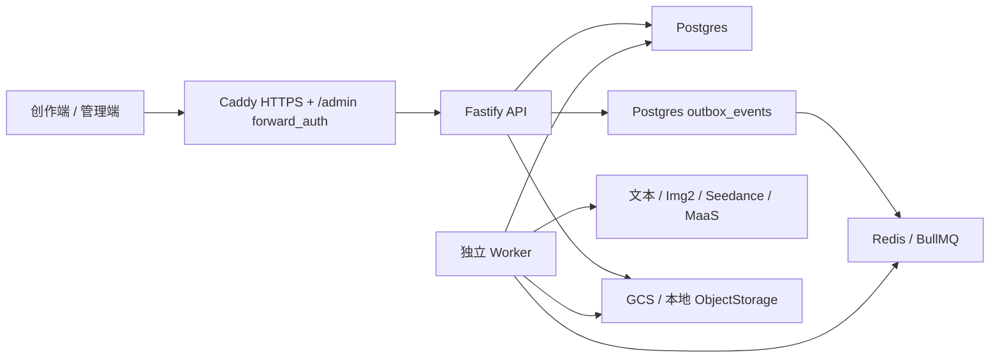

# SEQORA 当前状态

> 核对日期：2026-08-03。本文描述 `main` 和 `https://zjh.ai` 当前产品状态。若与历史开发记忆冲突，以 contracts、Service、Repository、实际 UI 和本文为准。

## 产品定位

SEQORA 是面向网剧、广告和短片的傻瓜式 AIGC 视频制作 Agent。当前可用主流程：

```text
8 位邀请码 + 邮箱验证码注册
  -> 项目库
  -> 智能生成/修改剧本
  -> 资产建议与资产定稿
  -> 分镜/分集
  -> Seedance 视频队列
  -> 分集或全片预览
```

当前适合封闭客户测试和小团队联合开发，不是正式商用 SaaS，也不是带剪辑、配音、字幕和交付编码的完整后期系统。

## 功能矩阵

| 模块           | 用户状态               | 后端状态                    | 说明                                                                      |
| -------------- | ---------------------- | --------------------------- | ------------------------------------------------------------------------- |
| 登录与会话     | 已开放                 | Postgres session            | HttpOnly Cookie、退出、恢复、设备 session、强制改密                       |
| 邀请注册       | 已开放                 | 已生产验证                  | 新邀请码固定 8 位数字；6 位邮箱验证码；Resend 投递；邀请码一次性使用      |
| 忘记密码       | 已开放                 | 已生产验证                  | 邮件发送重置链接；生产不返回 token                                        |
| 邮箱验证       | 已开放                 | 已生产验证                  | 注册/账号验证邮件和待验证页面                                             |
| 项目库         | 已开放                 | Postgres                    | 新建、打开、改名、归档删除、预览封面、内容类型/风格、任务摘要             |
| 功能栈三入口   | 占位                   | 未接工作流                  | 对话一句成片、图片大师、剧本大师仅 UI，按钮禁用                           |
| 短剧本         | 已开放                 | 后台任务                    | 智能生成、重新生成、修改意见、续写下一段/集、模型选择、保存               |
| 资产建议       | 已开放                 | 后台任务                    | 从当前剧本提取人物/场景/物品/服装；用户编辑后再写入资产                   |
| 小说上传与章节 | 页面标记开发中         | API/Repository 实验能力存在 | 不作为客户正式入口；真实样本回归需手工显式执行                            |
| 长剧本创作     | 占位                   | 尚未完成编排 Agent          | 计划是输入 -> 3-5 个大纲 -> 用户确认 -> 世界观/人物关系/分集等            |
| 资产管理       | 已开放                 | Postgres + ObjectStorage    | 人物、场景、物品、服装；音频仅支持上传/配置，不支持 AI 音频生成           |
| 图片生成       | 已开放                 | TokenAdvent GPT Image 2     | 直接导入、参考图再生成、纯文本生成；Nano Banana 未配置且禁用              |
| 人物定稿       | 已开放                 | Worker 图片任务             | 面部、全身、三视图，支持人种/肤色/瞳色/发色、腿部优化、造型版本           |
| 可信人像       | 已开放                 | StringX MaaS Worker         | AI 虚拟人入库、状态刷新、已有 AIGC/真人资源查询和绑定                     |
| 分镜与分集     | 已开放                 | Postgres                    | 按场次生成、动作级细拆、30-300 秒自动分集、手工编辑、参考图、前一版本历史 |
| 视频生成       | 已开放                 | StringX Seedance            | 图片非必需；资产/文本可直接生成；480p/720p/1080p/4K；单镜音频开启         |
| 连续生成       | 已开放                 | 依赖 + 尾帧                 | 分段并发、全片串联、全部独立；链内等待上一镜真实尾帧                      |
| 生成队列       | 已开放                 | Postgres + Outbox + BullMQ  | 后台运行、排队、暂停等待任务、远端取消 StringX、软归档、失败退款          |
| 消息中心       | 已开放但非持久通知系统 | 基于任务轮询                | 完成/失败提示、跳回项目和失败重试；刷新后的通知历史能力有限               |
| 成片预览       | 已开放                 | Worker + FFmpeg             | 分集/全部剧集、已完成片段、完整预览、历史版本、播放和下载                 |
| 正式后期       | 未完成                 | 未实现                      | FFmpeg 当前移除音轨；无配音、混音、字幕、转场时间线和母版输出             |
| 积分账本       | 已开放                 | Postgres ledger             | 扣费、退款、充值、调账、月度用量；部分通用任务价格仍来自客户端            |
| Stripe 支付    | 沙箱/代码能力          | 未正式商用                  | 正式价格、webhook endpoint、税务、发票、通知和对账运营未完成              |
| 管理员端       | 已部署                 | `/api/v1/admin/*`           | 生产路径 `/admin/`；账号、组织、角色、账单、session、审计与风险视图       |

## 当前创作逻辑

### 项目与剧本

- 项目内容类型固定为 `short-drama`、`advertisement`、`animation`，界面显示网剧、广告、短片。
- 项目视觉风格在新建时确定并传入资产和视频提示词；资产级风格字段保留兼容，但 API 会按项目风格归一。
- 网剧自动使用 `web-series` 剧本模式，单集时长可精确设置为 30 到 300 秒，并与分镜自动分集共用同一字段。
- 剧本默认模型是 `glm-5.2`。当前 UI 可选择 GPT 5.6、Kimi K3、GLM 5.2、GLM 5.2 Fast；只有配置了对应 Provider 的模型才能真实调用。
- 剧本生成、续写和资产建议创建 `generation_tasks.kind=text` 后台任务；用户离开页面不会中断，完成后 Worker 写回项目或任务结果。
- 网剧提示词要求 3 到 4 秒快切、场次内动作/表情/配角反应、对白/画外音/内心独白和结尾钩子。分镜仍要人工抽检，不应宣称模型必然满足。

### 资产

- 图片来源分为直接使用原图、参考图再生成和纯提示词生成。
- 场景、物品和服装最多 3 张参考图；人物面部固定 1:1，三视图设定表固定 16:9。
- 高级提示词 UI 以完全覆盖为主；contracts 中 `append | replace` 仍为旧数据兼容，不应在新 UI 重新暴露追加选择。
- 人物只有确认面部基准后才允许创建 StringX AI 人像资源。入库走 Worker，不依赖编辑器保持打开。
- 可信人像必须到 `active` 才能在仿真人视频里使用。`processing` 不能当成功，`failed` 必须展示上游错误。
- 物品/服装提示词必须排除人、人体和局部肢体；场景提示词根据项目/剧本时代推断，结构化模板不是唯一事实源。

### 分镜、视频和成片

- 按场次智能生成会从剧本结构生成镜头并拆动作；动作级细拆是更细的高级入口。
- 网剧镜头时长按 3 到 15 秒规范化，其他项目按 4 到 15 秒规范化。
- 分镜图片可单独生成或上传，但不是 Seedance 视频的硬前置。
- `continue` 镜头等待上一镜视频完成并使用其末帧；如果同时有当前分镜图，则以首/尾帧配对提交。只有首帧时会降级为普通参考图，避免 StringX 的成对校验错误。
- “分段并发”把镜头拆成最多套餐槽位数量的连续链；链之间并发，链内串行。“全片串联”是一条连续链。“全部独立”速度最快但主动放弃尾帧连续性。
- 有效套餐并发目前是免费 1、会员 3。`compose.demo.yml` 中旧演示不限并发变量没有进入账单摘要，不能作为已实现功能。
- 单镜头任务设置 `generateAudio=true`，Provider 可能返回对白/现场声；当前完整预览 FFmpeg 使用 `-an`，因此合成成片无声。
- 成片任务按源视频任务 ID 判定版本是否过期。新分镜或重生镜头后保留上一版预览，并提示重新合成。

## 认证与注册事实

生产默认 `AUTH_MODE=local`：

- 密码使用 scrypt 哈希；普通注册/改密最少 8 位，最大 128 位。
- 生产 bootstrap 密码配置仍要求至少 12 位，这是运维强度要求，不是用户表单下限。
- 新邀请码由管理端创建，当前固定为 8 位数字；数据库只保存 SHA-256 哈希。
- 开放邀请码可以先不绑定邮箱；第一次请求验证码时原子绑定邮箱。
- 验证码是 6 位数字，10 分钟有效；同一入口有冷却、尝试次数和 IP 频率限制。
- 邀请消费后不可重复注册。
- 显示名不唯一，可以重名；账号唯一标识是规范化邮箱。
- 如果邮箱已经存在，接受另一个组织邀请不会创建第二个账号。注册页密码用于验证原账号；忘记时必须先走密码重置，再用重置后的密码完成邀请。
- 生产邮件 Provider 是 Resend，负责注册验证码、邮箱验证、密码重置和邀请。密钥和发件人只存在生产 secret/env。

## 运行架构



Postgres 是账号、组织、账单、项目、资产、分镜、生成任务、AI Job 和小说域的业务来源。Redis/BullMQ 只承载触发队列。JSON Store 仍承载本地媒体索引、兼容缓存和迁移输入，不能重新扩大为核心业务数据库。

## 生产快照

- 域名：`https://zjh.ai`
- GCE 项目：`project-b3b9bf9e-3c8b-4fbc-9cc`
- 实例：`instance-20260726-112218`
- 区域：`asia-east2-b`
- 部署目录：`/opt/seqora`
- 当前形态：单机 Docker Compose，Postgres、Redis、API、Worker、Web/Caddy 五个服务。
- 数据盘：约 250 GB 系统盘；2026-08-03 核对使用率约 4%。
- API `8787` 不对公网开放；公网只开放 80/443，HTTPS 由 Caddy 处理。
- 管理端随 Web 镜像构建到 `/admin/`，未授权访问由 Caddy 和 API 双层拒绝。
- 2026-08-03 核对：健康接口 `status=ok`、readiness 为 true，文本、Img2、Seedance 和 MaaS 均显示 configured。

生产凭据、邀请码和用户信息不得写进本文。具体巡检和发布见 `OPERATIONS_RUNBOOK.md`。

## 已知风险

### P0：扩大外测前

1. 通用 `generation_tasks.estimatedCredits` 仍可由客户端提交，需要服务端定价表和报价确认，避免伪造低价格。
2. 完整成片会移除 Seedance 音轨；需要音轨归一、拼接、对白/环境声验收和无音轨兜底。
3. 注册、重置和邮件投递虽已生产可用，仍需投递失败告警、退信处理和运营可见状态。
4. CI/CD 工作流代码已存在，但在没有看到目标仓库最近一次成功生产发布前，运维不得假设自动发布一定可用。
5. 备份恢复、Redis 故障、Worker 重启、重复 Outbox 投递和三路并发需要定期生产演练。

### P1：正式收费前

1. Stripe 正式价格、webhook、支付失败通知、退款运营、税务与发票。
2. 用户协议、隐私政策、版权授权、数据导出和删除。
3. 持久消息中心、任务邮件通知和管理员告警。
4. 正式音频、字幕、粗剪时间线、转场和交付预设。
5. Provider 成本、延迟、错误码和额度的可观测仪表盘。

### P2：规模化

1. Worker 横向扩缩容、按任务类型队列和独立合成 Worker。
2. 托管 Postgres/Redis、CDN、对象生命周期和跨区备份。
3. 对话一句成片 Orchestrator：规划、预算确认、阶段审批、恢复和人工接管。
4. 长篇小说的大纲多方案、Story Bible、分集和单集重生完整产品化。

## 下一位开发者建议

不要从功能栈 UI 直接写一个巨大 Agent。先把当前主流程抽成可恢复的阶段状态机：`plan -> confirm -> script -> assets -> shots -> videos -> compose`，每阶段保存输入、输出、成本、任务 ID 和人工确认。第一优先级仍应是服务端定价和带音轨成片，它们直接决定外测可信度和成本安全。
