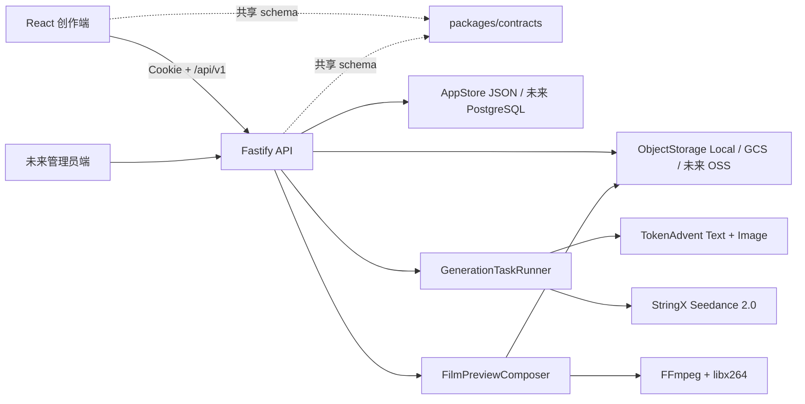

# SEQORA 项目开发记忆与接手手册

> 最后更新：2026-07-23
> 仓库：`usaaron/AIGC_Video_Platform`
> 本地目录：`C:\Users\admin\Desktop\图片\aigc-studio-demo`
> 当前目标：先把除音频外的创作全流程做成客户可真实测试的 Demo，再逐步替换为生产基础设施。

这份文档是项目的长期开发记忆。新的开发者或新的 AI 会话应先阅读本文，再查看 `git status`、`.env.example` 和相关源码。文档只记录环境变量名称，**绝不记录真实 API Key、Cookie、云凭据或用户上传内容**。

## 1. 一句话产品定义

SEQORA 是面向漫剧、短剧和动画短片团队的一站式 AIGC 创作工作台。产品设计原则是：比专业剪辑软件更简单，按照固定步骤从故事走到可播放视频，让没有培训经验的客户也能直接测试。

当前创作流程：

```text
登录
  -> 创建项目并确定画面比例
  -> AI 生成或编辑中文剧本
  -> 创建人物/场景/物品/服装资产
  -> 人物面部确认 -> 全身确认 -> 三视图
  -> 仿真人物完成 AIGC 入库，真人完成本人授权并绑定 Asset ID
  -> 按剧本拆分分镜
  -> 可选生成分镜静帧
  -> 以分镜图或项目资产为参考生成 Seedance 视频
  -> 按镜头顺序合成一个完整 MP4 预览
  -> 在成片页完整播放、保存版本或导出项目 JSON
```

音频资产表单已经存在，但真实音频 Provider 暂未接入。不要把音频写成“已跑通”。

## 2. 产品决策与范围

### 已确定的产品决策

- 前后端分离，创作端、API、共享契约和未来管理员端保持独立边界。
- 用户界面使用中文，交互应简单、一目了然，不模仿专业剪辑软件的复杂工作台。
- 项目级画面比例支持 `9:16`、`16:9`、`1:1`，资产和分镜默认继承项目比例。
- 项目概览允许直接编辑故事简介；剧本快速生成、专业视觉细节补齐和专业审核使用用户当前选择的视觉方向。视觉方向后续应升级为项目级持久字段。
- 剧本创作方向包含视觉风格、构图倾向、光影基调、运镜节奏和扩写重点；快速生成按钮明确只生成 15 到 30 秒视频的 4 到 6 场故事骨架，完成后才显示“补齐专业视觉细节”，避免用户误以为下拉框是独立装饰。会员才可调用七维专业审核。
- 项目概览封面和成片播放器必须继承项目比例；视频使用 `contain` 完整显示，不能为填满容器裁切画面。
- 人物必须按“面部 -> 全身 -> 三视图”的顺序定稿，后续阶段自动使用已确认基准图。
- 人物支持真人或动物、性别、年龄、具体年龄、画风、体型、背景和腿部比例优化。
- 人物参数位于当前阶段结果区上方，资产卡始终优先用已确认面部作为封面。
- Seedance 不直接接收任意真人人脸图。AI 仿真人先进入 `AIGC` 素材库；真人必须由本人在方舟完成认证和授权，再绑定 `LivenessFace` Asset ID。
- 三视图保留正面、侧面、背面三张源图，前端默认展示并下载成一张三栏设定表。
- 场景、物品、服装是三个独立资产类型，不合并。
- 所有资产图片支持统一放大、下载和关闭；图片任务可以确认入队后在后台继续生成并退出编辑器。
- 图片和剧本文本由 TokenAdvent 生成；视频与可信素材统一走弦序：`maas.stringx.top` Seedance 2.0 + `maas-ark.stringx.top` MaaS 素材库。Aideos 是独立第三方中转，不属于弦序。
- 剧本页提供“一键尝鲜”：先自动保存当前剧本，再分析最小主要人物、服装和场景清单，展示服务端积分与时间报价，用户确认后再批量建单；分析阶段不能直接产生图片费用。
- 一键尝鲜入口位于剧本页顶部主操作区；模型返回非法 JSON 时，服务端会尝试修复，仍失败则从剧本的角色、场景和服装字段提取最小资产计划，避免客户看到“功能无响应”。
- 超过 2,000 个非空白字符的长剧本进入保留原稿模式，模型必须保留全部场景和剧情事实；若模型输出比原稿短超过 15%，服务端拒绝覆盖并自动保留原稿。
- 免费版每个用户同时运行 1 个生成任务，会员版同时运行 3 个。
- 封闭外测使用本地账号密码和签名 HttpOnly Cookie，不开放注册；生产空数据卷只创建环境变量指定的创作者和管理员账号，默认不写入演示项目。
- 登录前只加载认证页面，工作台和各流程页面按需拆包；前端任务轮询按运行中、空闲和后台标签页动态降频。
- 第三方任务失败必须自动退还平台积分，退款必须幂等。
- 管理员、权限、多租户和订阅能力预留边界，但当前只做适合三人团队的模块化单体，不提前拆微服务。

### 当前不做

- 真实音频生成、配音、混音和最终音轨合成。
- 带音轨、字幕和交付参数的正式成片导出；当前只生成无声完整预览 MP4。
- 真实支付、自动续费、发票和套餐购买。
- PostgreSQL、Redis、消息队列、正式 OIDC、阿里云 OSS 的生产部署。
- 完整管理员端 UI。`apps/admin` 当前只是独立边界占位。

## 3. 当前真实完成状态

### 已跑通功能

- 本地账号登录、退出、会话恢复和权限校验。
- 登录页不预填或展示 Demo 凭据；认证响应禁止缓存，Cookie 使用 `SameSite=Strict`，任意受保护 API 返回 `401` 时前端立即清除会话并回到登录页。
- 生产首次初始化支持 `BOOTSTRAP_DEMO_WORKSPACE=false`，保留账号和初始积分但不创建“午夜胶片”、演示资产或演示分镜。
- 生产启动同时强制要求当前视频 Provider 密钥和 `TOKENADVENT_API_KEY`，避免客户环境因漏配密钥静默返回 Mock 图片或文本。
- Web 登录入口、工作台和九个页面已按需拆包；移除 Google Fonts 运行时依赖，任务同步间隔为运行中 2.5 秒、空闲 12 秒、后台 30 秒。
- Demo Compose 已设置 API/Web CPU、内存、PID 和轮转日志上限，默认面向 2 vCPU / 4GB 封闭外测机器。
- 项目创建、切换、设置、比例继承和版本保存。
- TokenAdvent 中文剧本默认走快速模式并保存到项目：一次逻辑调用生成适合 15 到 30 秒视频的 4 到 6 场、约 800 到 1600 字的故事骨架、可视动作和基础对白；服务端返回警告，不再自动进行第二次完整重写。用户可以主动点击“补齐专业视觉细节”，通过独立接口补充风格、构图、光影、运镜和衔接。
- 人物本地导入或 AI 生成。
- Fresh Seed 不再预置林夏、周野人物资产；读取旧本地数据时会按固定演示 ID 清理这两项，人物分类默认从空状态开始，不影响用户创建的真实资产。
- 人物大头照、面部确认、参考图全身生成、全身确认、腿部优化和三视图生成。
- 资产卡、参考图、人物候选和三视图源图的统一图片预览与鉴权下载。
- 人物各阶段及场景、物品、服装的“后台生成并退出”。
- 资产生成卡和人物阶段预览共用 `GenerationProgress.jsx`，统一显示“发起申请 -> 调用模型 -> 生产中 -> 已完成/失败”，并根据任务的 `providerState` 和 `progress` 实时更新。
- 场景、物品、服装的结构化选项、标准提示词和高级自定义提示词。
- TokenAdvent 文生图和参考图编辑。
- 一键尝鲜真实分析 1-2 个主要人物、1-2 套服装和 1-2 个核心场景；自动跳过已有同名资产，人物先生成面部候选，批次执行由服务端定价、校验剧本指纹、幂等扣费并加入现有生成队列；模型结构化输出异常时使用确定性字段提取兜底。
- 本地对象存储和 GCS 对象存储接口。
- 分镜提供“按场次拆分”和“动作级细拆”：场次模式保留最多 8 个非空段落的原规则，动作模式读取制作级剧本的动作字段，每个分号动作生成一个 5 到 6 秒镜头，每场最多 4 镜、全片最多 48 镜；两种模式都不调用文本 Provider，另有手动添加镜头。
- 剧本场景卡、角色卡和对白段会插入可直接填写的制作字段，不是简单空标签。
- 剧本页专业审核调用真实文本 Provider，服务端强制会员权限并校验七维 JSON 结果；默认按钮是“快速生成剧本”，快速生成完成后才显示“补齐专业视觉细节”，两次操作分别调用独立接口并显示对应加载态。
- 分镜自动选择最多三项相关项目资产，人物优先使用已确认全身基准；旧分镜会标记为“需同步资产”。
- 单镜头和批量视频都可跳过分镜图，直接使用匹配资产或纯提示词提交 Seedance；只有已主动创建的分镜图任务需要等待依赖。
- 弦序 Seedance 参考资产视频生成、状态续查、Range 代理播放和尾帧持久化；Aideos 仅保留为显式回滚 Provider。
- 人物编辑器提供可信人像状态、AI 人像自动入库、已授权真人 Asset ID 校验绑定和状态刷新；Active 资源在视频建单时自动改用 `asset://<asset_id>`。
- 人物编辑器新增弦序素材库“同步白名单”：按官方要求先查 `ListAssetGroups`，再按 `GroupIds` 查 `ListAssets`，可分别选择 `AIGC` 虚拟人或 `LivenessFace` 已授权真人；列表显示可放大的预览图、名称、Asset ID 和状态，点击 Active 卡片即可选择，仍保留手动 ID 输入。绑定结果会立即写回当前编辑器并持久化，重新进入不需要再次绑定；Processing 虚拟人每 4 秒自动刷新，重复点击不会重复创建素材。
- 分镜批量视频采用“段间并发、链内串行”：`parallel` 只在明确的 `independent` 场次之间并发，绝不为了凑满 3 路而拆断 `continue` 链；`continuity` 会把全部镜头改成一条尾帧承接链。服务端只有在前置任务真实生成 `last-frame` 后才提交下一镜。
- 仿真人和已授权真人没有 Active 方舟资源时，服务端在积分预扣前拒绝视频任务，避免把普通图片直接送入人脸审核。
- 分镜连续性工作台支持 `independent` 和 `continue`：连续镜头等待上一任务完成，读取其 `last-frame` 并作为当前任务的 `first_frame`；独立镜头保持套餐并发。
- 批量视频提供“并发优先 / 连续优先”。并发优先会保留天然场次边界，并在边界不足时把最长连续链均衡拆成最多 3 条链；链内继续用尾帧承接，链首保存为独立切镜。连续优先不拆现有链。按场次拆分的每个镜头都是独立链，动作级细拆则每个场次首镜独立、场内后续镜头连续。
- 图片与视频任务在 Worker 提交前统一编译 `quality-floor-v1` 质量规则，保留规则版本、预设和用户自定义负面提示词审计字段。
- 批量和单镜头生成前可选 `480p`、`720p`、`1080p`、`4k`，任务保存实际选择。
- 免费/会员并发、积分预扣、失败退款和账本。
- 等待任务可暂停和继续；单任务删除会先暂停、幂等退款，再通过 `queueHiddenAt` 从队列隐藏。
- 队列界面对 `queued` / `paused` 任务提供暂停、继续和删除退款；运行中的 StringX 视频可真实调用远端 `cancel` 后删除退款。Aideos 运行中仍不可暂停或删除，不能在产品层伪造状态。
- 任务归档。归档只隐藏队列记录，不删除图片/视频任务，因为输出 URL 依赖任务记录。
- 成片页默认展示由真实 Seedance 镜头按顺序合成的一个完整 MP4，也可切换单镜头；播放器和概览预览支持 `9:16`、`16:9`、`1:1`。
- 完整预览由本地 FFmpeg 统一尺寸和编码后写入 `ObjectStorage`，不再次调用第三方、不扣积分；镜头源任务变化后必须重新合成。
- 管理员概览 API 和创作者/管理员隔离。

### 2026-07-18 本地验收数据

`apps/api/data/app.json` 在本次开发热重载期间已回到约 8 KB 的 Seed 数据，原“客户全流程验收”工作区当前不可用。现有活动数据是 `Midnight Film`：4 个资产、5 个分镜、0 个已完成生成任务、免费方案 286 积分。不要声称旧验收图片和视频仍存在，也不要为了验证合成功能自动创建付费 Seedance 任务。

因此当前页面会正确显示“已完成 0/5 个镜头视频”并禁用“合成完整预览”。客户测试时需要先让 5 个分镜分别完成真实视频生成，按钮才会启用；合成过程本身不产生第三方费用。

旧工作区曾真实验证过人物、资产、分镜图和 Seedance 单镜头视频链路，相关 Provider 结论仍有效，但旧关系数据和输出不能视为当前可用验收样本。

验收时真实发现并修复过三个 Provider 边界：

1. Seedance 2.0 任务统一限制为 4 到 15 秒，Web、Contracts、共享提示词和 Worker 使用同一边界。
2. 携带 Base64 参考图的建单可能超过 30 秒，Seedance 请求超时已调整为 120 秒。
3. 第三方失败原先仍扣积分，现在失败会创建 `refund-<taskId>` 调整账本，只退款一次。

## 4. Git 状态与交接警告

编写本文时：

- 当前分支：`main`
- 远端：`origin -> git@github.com:usaaron/AIGC_Video_Platform.git`
- 远端基线提交：`d1f431a feat: connect Aideos Seedance video provider`
- TokenAdvent、真实剧本/图片/分镜/成片、退款和任务归档等改动仍是**本地未提交变更**。
- 用户明确要求当前阶段不要自动上传。没有新的 commit，也没有 push。

接手后第一步必须执行：

```bash
git status --short --branch
git diff --check
```

不要执行 `git reset --hard`、`git checkout --` 或删除 `apps/api/data/`。这些操作会丢失本地代码或真实验收数据。准备提交时只暂存源码、文档和 `.env.example`，绝不能暂存 `apps/api/.env`、`apps/api/data/` 或生成媒体。

当前改动主要分布：

- API Provider：`apps/api/src/core/generation/`
- 完整预览合成：`apps/api/src/core/film/`
- 任务编排：`apps/api/src/core/jobs/taskDispatcher.ts`
- 项目/生成路由与服务：`apps/api/src/modules/projects/`、`apps/api/src/modules/generation/`
- Provider 装配：`apps/api/src/app.ts`、`apps/api/src/config.ts`
- 创作流程：`apps/web/src/App.jsx` 和 `apps/web/src/pages/`
- 资产设计：`apps/web/src/features/assets/`
- 共享契约：`packages/contracts/src/`
- Provider 文档：`docs/ASSET_GENERATION.md`

## 5. 技术栈和仓库结构

### 技术栈

- Node.js `>=22.12`
- pnpm `>=11`
- React 19 + Vite 8
- Fastify 5 + TypeScript 5.9
- Zod 4 共享契约
- Vitest 4
- oxlint + Prettier
- 本地 JSON 仓储或进程内内存仓储
- 本地文件系统或 Google Cloud Storage
- FFmpeg + libx264（完整预览合成）
- Docker Compose + Caddy（外部测试同域 HTTPS 部署）

### Monorepo

```text
apps/
  web/       React 创作端；登录、项目、剧本、资产、分镜、队列、成片、账单、设置
  api/       Fastify API；认证、项目、媒体、生成、计费、管理员模块
  admin/     未来独立管理员端的边界占位
packages/
  contracts/ 前后端共享 Zod schema、类型、角色和权限
docs/        架构、权限、Provider、部署、规范和本交接文档
```

不要在 Web 和 API 之间复制领域枚举。请求/响应字段、角色、权限和核心实体应先修改 `packages/contracts`。

## 6. 总体架构



API 仍是模块化单体。路由负责协议和校验，Service 编排业务，Repository/Provider 处理基础设施。保持这个边界，不要让 React 直接调用第三方 Provider，也不要让路由直接读写 JSON 文件。

## 7. 核心领域模型与不变量

### 项目

项目保存名称、内容类型、画面比例、状态、简介、剧本和版本。项目读取返回：

```ts
{
  ;(project, assets, shots)
}
```

所有 Repository 查询必须使用服务端认证得到的 `tenantId` 和 `userId`。客户端传入租户 ID 不可信。

### 资产

稳定资产类型：

- `character`
- `scene`
- `prop`
- `costume`
- `audio`

资产同时保存结构化 `attributes`、编译后的 `prompt`、高级提示词、负面提示词、最多三张 `references` 和最终 `imageUrl`。

### 人物阶段状态

人物关键字段：

- `faceStatus`: `pending | approved`
- `bodyStatus`: `pending | approved`
- `faceReference`
- `bodyReference`
- `legStretch`
- `turnaround`
- `turnaroundLayout`: `sheet | separate`
- `portraitSource`: `ai-virtual | authorized-real`
- `trustedPortrait`: 方舟 Asset ID、Group ID、GroupType、状态、错误和最近校验时间

必须遵守：

1. 面部候选完成后用户明确“设为面部基准”，才解锁全身。
2. 全身请求只带确认的面部参考图。
3. 用户确认全身基准后才解锁三视图。
4. 三视图请求带面部和全身参考图，输出 `front`、`side`、`back`。
5. 前端下载的一张三栏表是 UI 合成结果；服务端仍保留三张独立源图。
6. 人物卡片封面必须优先读取 `faceReference`，不能被后续全身任务写入的 `imageUrl` 覆盖。
7. “后台生成并退出”必须在创建任务接口返回成功后再关闭编辑器；失败时保留草稿和错误提示。
8. 仿真人视频引用必须先完成 AIGC 入库；真人必须完成控制台本人认证、授权和制作方接收，代码只能查询及绑定。
9. `trustedPortrait.status=active` 时视频使用 `asset://<asset_id>`；Img2 图片生成继续使用本地参考图，不能混用。

### 分镜

分镜保存顺序、标题、景别、时长、提示词、负面提示词、连续模式和 `imageUrl`。场次拆分按非空段落生成最多 8 镜；动作级细拆按制作级剧本“动作”字段生成最多 48 个单动作镜头。两者都不写入旧版通用演示图片。当前接口仍使用 `replaceShots()` 直接删除项目旧分镜并创建新 ID，没有二次确认或撤销，旧生成任务仍引用旧镜头 ID。

### 生成任务

主要状态：

```text
queued -> running -> completed
                  -> failed
```

任务的 `clientRequestId` 用于幂等扣费和重复创建保护。远端状态保存在 `metadata`：

- `providerName`
- `providerState`
- `providerTaskId`
- `providerPolledAt`
- `providerPollErrors`
- `generatedOutputs`
- `dependsOnTaskId`
- `dependsOnTaskIds`
- `continuityMode`
- `continuitySourceTaskId`
- `videoInputMode`
- `qualityRuleVersion`
- `qualityPresetIds`
- `compiledNegativePrompt`
- `userNegativePrompt`
- `referenceAssetIds`
- `creditsRefundedAt`
- `queueHiddenAt`

完整预览也复用 `GenerationTask`，但使用 `provider: "local-compose"`、`generationStage: "film-preview"` 和 `estimatedCredits: 0`。`sourceVideoTaskIds` 必须按分镜顺序保存；输出位置记录在 `previewStorageKey`。它由 `FilmPreviewComposer` 执行，不能进入 Seedance 并发计算，也不能被本地模拟任务进度覆盖。

图片和视频受保护 URL 都依赖任务记录。**归档只能设置 `queueHiddenAt`，不能删除已完成任务。** 删除任务会让资产图片、分镜图和成片视频失效。

## 8. Provider 记忆

### TokenAdvent

默认 Base URL：`https://tokenadvent.com`。

已验证端点：

- `POST /v1/chat/completions`
- `POST /v1/images/generations`
- `POST /v1/images/edits`

默认模型：

- 文本：`gpt-5.6`（2026-07-23 已通过 TokenAdvent 模型列表确认可用）
- 图片：`gpt-image-2`
- 图片质量：`low`

图片生成响应使用 `data[0].b64_json`。参考图编辑使用 multipart，字段名是 `image[]`，最多上传三张本地对象存储参考图。

快速剧本生成使用 `max_completion_tokens=2400` 和 SSE 流式响应，一次逻辑调用输出 4 到 6 个单行场景，每场包含场次、剧情、场景、角色、动作和对白；服务端返回 `mode: quick` 与 `warnings`，不进行自动完整重写。用户主动补齐视觉细节时使用 `/script/enrich` 和 `max_completion_tokens=4000`，在保留快速剧本内容的前提下补充风格、构图、光影、运镜和衔接，返回 `mode: detailed`。Provider 对连接重置、超时和可重试上游状态自动重试一次；仍失败时返回 `TEXT_PROVIDER_FAILED`，并保留原剧本。

尺寸映射：

| 比例       | Provider size |
| ---------- | ------------- |
| `9:16`     | `1024x1536`   |
| `16:9`     | `1536x1024`   |
| 其他/`1:1` | `1024x1024`   |

相关文件：

- `tokenAdventTextProvider.ts`
- `tokenAdventImageProvider.ts`
- `textProvider.ts`
- `imageProvider.ts`

### 弦序 Seedance 2.0

默认 Base URL：`https://aideos.openrouter.icu`，默认模型：`doubao-seedance-2-0-260128`。

端点：

- `POST /v1/video/generations`
- `GET /v1/videos/:taskId`
- `GET /v1/videos/:taskId/content`

请求规则：

- `seconds` 以字符串发送，平台统一限制为 4 到 15 秒。
- `metadata.resolution` 允许 `480p`、`720p`、`1080p`、`4k`；`metadata.ratio` 使用项目比例，`generate_audio` 当前为 `false`。
- `images` 是最多 9 个字符串。Worker 内部先按 `first_frame/reference_image` 编排，再扁平化提交，因此连续镜头末帧必须排第一，`asset://<asset_id>` 必须原样保留。
- 本地受保护分镜图和资产图由 Worker 读取为 Base64 Data URL；没有图片时直接发送纯文本。
- 请求默认带 `return_last_frame: true`，但 Aideos 文档没有定义独立尾帧 URL。视频完成后 Provider 流式下载 MP4 到临时目录，用 FFmpeg 截取 JPEG 末帧，写入 `ObjectStorage` 后清理临时文件。
- 浏览器通过本地鉴权 content 路由播放；Provider 转发 `Range` 并透传 `206/Accept-Ranges/Content-Range`，前端不接触弦序 Token。
- 建单最长等待 120 秒；拿到远端任务 ID 后每 `VIDEO_POLL_INTERVAL_MS` 轮询，默认 5 秒。
- 负面提示词以 `【质量约束】...` 合入 prompt，因为 Aideos 没有文档化的独立负面字段。
- 当前默认装配由 `VIDEO_PROVIDER=stringx` 控制，任务审计字段为 `providerName=stringx-seedance`。Aideos 与官方 Ark 分别保留为显式回滚实现。
- 2026-07-20 曾通过第三方 Aideos 完成 `480p`、`9:16`、4 秒动态视频冒烟；该结果只能证明 Aideos 链路，不代表弦序视频链路。弦序直连鉴权和协议已验证，真实生成当前受成员积分额度阻塞。

#### 素材库与真人授权

- 素材库 Host：`https://maas-ark.stringx.top`，Action API 版本 `2024-01-01`。
- 素材库使用独立 AK/SK SigV4；Aideos Bearer Token 不能调用素材库。
- `AIGC` 支持 `CreateAssetGroup/CreateAsset`；图片 URL 必须公网可下载，创建后轮询 `GetAsset` 到 `Active/Failed`。
- `LivenessFace` 只能在方舟控制台创建、真人认证、上传和授权，OpenAPI 只允许查询。
- 真人授权控制台入口由后端配置接口返回；不要把二维码、身份证明或人脸原图保存到项目 JSON。
- Asset ID、素材库 AK/SK 和 StringX 视频 Token 必须属于同一个弦序租户/项目；素材 `ProjectName` 默认 `default`。
- 当前代码已完成签名、AIGC 创建、Asset 查询绑定、状态映射、短期素材下载令牌和 `asset://` 视频引用。
- **当前运行配置**：StringX 视频 Token 与 MaaS AK/SK 已在忽略的本地 `.env` 中配置并真实鉴权成功。人物“林夏”由人工上传后已成为 Active 资源；自动入库仍需要稳定 `PUBLIC_API_BASE_URL` 或对象存储。聊天中暴露过的全部凭证上线前必须轮换。

相关文件：

- `aideosSeedanceProvider.ts`
- `volcArkSeedanceProvider.ts`（仅回滚）
- `videoProvider.ts`
- `taskDispatcher.ts`

### Provider 安全规则

- Key 只允许存在于 `apps/api/.env` 或部署平台 Secret Manager。
- 禁止把 Key 写进 Markdown、测试、前端 `VITE_*` 变量、提交记录或错误截图。
- `.env.example` 只能保留空值和变量说明。
- 真实调用会产生外部费用。测试时先做一段剧本、少量低质量图片和一个 5 秒视频。

## 9. GenerationTaskRunner 工作方式

`GenerationTaskRunner` 是当前进程内 Worker，每 900ms 执行一次 tick：

1. 补偿历史失败但尚未退款的任务。
2. 按用户套餐计算可用并发：免费 1、会员 3。
3. 检查 `dependsOnTaskId` / `dependsOnTaskIds`；依赖未完成继续等待，依赖失败则终止并退款。
4. 把可运行的 queued 任务标记为 running。
5. 图片任务同步等待 TokenAdvent 返回 Base64，再写入 `ObjectStorage`。
6. 视频任务提交后保存 `providerTaskId`，后续 tick 轮询状态。
7. 完成图片任务时更新对应 `asset.imageUrl` 或 `shot.imageUrl`。
8. 失败时保存可见错误，并用 `refund-<taskId>` 账本幂等退款。

调度器会在同一个 tick 中先原子占用最多 3 个可用槽位，再通过 `Promise.all` 向 Provider 提交所有已选任务。`taskDispatcher.test.ts` 使用阻塞式 Provider 证明会员在任一提交返回前已经发出 3 次 `submit`，免费账号在相同条件下只发出 1 次。队列页显示的是实际远端运行数 / 套餐上限，例如 `2 / 3`，不再把上限 3 误写成当前并发数；`local-compose` 不占远端并发。

视频提交前还会执行两次提示词保护：Web 先编译用于预览和任务记录，Worker 再基于服务端项目、分镜和资产重新编译，避免客户端篡改或旧队列漏规则。图片任务使用 `negativePrompt` 字段；Aideos 没有文档化的独立负面字段，因此 Provider 把编译结果合并到文本的 `【质量约束】` 段落。

连续镜头的状态链是：上一任务完成且有尾帧 -> 当前任务解除依赖 -> Worker 读取尾帧 -> 以 `first_frame` 提交 Seedance。上一任务失败、被取消或没有尾帧时，当前任务不会提交。连续模式因此会牺牲这一条链上的并发换取更好的首尾约束；完全独立的镜头不受影响。

批量并发规划位于 `apps/web/src/features/storyboard/videoBatchPlanner.js`。不要重新在页面循环里无条件把 `previousVideoTask` 传给下一镜，否则会再次把所有镜头串成单链，导致会员看似有 3 路额度但实际只能运行 1 路。

任务控制规则：

- `queued` 可切换为 `paused`，暂停任务不参与 Worker 调度，也不占并发。
- `paused` 可恢复为 `queued`；存在未完成依赖时仍继续等待依赖。
- 删除等待任务时，服务端在同一仓储事务中先置为 `paused`，再写入 `queueHiddenAt/deletedAt`；预扣积分通过 `refund-<taskId>` 只退一次。
- 删除完成或失败任务只从队列隐藏，不物理删除任务和输出，避免资产、分镜或成片 URL 失效。
- StringX 已接入运行中取消接口；Aideos 没有可验证的暂停或取消接口，因此 Aideos 运行中任务不展示删除操作，API 返回 `409` 防止伪造。

进程重启恢复规则：

- 视频任务有 `providerTaskId`：继续轮询，不重复提交，不重复扣费。
- 任务处于 `submitting` 但没有 `providerTaskId`：无法确认远端是否建单，标记失败并退款，用户可重试。
- 已完成图片保存在对象存储，任务描述符保存在 JSON。

不要让 `dispatch()` 等待完整图片生成，否则创建任务 API 会阻塞。当前 `dispatch()` 只触发后台 tick。

## 10. 前端关键结构

`apps/web/src/App.jsx` 是当前页面编排中心，管理：

- 当前项目工作区
- 任务轮询（1.5 秒）
- 账单和会话刷新
- 页面导航
- 生成任务 payload

项目切换有过真实竞态：旧项目轮询响应会覆盖新项目。当前 effect 使用 `cancelled` 标记阻止过期响应写回。修改轮询时必须保留这个保护，最好后续迁移到带 query key 和取消请求的数据层。

页面：

| 文件                 | 职责                                       |
| -------------------- | ------------------------------------------ |
| `LoginPage.jsx`      | 登录和 Demo 账号切换                       |
| `OverviewPage.jsx`   | 项目摘要和流程状态                         |
| `ScriptPage.jsx`     | 剧本编辑、上传、真实 AI 扩写               |
| `AssetsPage.jsx`     | 资产分类、创建、编辑和生成入口             |
| `StoryboardPage.jsx` | 分镜编辑、静帧和视频生成                   |
| `GenerationPage.jsx` | 队列、状态、错误、结果链接和归档           |
| `FilmPage.jsx`       | 真实视频播放、静帧回退、时间线、版本和导出 |
| `BillingPage.jsx`    | Demo 套餐、积分余额和账本                  |
| `SettingsPage.jsx`   | 项目设置、账号信息和退出                   |

资产功能：

- `AssetEditor.jsx`：通用资产编辑器。
- `CharacterWorkflow.jsx`：人物三阶段状态机。
- `AssetFields.jsx`：场景/物品/服装/音频结构化控件。
- `assetOptions.js`：选项和默认值唯一来源。
- `promptCompiler.js`：中文标准提示词、高级 append/replace 和人物阶段提示词。
- `ReferenceUploader.jsx`：本地参考图上传。

## 11. API 路由速查

所有业务路由前缀为 `/api/v1`。

### 认证

- `POST /auth/login`
- `POST /auth/logout`
- `GET /auth/me`

### 项目、资产、分镜

- `GET /projects`
- `POST /projects`
- `GET /projects/:projectId`
- `PATCH /projects/:projectId`
- `POST /projects/:projectId/versions`
- `POST /projects/:projectId/script/generate`
- `POST /projects/:projectId/script/review`：会员专属结构化专业审核
- `POST /projects/:projectId/quick-start/plan`：分析最小资产闭环并返回积分/时间报价
- `POST /projects/:projectId/quick-start/execute`：原子创建尝鲜资产、积分流水和图片任务
- `POST /projects/:projectId/assets`
- `PATCH /projects/:projectId/assets/:assetId`
- `DELETE /projects/:projectId/assets/:assetId`
- `GET /trusted-assets/configuration`
- `POST /projects/:projectId/assets/:assetId/trusted-portrait/register`
- `POST /projects/:projectId/assets/:assetId/trusted-portrait/bind`
- `POST /projects/:projectId/assets/:assetId/trusted-portrait/refresh`
- `POST /projects/:projectId/shots`
- `PATCH /projects/:projectId/shots/:shotId`
- `POST /projects/:projectId/shots/generate`

### 媒体与生成

- `POST /projects/:projectId/media`
- `GET /media/:mediaId`
- `POST /generation/tasks`
- `GET /projects/:projectId/generation/tasks`
- `GET /generation/tasks/:taskId/outputs/:view`
- `GET /generation/tasks/:taskId/content`
- `DELETE /projects/:projectId/generation/tasks/completed`：实际语义是归档队列记录，不删除输出。

### 计费与管理

- `GET /billing/summary`
- `PUT /billing/plan`
- `GET /admin/overview`

### 健康检查

`GET /api/v1/health` 返回 API 和四个 Provider 是否配置：`seedance`、`img2`、`text`、`assetLibrary`；`providerNames.seedance` 会明确显示 `stringx-seedance`、`aideos-seedance` 或 `volc-ark-seedance`，避免只看到“configured”却无法判断真实路由。

## 12. 环境变量

从 `apps/api/.env.example` 创建本地 `apps/api/.env`。不要使用 `CONTRIBUTING.md` 中过时的 `.env.local` 说法，API 当前读取 `.env`。

```dotenv
NODE_ENV=development
API_HOST=127.0.0.1
API_PORT=8787
WEB_ORIGIN=http://localhost:5173
PUBLIC_API_BASE_URL=
TRUST_PROXY=false
RATE_LIMIT_MAX=300

AUTH_MODE=local
AUTH_SECRET=<至少 32 位随机值>
BOOTSTRAP_CREATOR_NAME=<创作者显示名>
BOOTSTRAP_CREATOR_EMAIL=<空数据卷首次创建的创作者邮箱>
BOOTSTRAP_CREATOR_PASSWORD=<唯一强密码>
BOOTSTRAP_ADMIN_NAME=<管理员显示名>
BOOTSTRAP_ADMIN_EMAIL=<空数据卷首次创建的管理员邮箱>
BOOTSTRAP_ADMIN_PASSWORD=<唯一强密码>
BOOTSTRAP_DEMO_WORKSPACE=false
DATA_FILE=./data/app.json

STORAGE_DRIVER=local
UPLOAD_DIR=./data/uploads
MAX_UPLOAD_BYTES=10485760
GCS_BUCKET=

VIDEO_PROVIDER=stringx
STRINGX_BASE_URL=https://maas.stringx.top/api/v3
STRINGX_API_KEY=<从弦序令牌管理或部署 Secret 注入>
STRINGX_VIDEO_MODEL=doubao-seedance-2-0-260128
STRINGX_REQUEST_TIMEOUT_MS=120000

# 仅 VIDEO_PROVIDER=aideos 回滚时使用
AIDEOS_BASE_URL=https://aideos.openrouter.icu
AIDEOS_API_KEY=<从密码管理器或部署 Secret 注入>
AIDEOS_VIDEO_MODEL=doubao-seedance-2-0-260128
AIDEOS_REQUEST_TIMEOUT_MS=120000
VIDEO_POLL_INTERVAL_MS=5000

# 仅 VIDEO_PROVIDER=volc-ark 回滚时使用
ARK_API_BASE_URL=https://ark.cn-beijing.volces.com/api/v3
ARK_API_KEY=
ARK_VIDEO_MODEL=doubao-seedance-2-0-260128
ARK_REQUEST_TIMEOUT_MS=120000

VOLC_ASSET_BASE_URL=https://maas-ark.stringx.top
VOLC_ACCESS_KEY=<从弦序 MaaS 或部署 Secret 注入>
VOLC_SECRET_KEY=<从弦序 MaaS 或部署 Secret 注入>
VOLC_ARK_PROJECT_NAME=default
ASSET_LIBRARY_CONSOLE_URL=<可选：弦序私域素材库控制台地址>
VOLC_ASSET_REQUEST_TIMEOUT_MS=30000

TOKENADVENT_BASE_URL=https://tokenadvent.com
TOKENADVENT_API_KEY=<从密码管理器或部署 Secret 注入>
IMG2_MODEL=gpt-image-2
IMG2_QUALITY=low
TEXT_MODEL=gpt-5.6
TEXT_API_KEY=<可选：Kimi/GLM 模型中转密钥；GPT 和图片继续使用 TOKENADVENT_API_KEY>
TOKENADVENT_REQUEST_TIMEOUT_MS=180000
```

Web 可选变量：

```dotenv
VITE_API_BASE_URL=/api/v1
```

本地 Vite 通过代理访问 `127.0.0.1:8787`。出现 `ECONNREFUSED 127.0.0.1:8787` 时，先检查 API 进程和健康接口，不要修改前端代理地址来掩盖 API 退出。

## 13. 本地运行与账号

要求 Node.js 22.12+ 和 pnpm 11+：

```bash
corepack enable
pnpm install
pnpm dev
```

或分别启动：

```bash
pnpm dev:api
pnpm dev:web
```

地址：

- Web：`http://localhost:5173`
- API：`http://127.0.0.1:8787`
- 健康：`http://127.0.0.1:8787/api/v1/health`

本地 Seed 账号：

| 身份   | 邮箱                   | 密码          |
| ------ | ---------------------- | ------------- |
| 创作者 | `creator@seqora.local` | `Creator123!` |
| 管理员 | `admin@seqora.local`   | `Admin123!`   |

密码使用 scrypt 哈希保存，会话使用签名 HttpOnly Cookie。`BOOTSTRAP_*` 只在 `DATA_FILE` 不存在时读取，已有数据不会因环境变量变化而改密码。生产环境必须替换本地默认账号和 `AUTH_SECRET`。

## 14. 数据与对象存储

### AppStore

开发数据默认写入：

```text
apps/api/data/app.json
```

写入采用临时文件后 rename，避免半写文件。测试使用 `DATA_FILE=:memory:`。

注意：

- `apps/api/data/` 被 Git 忽略。
- 删除 `app.json` 会重建 Seed 项目，并丢失本机项目、任务和媒体关系数据。
- 当前 `app.json` 已回到 Seed 状态；Fresh Clone 同样不包含旧真实验收项目和生成媒体。
- 若要发布固定在线 Demo，应把数据迁移到正式数据库/对象存储或单独制作无密钥演示种子，不能取消 `.gitignore` 直接提交运行数据。

### ObjectStorage

当前实现：

- `LocalObjectStorage`
- `GoogleCloudObjectStorage`

生产迁移阿里云时新增 `AliyunOssObjectStorage` 并在 `createObjectStorage()` 装配，业务模块和 URL 契约不应改变。

对象 key 必须限制在存储根目录内。不要绕过 `pathFor()` 的目录穿越保护。

### 外部测试部署

- 推荐 Google Compute Engine 单实例运行 `compose.demo.yml`，Caddy 同域提供 Web、`/api` 代理和自动 HTTPS。
- API JSON 数据挂载 `seqora_data` 持久卷，媒体使用私有 GCS；公网不能开放 API `8787`。
- API 镜像内置 FFmpeg 并使用非 root 用户；Web 容器只接收 `APP_ADDRESS`，不能注入模型 Key。
- 生产配置拒绝默认 `AUTH_SECRET`、默认首次账号密码和非 HTTPS `WEB_ORIGIN`。
- `@fastify/helmet` 提供 API 安全响应头；全局每 IP 默认 300 请求/分钟，登录单独限制 10 次/分钟。
- `packages/contracts` 和 `packages/prompting` 必须编译到 `dist`，生产 API 才能用纯 Node 解析工作区依赖。不要把它们改回只执行 `tsc --noEmit`。
- 完整部署、备份、回滚和上线门槛以 `docs/DEPLOYMENT.md` 为准。

## 15. 认证、权限和多租户

- 主体包含 `userId`、`tenantId` 和 `roles`。
- 路由使用稳定权限字符串，不直接依赖 UI 隐藏按钮。
- Repository 再次按租户和用户过滤，形成纵深保护。
- 角色：`creator`、`member`、`admin`、`owner`。
- 会员是套餐并发策略，不应继续膨胀为多个角色。
- 生产禁止 `AUTH_MODE=demo`。
- 生产 OIDC/JWT 必须校验签名、issuer、audience 和过期时间，不能只 decode。

## 16. 积分和订阅现状

当前平台积分是 Demo 账本：

- 创建生成任务前按 `estimatedCredits` 预扣。
- `clientRequestId` 防止重复扣费。
- 远端图片/视频失败后自动退款。
- 免费并发 1，会员并发 3。
- 切换会员会赠送 500 Demo 积分。

重要生产风险：

- 通用生成任务的 `estimatedCredits` 当前仍由前端提交，恶意客户端可以伪造低价格。上线付费前必须在后端按任务类型、模型、质量和输出数量计算价格。一键尝鲜已经使用服务端固定价格，不接受客户端报价。
- 会员切换接口没有支付验证，只能用于 Demo。
- 剧本生成走项目专用接口，目前不扣平台积分。
- 计费预占、任务创建和外部调用还不是跨数据库事务。

## 17. 已验证的质量状态

2026-07-19 最后一次执行：

```bash
pnpm check
```

结果：

- Prettier 通过。
- contracts lint 通过。
- API lint 通过。
- Web lint 通过。
- contracts：9 个测试通过。
- prompting：7 个测试通过。
- API：55 个测试通过。
- Web：25 个测试通过。
- 共 96 个测试通过。
- contracts、prompting、API、Web 全部生产构建通过。
- API 生产依赖包已用纯 Node 启动，健康检查和自定义 Bootstrap 登录返回 `200`，生产 Cookie 包含 `Secure`。
- `pnpm audit --prod --audit-level moderate` 通过；Google Cloud Storage 的传递依赖 `uuid` 固定到修复版 `11.1.1`。
- `git diff --check` 通过。
- 严格 Key 模式扫描通过。
- `apps/api/.env` 和 `apps/api/data/` 确认被 Git 忽略。
- GitHub Actions 的 `CI` 工作流分别执行格式、Lint、测试和构建，等价于 `pnpm check`；`Container Images` 工作流另行校验 Compose 并构建 API/Web 镜像但不推送。

真实浏览器已验证：

- 退出和重新登录。
- 新建/切换项目不会被旧轮询覆盖。
- AI 剧本写回项目。
- 概览编辑故事简介、剧本创作方向、结构化场景/角色/对白块和会员专业审核页面。
- 剧本页“一键尝鲜”入口会使用当前编辑内容并在分析前自动保存；真实文本分析不应在日常浏览器验收中触发，避免未经确认产生外部费用，完整计划/执行由假 Provider 集成测试覆盖。
- 人物面部、全身、三视图真实生成。
- 场景、物品、服装真实生成。
- 人物资产卡优先展示脸部视图，资产卡、参考图和人物生成结果可放大、下载和关闭。
- 删除遗留演示人物后，概览显示角色 `0`，资产页人物分类显示 `0` 和“添加人物”入口，不再出现林夏、周野；场景和音频资产保持不变。
- 人物身份参数位于身份锚点上方，场景等图片资产支持确认入队后后台生成并退出。
- 免费版 1 个运行、后续任务排队。
- 分镜图真实生成。
- Seedance 任务提交、API 重启后续查、完成和播放。
- MP4 可解码为 `720 x 1280`、约 5.04 秒、媒体 `readyState=4`。
- 任务归档后资产图片和成片仍可读取。
- 浏览器控制台没有应用错误。
- 资产页已在桌面宽度和 `390 x 844` 手机宽度实测；编辑器、底栏和三个阶段操作按钮无横向溢出或重叠。
- 剧本页已在桌面和 `390 x 844` 手机宽度实测；视觉方向控件、专业审核按钮和分镜/队列新说明无横向溢出，浏览器控制台无错误。
- 成片页真实 `<video>` 已按 `9:16` 项目实测为 `360 x 640`，使用 `object-fit: contain`；`16:9`、`1:1` 比例映射有自动化测试。手机时间线只在自身内部横向滚动，不再撑宽页面。

移动端资产编辑器已通过 `390 x 844` 实测；分镜、成片等其他页面仍缺少完整的手机端截图回归，后续 UI 修改应继续补 Playwright 截图基线。

## 18. 全项目审计、已知限制和优先级

### 2026-07-19 发布判断

| 目标             | 结论       | 说明                                                                                   |
| ---------------- | ---------- | -------------------------------------------------------------------------------------- |
| 本地产品演示     | 有条件可用 | 弦序纯文本视频、播放、尾帧和退款已真实通过；人物视频仍受 AIGC 资源长期 Processing 阻塞 |
| 邀请制封闭外测   | 暂不发布   | 完成下面 P0 后可发布，必须明确“无音频、非正式成片”边界                                 |
| 接受客户付费     | 不可用     | 价格、套餐、任务事务、数据持久化和合规均未达到收费要求                                 |
| 多客户规模化生产 | 不可用     | 需要 PostgreSQL、持久队列、正式身份系统、监控和租户运营能力                            |

审计结论：当前不是空框架，而是一个真实 Provider 已接入、能从剧本走到无声完整视频预览的高完成度 Demo。产品方向应继续做“导演 Agent 的固定工作流”，不应扩张成类似专业剪辑软件的复杂时间线。最主要的风险不是页面功能少，而是生成前缺少确认、生成后缺少自动质检，以及 Demo 计费和持久化机制被误用为正式商业系统。

### P0：封闭外测前必须完成

1. 轮换聊天中暴露过的弦序 Token；请弦序排查 AIGC 资源长期 `Processing`，完成一个 `asset://maas-*` 人物镜头并确认角色一致性。纯文本视频、播放、FFmpeg 尾帧和失败退款已于 2026-07-20 真实通过。
2. 为“按剧本重新拆分”增加二次确认和一次撤销，避免误触后 `replaceShots()` 立即删除旧分镜和旧 ID。未来重新引入 AI 分镜时必须使用“生成提案 -> 显示差异 -> 用户确认”的独立入口。
3. 把一键尝鲜已采用的服务端定价扩展到全部生成入口。客户端只提交任务类型、模型、清晰度、时长和数量，API 返回报价并按报价预扣；忽略客户端 `estimatedCredits`。文本扩写和专业审核也要有频率、额度、成本记录与幂等键。
4. 封闭客户入口必须移除 `LoginPage.jsx` 中预填和展示的本地默认账号密码，为每位测试者创建唯一账号；禁止普通用户调用 `/billing/plan` 自行切会员和重复领取 500 Demo 积分。
5. Seedance 成功后立即把单镜头 MP4 下载到自有对象存储，再把任务播放地址切到平台文件。Aideos content 端点只应作为下载源，不能假设远端任务文件永久可用，否则后续可能无法播放单镜头或重新合成完整预览。
6. 增加一条最小 Playwright 主流程：登录 -> 创建项目 -> 保存剧本 -> 创建资产 -> 手动分镜 -> 使用测试 Provider 建单 -> 队列状态 -> 成片页。真实 Provider 冒烟测试单独手工执行，避免 CI 产生费用。
7. 发布前执行 `pnpm check`、容器构建、密钥扫描、备份恢复演练和移动端主路径验收；GitHub 保护 `main`，要求 Quality 与 Container Images 两个工作流通过并至少一人 Review。
8. 外测说明必须写清：当前无音频、完整预览不是正式交付母版、运行中的第三方任务不能暂停、测试素材必须拥有授权。为 Provider 和云存储设置每日额度与预算告警。

### P1：收费前必须完成

1. 把项目视觉方向、专业审核结果、审核所基于的项目版本和“一键应用建议”记录持久化。当前 `ScriptPage.jsx` 只保存在 React state，刷新即丢失。
2. 把 JSON AppStore 换成 PostgreSQL，给项目、资产、分镜、任务、账本、审核结果和媒体建立迁移、索引、软删除、版本与备份策略。
3. 把进程内 Worker 换成持久队列。任务创建、积分预占和 Outbox 必须在一个数据库事务中提交；Provider 建单使用幂等键，并建立“平台已退款但第三方可能已扣费”的自动对账队列。
4. 使用正式 OIDC/JWT 或成熟身份服务，增加邀请、禁用、密码重置、租户成员管理、会话撤销和管理员审计；真实订阅只由支付回调改变权益。
5. 上传文件按魔数检测真实类型，限制图片尺寸和解码资源，加入恶意文件扫描；大文件改为直传对象存储或流式上传，不能长期使用 `toBuffer()` 全量进入 API 内存。
6. 增加用户协议、隐私说明、素材版权授权、人物肖像授权、内容安全审核、数据导出与删除流程。未完成前不接收敏感素材或公开注册。
7. 增加结构化日志、错误追踪、任务耗时与成功率指标、Provider 成本、队列积压、余额和退款告警；任务详情必须能看到请求版本、Provider ID、重试和账本关系。
8. 接入真实音频 Provider、配音、环境音、SFX、音乐、字幕和正式导出。完成这些之前，产品名称应使用“完整视频预览”，不能承诺“可直接交付成片”。

### P2：规模化前和工程持续改进

1. 将 `App.jsx` 约 680 行的页面编排和轮询迁移到稳定的数据请求层，将约 4329 行的 `App.css` 按功能拆分；保持现有视觉语言，不做无目标重写。
2. 建立桌面与 390px 手机截图回归、Provider 契约测试、数据库迁移测试、队列恢复测试和性能基线。
3. 管理员端增加租户、账号、任务、成本、人工退款、内容处置和审计日志，不让管理员直接修改底层 JSON。
4. 媒体使用 CDN、生命周期和删除策略；生成 Worker、FFmpeg 合成 Worker 与 API 独立扩缩容，并为每个租户设置配额与公平调度。
5. 清理过时文档。`docs/ARCHITECTURE.md` 仍写着空账本、空任务分发器和内存仓储，已与源码不符；事实应以本文和源码为准，随后同步更新其他文档。

### 傻瓜式专业 Agent 产品蓝图

不要先做自由画布或多轨专业时间线。它会显著增加学习成本，却不能直接解决人物漂移、镜头衔接和生成失败。现阶段最合适的是纵向导演工作流，在分镜之间显示明确的衔接节点；只有用户确实需要非线性分支和复杂重排时，再增加轻量节点视图。

推荐固定为九步闭环：

1. **项目目标**：题材、受众、总时长、画面比例、视觉风格和交付用途，形成项目 Brief。
2. **剧本体检**：AI 从剧情、角色、对白、风格、构图、光影和运镜审核，所有建议都提供“应用到草稿”和“忽略”，而不是只给分数。
3. **项目圣经**：锁定角色脸、体型、服装、场景、道具和色彩基调；未锁定关键资产时阻止一键批量生成并说明缺什么。
4. **分镜提案**：AI 生成可编辑草案，先展示预计镜头数、总时长、费用和与旧版差异，用户确认后才替换正式分镜。
5. **生成前检查**：逐镜展示实际参考资产、提示词、负面提示词、清晰度、预计积分和连续性依赖；错误资产可在此人工锁定。
6. **自动生成**：状态使用“等待前置镜头、提交第三方、生成中、下载入库、合成中”，不要只显示模糊百分比。
7. **自动质检**：先做分辨率、比例、时长、黑帧、静帧、文件损坏等确定性检查，再逐步增加人脸相似度、资产匹配、闪烁、OCR 水印和动作连续性检测。
8. **问题驱动重试**：用户选择“脸变了、动作断了、构图错误、画面闪烁、资产不符”等原因，只重生成问题镜头，并把原因编译进下一次提示词。
9. **完整预览与交付**：镜头全部通过后再合成；未来加入声音、字幕、转场和交付编码，保留版本与可追溯的源任务。

真正解决连贯性的核心不是画布，而是“镜头连续性账本”。每个分镜后续应增加：时间地点、出场人物、服装、手持物、动作起点/终点、入镜/出镜方向、视线方向、主光方向、180 度轴线和上一镜遗留状态。未来的 AI 分镜提案可负责生成这些字段，编导可修改，系统在相邻镜冲突时告警，视频提示词编译器必须读取这些字段。尾帧承接只是其中一个技术手段，不能替代连续性设计。

质量下限应形成版本化闭环：`quality-floor-v1` 继续作为唯一共享规则来源；每次任务保存规则版本、项目版本、资产 ID 和用户修改；生成后自动质检；重试原因回写任务；定期按模型、清晰度、题材和失败原因统计通过率。这样负面提示词不是一段不断膨胀的固定文本，而是可测试、可回滚、可迭代的质量策略。

### 未来两周务实迭代顺序

1. 第 1-2 天：轮换并补齐弦序凭证、隐藏 Demo 凭据、关闭自助套餐切换、服务端报价、重新拆分确认与撤销和发布前真实冒烟。
2. 第 3-5 天：持久化项目视觉方向与审核结果、缓存单镜头视频、增加生成前检查页和主流程 Playwright。
3. 第 6-8 天：增加连续性账本最小字段、人工锁定分镜资产、提示词编译继承和相邻镜冲突提示。
4. 第 9-10 天：完成确定性视频质检、问题原因重试、外测反馈入口、监控面板和外测操作手册。

三人团队建议按结果边界分工：一人负责产品验收与 Web 导演流程，一人负责 API、计费、持久化和部署，一人负责 Provider、提示词、连续性和视频质检。每天 15 分钟只同步阻塞和当天可验收结果；每个 PR 一个主题、至少一人 Review、附桌面/手机截图或 API 测试证据。不要三个人同时修改 `App.jsx` 或 `packages/contracts`，共享契约变更先合并再并行。

### 当前 Seedance 分镜视频链路

- 共享包 `packages/prompting` 是视频提示词和 Seedance 最短时长的唯一规则来源，Web 与 API 都依赖它。
- 提示词包含当前镜头、相邻镜头、相关剧本原文、资产身份、人物动作、镜头运动、环境运动和连续时间推进。
- Web 建单时保存编译结果；Worker 提交前基于服务端项目、分镜和资产重新编译，旧排队任务也能升级。
- 任务审计字段包括 `compiledPrompt`、`videoPromptVersion`、`sourceProjectVersion`、`referenceAssetIds`、`images` 和 `videoInputMode`。
- 受保护的分镜图和资产图由 Worker 从对象存储读取并转成 Base64 Data URL，前端路径不会直接发送给第三方。
- 真实 Seedance 完成前，成片页不会提供静态图播放按钮或自动轮播；只有完成任务才渲染 `<video>`。
- 全部分镜视频完成后，成片页可创建零积分 `local-compose` 任务；FFmpeg 按分镜顺序生成一个 H.264、24 fps、无声 MP4，默认优先展示这个完整预览。
- 完整预览按 `sourceVideoTaskIds` 判断是否过期。任一镜头换成新任务后必须重新合成，不能继续把旧预览标为当前成片。
- 成片播放器由 `project.aspectRatio` 映射为横屏、竖屏或方形舞台；概览预览使用同一映射，媒体统一 `contain`，禁止恢复固定 `16:8.3` 或手机端 `16:10`。
- 视频内容代理支持标准字节范围：向 Aideos content 端点转发 `Range`，并返回 `206`、`Accept-Ranges`、`Content-Range`；弦序 Token 只能由 API 持有。
- 分镜卡片必须完整换行显示提示词和参考资产，每条卡片有明确的“生成图片”和“生成视频”按钮。图片是可选参考，单镜头和批量视频都不能暗中补建图片；没有分镜图时直接发送当前匹配资产，没有资产时允许纯提示词生成。
- 分镜页的“按场次拆分”“动作级细拆”和“手动添加”是三个明确入口；前两者都不调用文本 Provider。动作级模式用于解决一个完整场次被强塞进单个短视频后产生的镜内跳切。
- 剧本视觉方向是当前请求级配置，扩写和审核会使用它。下一步应把方向作为项目版本字段持久化并由扩写、审核和视频提示词共同读取，不能只留在前端 local state。
- 连续性工作台展示镜头间衔接节点、上一镜头尾帧状态和当前模式。`continue` 任务必须保存上一任务 ID，并在 Worker 中真正发送 `first_frame`；不能只在界面显示“连续”。
- 质量规则的唯一共享来源是 `packages/prompting/src/qualityRuleCompiler.ts`，版本为 `quality-floor-v1`。新增规则必须更新对应测试，并考虑画风、天气、空场景和广告品牌标识的条件冲突。
- 2026-07-20 用户确认 Aideos 是第三方中转，并要求视频与素材全走弦序。默认装配已切换为 StringX，Aideos 和官方 Ark 只保留显式回滚能力。
- Aideos 状态使用 `queued/in_progress/completed/failed`，视频通过 `/v1/videos/:id/content` 读取。Aideos 文档未承诺独立尾帧 URL，所以必须保留服务端 FFmpeg 末帧提取，不能把 `return_last_frame` 当作已有返回字段。
- 2026-07-18 官方链路曾成功生成 `480p` 和 `720p` 两档 `9:16` 无声视频。2026-07-20 第三方 Aideos 成功生成一段 `480p`、4.04 秒视频；弦序直连在同日通过鉴权和请求校验，但因 `membership credit quota exceeded` 尚未产出 MP4。

### 2026-07-20 弦序真实联调记录

- 自动链路已经走到：本地确认 2D 国漫面部 -> 签名 HTTPS 下载地址 -> 弦序 MaaS `CreateAssetGroup/CreateAsset` -> 返回弦序北京 TOS 占位地址。它只能证明 AK/SK、签名和建单正常，不能证明异步 Worker 已成功下载原图。
- 当前 2D 国漫人物“林夏”资源一直处于 `Processing`，`Moderation.Strategy=Default`，`Error.Code/Message` 为空，`UpdateTime` 停在创建时间。弦序工作人员确认两条测试素材都未上传成功；控制台破损缩略图与长期“注册中”应按源图获取失败处理，不再解释为并发池排队。
- 注册中的 `asset://maas-*` 提交 Aideos 返回 `ResourceNotFound`、错误码 `10004`；原始 Base64 图片和弦序 TOS 图片地址均返回 `SecurityConstraintViolation`、错误码 `10501`。三次任务均由平台自动退款。
- 调度器原本只放行 `asset://asset-*`，会错误丢弃弦序实际返回的 `maas-*` ID；现已改为安全接受最长 128 位的字母、数字、点、下划线和连字符，并补充调度器与 Aideos 契约测试。
- 已导出 `C:\Users\admin\Desktop\图片\林夏-2D国漫-面部基准.png` 供弦序工作人员手动上传。自动上传签名链接有效期已从 30 分钟延长到 24 小时，但正式重试必须使用稳定公网域名或对象存储。工作人员手动上传并返回新的 Active Asset ID 后，先在资产页同步/绑定，再重跑镜头 02，最后按尾帧承接生成镜头 03/04并合成完整预览。
- 人工上传的“林夏-面部基准”已于 2026-07-20 变为 Active，并绑定到本地人物；Asset ID 为 `maas-01kxypge98wdx00af6xxsrfhmr`，Group ID 为 `grp_019f7bc2-e4a6-70fa-b277-44c2fff67a18`。
- 弦序视频正式文档为 `https://stringx-maas.apifox.cn/`，Host 为 `https://maas.stringx.top`，任务 API 前缀为 `/api/v3/contents/generations/tasks`。代码已新增 `StringXSeedanceProvider`，默认 `VIDEO_PROVIDER=stringx`，任务审计名为 `stringx-seedance`；Aideos 不再冒充弦序。
- 真实镜头 02 冒烟任务 `061dba6d-b105-4d3c-95b1-89dddd818096` 已正确路由到 `stringx-seedance`，弦序曾返回 `409 membership credit quota exceeded`。用户补齐成员与令牌额度后，2026-07-20 已成功生成真实 `480p`、9:16、8 秒视频，受保护内容接口返回 `206 video/mp4`，文件约 2.52 MB，并成功保存尾帧。弦序额度链路当前已打通。
- 弦序连续性接口要求 `first_frame` 与 `last_frame` 成对出现。平台只有上一镜尾帧时，`StringXSeedanceProvider` 会将它降级为排在第一位的 `reference_image`，避免 `400 first_frame and last_frame must appear together`，同时保留连续性提示词和人物资产。
- 热重载期间曾同时运行两个 API watcher，共用固定 `app.json.tmp`，导致 `EPERM/ENOENT` 和关系数据回退。`AppStore` 已改为每次写入使用 PID + UUID 唯一临时文件，读取已有数据时不再立即回写；本机已清理为单 API 进程。Active 的林夏关系已通过正常上传/创建/绑定 API 恢复，本地资产 ID 为 `f368eb10-d4e0-49ed-8162-ee1d54d5fa7d`。
- 弦序在任务刚创建后的短暂阶段可能返回文档枚举之外的非终态状态。Provider 现在只把 `succeeded/completed` 视为成功，把 `failed/cancelled/canceled/expired/error` 视为失败，其余状态统一继续轮询，避免 Zod 枚举误判后远端继续生成而本地退款。Worker 会恢复旧版状态解析器误判且尚未隐藏的远端任务；用户已隐藏的旧任务不会恢复。
- 成片合成现分为 `full` 和 `partial` 两种模式。`partial` 只允许使用从第 1 镜开始连续完成的前缀，不会跨过未完成镜头；任务保存 `previewMode`、`sourceShotCount`、`totalShotCount` 和有序 `sourceVideoTaskIds`，不能把片段预览标成完整成片。
- 最后一个远端分镜视频完成后，API Worker 会在服务端检查当前项目全部分镜并自动创建零积分 `full` 合成任务，不依赖用户停留在成片页。接口和前端仍保留手动合成入口，用于失败重试或镜头版本更新后的重建。
- 2026-07-20 已用当前《午夜胶片》动作级 21 镜项目真实验收部分合成：前 13 镜生成一个 65.54 秒、20.6 MB、H.264、24 fps、`720 x 1280` 的无声 MP4；受保护播放器加载到 `readyState=4`，桌面和 `390 x 844` 移动端布局通过检查。验收时后续镜头仍按上一镜尾帧依赖顺序生成，最终完整预览必须等待 21/21，不能把这次 13 镜文件当成最终成片。
- 同日 21 个镜头全部完成后，服务端自动生成 `full` 合成任务和真实文件：105.875 秒、33.7 MB、H.264、24 fps、`720 x 1280`。成片页使用 `preload=auto` 后应用内播放器可读取到 `readyState=4`，并提供“打开播放”和带明确文件名的“下载完整视频”；原“导出项目包”已改名“导出项目数据”，避免把 JSON 误认为成片交付。
- 同日新建展示项目《天穹回响》（Project ID `453b2260-df98-4864-904e-cca2d406c699`），使用“单 CG 人物 + 单宏观场景 + 无手持物”来控制生成下限。已创建并绑定角色“岚星”与“天穹环城观景桥”，5 个弦序真实视频任务全部成功；每镜约 5.04 秒、`1920 x 1080`、H.264、24 fps。逐秒抽帧检查始终只有一个人物和一个环形建筑，银发、蓝白金护甲、人脸与场景基本稳定，未见重复物品、多余人物或明显结构穿帮。
- 《天穹回响》最新 `full` 合成任务为 `f59fea15-bfc6-4e6b-b6c9-22ac23edb289`，输出 25.208333 秒、`1920 x 1080`、24 fps、H.264 无声 MP4；应用内播放器实测 `readyState=4`，宽高和时长均正确，“下载完整视频”已指向该任务。对外演示副本位于 `C:\Users\admin\Desktop\图片\天穹回响-25秒-1080P.mp4`，25 帧全片检查图位于 `apps/api/data/tianqiong-full-audit.jpg`。旧 720P 合成任务 `fbe60b03-2134-49f4-a4f7-a8a20706f10b` 仅保留历史，不应用于展示。
- 为保留源视频清晰度，`local-compose` 的 1080P 目标已修正为 16:9 `1920 x 1080`、9:16 `1080 x 1920`、1:1 `1080 x 1080`；完整预览创建接口支持 `force`，可在源镜头不变时强制重新高清合成。创建项目和创建分镜路由也已修复为正确返回实体，不再返回空对象。
- TokenAdvent 普通图片生成可用，并对瞬时网络 `fetch failed` 增加了一次有限重试；但图片编辑端点在本次验收期间持续 `fetch failed`，所以未生成全身图和分镜图，视频改为使用已确认的“人物面部 + 场景”双参考直接驱动。图片失败任务均已自动退费，5 个视频共消耗 90 积分，本次最终已知余额为 236 积分。
- 本轮验收后 `pnpm check` 全部通过：格式、lint、前后端与共享包 122 项测试、TypeScript/前端生产构建均成功。该片当前明确为无音频完整视频预览，不得宣称已完成配音、音效、音乐或字幕交付。
- 同日新建宏观展示项目《星渊越界》（Project ID `6752870d-6713-4b2a-a1e0-f63b854e3a2c`）：16:9、5 镜× 5 秒、第一视角轨道巨构、单 CG 主角、单行星级环门，视觉融合水平变形宽银幕炫光、受控色散紫边和细腻暗角。TokenAdvent 角色面部文生图两次 `fetch failed` 并全额退费，最终将已验证的“岚星”CG 面部通过本地媒体导入复用为“零·镜界引路者”；“星渊轨道圣殿”场景图真实生成成功。
- 《星渊越界》最终第三镜任务为 `1b9c9d7d-aa82-4b8f-b0d5-8803f46930b2`，提示词明确只允许主角自己的右手，并要求右肩、上臂、肘部、前臂到手掌全程连续可见；禁止观众手、陌生人手、边缘伸入手、断手和第二只手。2 fps 抽帧验收确认只有主角的灰白手套右手，身体连接清晰，未再出现观众的手。一次本地依赖组装错误导致的任务在远端建单前被拦截，18 积分已自动退回。
- 《星渊越界》最新 `full` 合成任务为 `75cec523-d03e-49c2-ab1e-fbc84f7395c1`，使用 5 个最终镜头输出 25.208333 秒、`1920 x 1080`、24 fps、H.264 无声 MP4；应用内播放器实测 `readyState=4`，宽高、时长和下载链接均指向该任务。完整版位于 `C:\Users\admin\Desktop\图片\星渊越界-25s-1080P-final-v4.mp4`；推荐对外展示的粗剪版位于 `C:\Users\admin\Desktop\图片\星渊越界-19s-1080P-demo-final.mp4`，实际 19.375 秒，使用 0.25 秒淡化衔接并裁掉重复转身与第四镜重复手部开场，逐 0.5 秒检查图为 `apps/api/data/star-abyss-demo-final-audit.jpg`。当前平台余额 104 积分，两个版本均为无声预览。
- 真实生成期间暴露并修复 PATCH 契约问题：`updateAssetSchema` 和 `updateShotSchema` 不能从创建 schema 直接 `.partial()`，否则 Zod 会把创建默认值注入 PATCH，静默清空资产提示词/图片并把分镜重置为 4 秒、中景、独立模式。更新 schema 现只返回实际提交字段，并增加共享契约与 API 集成回归测试；项目数据已恢复为 5 秒、原景别和连续模式。同轮 `pnpm check` 全部通过：格式、lint、125 项测试和前后端生产构建均成功。
- 该项目第四镜远端生成期间 API 端口曾停止响应，重启单服务实例后 Worker 基于已保存的 StringX `providerTaskId` 成功续查并接回完成结果，随后自动放行第五镜和完整合成。这验证了当前 JSON 持久化下的远端任务续查能力，但上线前仍需要持久队列和单例 Worker 锁来避免多进程重复调度。

## 19. 容易误改的地方

- 不要删除已完成任务来“清理队列”；设置 `queueHiddenAt` 才不会破坏输出。
- 不要把 Aideos `running` 任务标成暂停；只有 StringX 任务可在远端取消成功后标记 `cancelled`。
- 不要把项目切换轮询的 `cancelled` 防护删掉。
- 不要让前端直接读取 TokenAdvent、Aideos Token 或 MaaS AK/SK。
- 不要把受保护本地 URL原样传给第三方；Worker 必须读取对象并转上传文件或 Data URL。
- 不要把三视图当作一张源图；服务端必须保留三个 view 输出。
- 不要让分镜时长超出 Seedance 2.0 官方的 4 到 15 秒范围。
- 不要把音频 UI 的存在写成真实 Provider 已接入。
- 不要把无声“完整成片预览”写成带音频、字幕和交付编码的最终成片。
- 不要让 `local-compose` 任务进入 Seedance 并发、积分预扣或模拟进度更新。
- 不要把共享包 `exports.import` 改回 `src/*.ts`；这会再次导致 `node dist/server.js` 在生产启动失败。
- 不要把 `deploy/demo.env`、GCS 凭据或 Provider Key 注入 Web/Caddy 容器。
- 不要提交 `apps/api/data/app.json` 或 uploads 来保存 Demo，这会引入用户数据和大文件。
- 不要相信 `docs/ARCHITECTURE.md` 中“空实现/内存任务仓储”的历史表述；当前事实以本文和源码为准，后续应同步清理旧文档。

## 20. 新会话接手清单

按顺序执行：

1. 阅读本文和 `README.md`。
2. 执行 `git status --short --branch`，保护现有未提交改动。
3. 确认 `apps/api/.env` 存在且仍被 Git 忽略，不输出其内容。
4. 执行 `pnpm install`，然后 `pnpm check`。
5. 启动 `pnpm dev`。
6. 检查 `/api/v1/health` 的 `seedance/img2/text/assetLibrary` 状态。
7. 登录创作者账号并确认当前 Seed 数据；旧“客户全流程验收”项目当前不存在。
8. 不要为验证完整预览自动重复真实生成；需要客户视频时先确认第三方费用。
9. 修改任务、积分、权限或输出存储时必须添加测试。
10. 用户没有明确批准时，不 commit、不 push、不改远端。

推荐给下一位 AI/开发者的开场指令：

```text
先阅读 docs/DEVELOPMENT_MEMORY.md，然后检查 git status、健康接口和当前测试。
保护 apps/api/data/ 中的当前 Seed 数据，不要读取或输出 .env 密钥。
当前本地未提交改动包含真实 TokenAdvent 图片/剧本、弦序 Seedance/MaaS 链路和第三方 Aideos 历史视频；
在现有架构上继续，不要从旧提交重做，也不要未经批准上传。
```

## 21. 每次重大变更后如何维护本文

以下变化必须同步更新本文：

- Provider、模型、端点或请求字段变化。
- 数据库、队列、对象存储或认证实现变化。
- 资产/分镜/任务契约变化。
- 计费、并发和退款规则变化。
- 本地验收项目、测试数量和已知限制变化。
- Git 基线提交或部署地址变化。

更新时仍然禁止记录真实 Key、Cookie、个人信息和用户上传内容。

## 22. 2026-07-21 云端 Demo 部署

- 目标 GCE 实例：`instance-20260719-184241`，区域 `asia-east2-c`，公网 IP `35.241.113.169`，规格 `n2-standard-2`，系统盘当前 10 GB。
- 本次使用 Docker Compose + Caddy 部署 API/Web，API、Web、FFmpeg、Provider 配置均已构建成功；实例启动脚本执行完成后已从实例元数据移除，避免每次重启重复部署。
- 正式 Demo 地址已切换为 `https://zjh.ai`。NameSilo 已正确委派到 Cloud DNS 的 `ns-cloud-b1~b4.googledomains.com`，Google/Cloudflare 公共 DNS 均解析到 `35.241.113.169`；HTTP 自动 308 跳转 HTTPS，健康检查返回 200，CORS 为 `https://zjh.ai`，Seedance、img2、text、assetLibrary 均为 configured。
- 域名切换使用无密钥脚本 `deploy/switch-domain-gce.sh`，只更新 `/opt/seqora/deploy/demo.env` 的 `APP_ADDRESS`、`WEB_ORIGIN`、`PUBLIC_API_BASE_URL` 并强制重建容器。切换完成后一次性 `startup-script` 已从 GCE 实例元数据移除；本机部署凭据文件中的 URL 也已更新为 `https://zjh.ai`。
- 源码部署包和运行数据包曾上传到临时私有 Bucket `gs://seqora-deploy-project-935680ce-9aaf-496a-bb7/releases/20260721/`；部署完成后已删除整个 Bucket，避免生产 `demo.env` 长期留在云端。运行数据包含当前项目 `app.json`、资产和生成媒体，不进入 Git。部署中修复了 `uploads/uploads` 的重复目录，完整成片 Range 请求已验证为 206、`video/mp4`、`1920 x 1080`、25.208333 秒。
- 云端强账号凭据只保存在本机 `C:\Users\admin\Desktop\图片\seqora-deploy-credentials.txt`，禁止提交 GitHub 或发到聊天。迁移数据后的旧 `creator@seqora.local / Creator123!` 已失效，新创作者和管理员账号登录均已验证。
- 云端浏览器验收：登录成功、4 个项目存在、《星渊越界》存在、Provider 状态正常、完整成片直接播放 `readyState=4`。当前项目后来扩展为 8 个分镜，旧 5 镜完整成片仍可从最近生成任务打开；成片页对当前 8 镜显示待重新生成是正确的一致性保护。
- 代码侧新增可复用部署脚本：`deploy/package.ps1`、`deploy/credential-patch.mjs`、`deploy/bootstrap-gce.sh`。运行数据与源码分包；生产 `demo.env` 只允许经 SSH/SCP 私密传输，部署后必须清理临时归档，部署前必须重新生成包并校验 SHA-256。
- 本次本地最终检查：`pnpm check` 通过，125 项测试通过，API/Web/shared 构建通过。当前工作树仍有大量未提交改动，未执行 commit、push 或 reset。

## 23. 2026-07-21 本地用量与资产来源重构

- 账单摘要新增 `monthlyUsage`，按北京时间自然月统计 `consumedCredits`、`refundedCredits`、`netCredits`、`generationCount` 和套餐内月度积分。侧栏“本月生成”读取真实账本并可点击进入积分明细，不再把剩余积分误标为本月用量。
- 图片资产创建明确拆为三条路径：`直接使用原图`、`参考图再生成`、`纯提示词生成`。后端仍兼容原有 `sourceMode=import/generate`：直接使用映射为 `import`；后两者映射为 `generate`，是否存在 `references` 用于区分参考生成与纯文本生成，不需要迁移旧数据。
- 直接使用原图最多 1 张，保存后自动成为 `confirmed` 资产；不创建 Img2 任务、不扣积分，`prompt/customPrompt/negativePrompt` 均为空。资产名称、描述和属性只用于检索、分镜匹配与后续视频参考。资产卡和会员批量生成都会排除直接导入资产。
- 参考图再生成最多 3 张，参考图、属性、项目比例、提示词和负面提示词会提交给 Img2；提示词编译器只要检测到参考图就加入身份、结构、颜色和关键细节一致性约束。切换到纯提示词生成会清空旧参考图和旧导入预览，避免隐藏携带素材。
- 人物面部遵循同一来源规则：直接使用原图时可把上传图片直接设为面部基准且不显示生成按钮；参考图再生成必须先产出新的面部候选才能确认；后续全身和三视图仍继承已确认面部并走 Img2。
- 本次处理时发现本地 `8787` 被旧的非 watch API 进程占用，导致新账单字段未热更新。旧进程已停止并重新启动单一 `pnpm --filter @seqora/api dev` 服务；本地数据未改动。验收时真实月度数据为 74 个任务、消耗 1206、退款 506、净消耗 700。
- 本次完整 `pnpm check` 通过：129 项测试、全部 lint、格式检查和 API/Web/shared 构建均成功；本地浏览器已验证三种资产来源、用量明细入口和移动端弹窗布局，控制台无警告或错误。

## 24. 2026-07-21 账号改密与模块化 CI/CD

- 已增加登录账号自助改密：前端入口位于“项目设置 -> 账号安全”，调用 `PUT /api/v1/auth/password`。服务端校验当前密码，新密码至少 12 位且不能与当前密码相同，继续使用 scrypt 哈希持久化；错误当前密码不会清除有效会话。
- 云端首次账号仍由 `/opt/seqora/deploy/demo.env` 的 `BOOTSTRAP_CREATOR_*` 与 `BOOTSTRAP_ADMIN_*` 创建，且仅在空 `seqora_data` 卷首次启动时生效。修改这些变量不能修改现有账号；现有账号必须登录后自助改密。当前没有忘记密码和管理员强制重置功能。
- 真实云端账号凭据仍只保存在本机忽略文件 `C:\Users\admin\Desktop\图片\seqora-deploy-credentials.txt`，禁止提交、打印到日志或复制进本文。改密后应同步更新该本机凭据记录。
- `compose.demo.yml` 现在通过 `API_IMAGE` 和 `WEB_IMAGE` 独立选择镜像，同时保留本地 `build`。服务器私有 `deploy/release.env` 保存当前镜像引用，并被 Git 忽略。
- `.github/workflows/ci.yml` 在完整 Push 范围内判断 API/Web 变化，并把经过检查的 `release-plan.env` 作为短期 Artifact 交给 `.github/workflows/deploy.yml`。只改 `apps/web` 时仅发布 Web，只改 `apps/api` 时仅发布 API；`packages/*`、锁文件、Compose 或发布脚本变化会发布两端；纯文档变化不发布。
- `.github/workflows/deploy.yml` 只在 `main` 的 CI 成功后自动运行，也支持手动选择 `api`、`web`、`all`。镜像推送到 Artifact Registry 并使用不可变 Commit SHA 标签，随后通过 IAP SSH 调用 `deploy/update-release.sh`。
- `deploy/update-release.sh` 使用文件锁避免并发发布，更新前备份 `app.json` 和旧镜像清单，仅重建目标服务，并通过 `https://zjh.ai/api/v1/health` 验证；健康检查失败会自动恢复旧镜像。
- 完整的一次性开通、IAM、GitHub Environment、Variables/Secrets、人工发布与回滚步骤见 `docs/CICD.md`。当前代码已准备，但 Google Cloud 的 Artifact Registry API/仓库、Workload Identity Federation、对应 IAM 和 GitHub `production` Environment 尚未开通，因此 CD 暂时不能真实发布。

## 25. 2026-07-23 面部预览、人像入库、尝鲜与场景衔接

- 人物面部阶段只展示真实面部候选图或已确认面部图，不再在结果图下方重复显示“资产已生成/生成失败”进度块。远端完成结果会优先选择 `mediaType=image + view=single`，避免误取其他输出视图；浏览器实测结果 URL 指向受保护的真实媒体/任务输出接口。
- “创建 AI 人像资源”是真实弦序 MaaS 入库链路，不是本地假按钮。它要求 MaaS AK/SK、已确认面部基准和可供弦序下载源图的 `PUBLIC_API_BASE_URL`。当前本地 MaaS 凭据已配置，但 `PUBLIC_API_BASE_URL` 为空，因此自动入库不能从公网回读本机图片；页面现在明确提示先在弦序手动上传并从白名单绑定。云端 `https://zjh.ai` 部署必须把 `PUBLIC_API_BASE_URL` 指向同一云端 API，并保证其访问同一份对象存储和签名密钥。
- 剧本页“一键尝鲜”真实流程为：自动保存当前剧本 -> 文本模型提取最多 1-2 个主要人物、1-2 套服装、1-2 个场景 -> 跳过同类型同名已有资产 -> 展示服务端积分/时间/并发报价 -> 用户确认后原子创建资产、扣积分并加入 Img2 队列 -> 前端刷新项目、任务、账单和会话。分析异常会先修复 JSON，再使用剧本字段提取兜底；没有新资产时不执行重复生成和扣费。
- 本地浏览器只执行了真实尝鲜“分析计划”，没有点击最终生成：当前项目已有主要人物，因此计划返回 0 个人物、1 套服装、2 个场景，共 3 个任务和 18 积分报价。弹窗能清楚显示“分析完成”和待确认扣费状态，证明按钮、保存、Provider、计划接口和 UI 已闭环。
- 分镜契约新增 `continuityNote`，旧项目读取时默认空字符串。按场次拆分会提取上一场末尾最多 320 字和本场开头最多 180 字；动作级细拆会优先提取上一镜动作。备注同时进入分镜图片与 Seedance 视频提示词，也可在分镜编辑器手工修改。不要把上一整场原文重复发送给每个镜头；真实 `last-frame -> first_frame` 仍是连续模式的第一优先级，文本上下文只补充人物位置、动作方向、服装、物品和光线状态。
- TokenAdvent 实时模型列表已确认包含 `gpt-5.6`，本地、默认配置和部署示例均由 `gpt-5.4` 切换到 `gpt-5.6`。该切换减少了本次尝鲜等待，但上游排队、输出长度和 JSON 修复仍可能影响耗时，不能承诺固定响应秒数。
- 本次 `pnpm check` 全部通过：API 92 项、Web 45 项、Contracts 12 项、Prompting 8 项，共 157 项测试；格式、lint、TypeScript 和生产构建均成功。桌面与 `390 x 844` 移动端无横向溢出，浏览器控制台无错误。

## 26. 2026-07-23 云端源码更新

- 使用 SSH 直连 GCE 实例完成源码更新，未替换云端 `seqora-demo_seqora_data` 数据卷，服务器上的 `demo.env`、账号、资产、任务和生成结果均保留。
- 新增 `deploy/update-source.sh`：先备份旧源码目录和生产配置，再替换源码、重新构建 API/Web 容器；健康检查失败会自动恢复旧源码目录并重新启动旧版本。
- 云端验证通过：`https://zjh.ai/` 返回 200，`/api/v1/health` 返回 200，未登录 `/api/v1/auth/me` 返回 401，`/api/v1/trusted-assets/configuration` 返回 `virtualRegistrationReady=true`；API 容器 healthy，Web 容器 running，8787 未直接暴露公网。
- 云端当前配置确认：`PUBLIC_API_BASE_URL=https://zjh.ai`、`VIDEO_PROVIDER=stringx`、`TEXT_MODEL=gpt-5.6-terra`。本机 gcloud OAuth 刷新曾超时，本次使用已配置的 `seqoradeploy` SSH 密钥完成发布，不影响云端服务。

## 27. 2026-07-27 新 GCE 轻量迁移

- 新实例为 `instance-20260726-112218`，项目 `project-b3b9bf9e-3c8b-4fbc-9cc`，区域 `asia-east2-b`，规格 `n2d-standard-4`，约 4 vCPU、16GB 内存、250GB 系统盘。公网地址 `34.92.246.97` 已提升为区域静态地址 `seqora-prod-ip`。
- 新增 `seqora-web` 网络标签和 `seqora-allow-web` 防火墙规则，只开放 TCP 80/443 与 UDP 443；API 的 8787 仍只在 Docker 网络内暴露。Docker Engine、Buildx 和 Compose Plugin 使用 Docker 官方 Debian 仓库安装。
- `deploy/package.ps1` 默认不再生成约 391MB 的本地运行数据包，只有传入 `-IncludeRuntimeData` 才迁移 `apps/api/data`。本次实际源码归档为 1.16MB，新服务器使用全新 `seqora_data` 卷，未迁移旧服务器项目、素材或任务。
- `.dockerignore` 排除生产 `demo.env`、本地数据、依赖、构建产物、测试和文档；API/Web Dockerfile 使用过滤后的工作区依赖与 BuildKit pnpm 缓存。首次 API/Web 构建约 93 秒，后续依赖未变化时可复用缓存。
- 新机生产资源限制为 API 3 CPU、4GB 内存、2GB Node 堆，Web/Caddy 0.5 CPU、256MB 内存。空闲实测 API 约 87MB、Web 约 16MB，服务器仍保留充足空间给 FFmpeg 和并发任务。
- `zjh.ai` 已切换解析至 `34.92.246.97`，Google DNS 与 Cloudflare DNS 均返回新地址；Caddy 已取得正式证书。公网首页和 `/api/v1/health` 返回 200，未登录 `/api/v1/auth/me` 返回 401，Seedance、Img2、文本和弦序 MaaS 素材库均显示 configured。
- 旧实例未被停止或修改，可在确认新机业务流程、账号和新数据卷无误后再单独下线。新机初始化脚本为 `deploy/bootstrap-fresh-gce.sh`，生产临时源码归档会在成功部署后从服务器删除。
