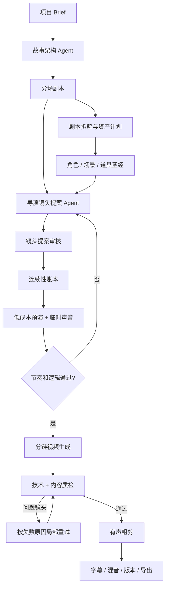

# 剧本到成片导演链路审计

> 首次审计：2026-08-04；当前工作分支校对：2026-09-08。
> 范围：当前短剧本、资产、自动分镜、Seedance 视频、连续生成与完整预览。
> 目标：记录已落地的质量规则、仍存在的导演能力缺口与后续工作流。本文不是生产发布或生成质量验收记录。

## 一句话结论

当前已将网剧自然分场、按顺序解析的动作/对白/声音和确定性导演规划分开。固定三场两镜、台词与动作分别均分、各镜重复整场剧情、无对白时补固定独白等问题已有针对性调整；完整预览也已有音轨保留。剩余核心缺口是语义层面的镜头选择、连续性验证、生产前预演与生成后的内容质检。

当前规则能够改善输入和分配方式，但不能保证：

- 每场戏有清晰的戏剧目的、冲突升级和转折；
- 导演为同一场戏设计建立镜头、主镜头、反应镜头、插入镜头和收束镜头；
- 相邻镜头遵守视线、运动方向、空间轴线、人物站位和物件状态；
- 在产生昂贵视频前，用低成本预演验证时长、节奏、对白和镜头顺序；
- 对白可听度、环境声连续性，以及逻辑、连续性和技术质量均通过自动质检。

后续应在已有规则规划和 Agent 阶段执行上增加可检查的导演提案、预演和质量门禁。默认路径应继续控制模型调用次数与等待时间，不能为了“多 Agent”而让每位用户承担重复规划的成本。

## 行业工作流

传统影视和较成熟的 AI 视频平台通常不会从剧本正文直接跳到视频任务，实际链路至少包含以下层次。

### 1. 故事与剧本

先确定项目 Brief、人物目标、冲突、场景转折、对白和集尾钩子。这个阶段回答“发生什么、为什么发生、观众应该感受到什么”，不负责把所有摄影参数塞进剧本正文。

### 2. 剧本拆解

以场景为单位识别人物、群众、场景陈设、道具、服装、化妆、车辆、特效、声音和音乐等制作元素。StudioBinder 的剧本拆解说明明确把这一步定义为前期制作层，并将其作为拍摄计划、预算和各部门准备工作的输入。

### 3. 导演镜头清单

导演或摄影指导根据场景中的 story beats 设计 coverage。镜头清单不是把动作句按分号拆开，而是为每个镜头明确：

- 镜头在本场戏里的叙事目的；
- 对应的场景和剧情拍点；
- 画面内容与动作起点/终点；
- 景别、机位、角度、运动和时长；
- 出场人物、对白范围和所需资产；
- 与上一镜、下一镜的剪辑关系。

StudioBinder 对 shot list 的定义也是“按顺序组成场景的镜头集合”，核心字段包括镜头、场景、动作、景别、角度、运动、镜头参数和演员，而不是简单切割剧本文字。

### 4. 故事板与预演

故事板把动作拆成有顺序的画面 panel，并携带摄影方向、对白和动作说明。其价值不是生成漂亮图片，而是在正式生产前发现空间、节奏和叙事问题。

成熟流程还会把故事板、占位音频和镜头时长组合成 animatic。即使不为每个镜头生成高质量分镜图，也需要用资产缩略图、场景锚点、构图草图或纯色占位块完成低成本预演。

### 5. 资产与视觉锚点

锁定角色身份、造型版本、核心场景布局、关键物品和视觉规则。对于一个场景，优先建立可复用的场景母版和多角度参考，而不是让每个镜头独立抽一张彼此不一致的图。

### 6. 视频生成、质检和后期

按连续链提交镜头，生成后检查比例、时长、黑帧、静帧、闪烁、人脸与资产一致性、动作完成度、对白/声音和相邻镜头连续性。只有通过的镜头进入粗剪；失败镜头按具体原因重试。粗剪之后还需要对白、环境声、音效、音乐、字幕、混音和交付编码。

## LibTV 类产品的差异

2026-05 的第三方 LibTV 实测文章展示了两种入口：手动画布工作流和 Agent 编排工作流。其公开演示体现了以下产品能力：

- 文本、图片、视频、音频和脚本节点可以组合成可复用工作流；
- 剧本会先转成包含时长、画面、人物和景别的分镜脚本；
- 分镜图可以批量生成、单张重抽、修改提示词；
- 多张图片可共同作为参考，支持局部重做和多角度；
- 分镜视频之后仍有剪辑、画面优化和音频环节；
- 创作者可以复用已验证的工作流，而不是每个项目从头拼提示词。

这篇文章是第三方体验记录，不是 LibTV 的内部技术文档，不能据此推断其模型和后端实现。但它足以说明用户感知上的关键差异：专业感来自可检查的中间产物、可复用导演工作流和逐环节返修，不只是更强的文生视频模型。

## 当前 SEQORA 实际链路

```text
用户想法/已有文本，或 AgentStudio 已确认的制作方案
  -> 现有文本生成及必要修复路径，不新增导演模型轮次
  -> 网剧自然分场正文，短片/广告保留兼容制作字段
  -> 资产建议与定稿
  -> 场次元数据 + 按发生顺序排列的动作/对白/声音
  -> 已有显式镜头规格优先，否则按时长和叙事单元做确定性规划
  -> 每镜分配自己的动作、对白、声音、景别、时长与衔接
  -> 编译人物表演、动作、声音、运镜和负面约束
  -> Seedance 单镜生成
  -> 尾帧承接或独立并发
  -> FFmpeg 保留音轨、补静音并按顺序拼接
```

关键源码：

- 剧本生成：`apps/api/src/modules/projects/service.ts`、`scriptWriting.ts`
- 自然正文事件解析：`apps/api/src/modules/projects/screenplayParsing.ts`
- 场次规划：`apps/api/src/modules/projects/directorShotPlanning.ts`
- 兼容字段解析与动作细拆：`apps/api/src/modules/projects/shotPlanning.ts`
- 视频提示词：`packages/prompting/src/videoPromptCompiler.ts`
- 前端批次编排：`apps/web/src/App.jsx`、`apps/web/src/features/storyboard/videoBatchPlanner.js`
- 分镜 UI：`apps/web/src/pages/StoryboardPage.jsx`
- 成片限制：`apps/api/src/core/film/`
- 一句成片入口与阶段执行：`apps/web/src/pages/FunctionStackPage.jsx`、`apps/api/src/modules/agent/`

### 本次质量规则调整

- 网剧单集预算随目标秒数变化，60 秒建议从 5 场起草、允许 3～8 场；各场按地点、时间或戏剧目标的变化组织，允许长短不同。改写已有结构化原稿仍默认保持场次数量、编号和顺序。
- 每场由目标、阻力、选择、代价和可见结果驱动；下一场从上一场的新后果开始。短片与快速剧本复用因果规则，广告要求每段承担新的传播任务，用可见使用结果推进。
- 白描动作、潜台词、停顿与听者反应优先；对白数量服从可表演时长，移除每镜四句的硬指标。重复发声和过密口播会产生检查提示，不再为无对白场景强加“不能在这里停下”等固定独白。
- 自然正文中的对白和声音跟随触发动作，按顺序分组并考虑动作长度及发声负载；长段落只在明确句子边界细分。每镜只携带自己的可执行内容，场尾变化仅进入末镜，不把整场动作和结尾复制给每镜。
- 短场次保留标注时长，长场次按单镜最长 15 秒规划，不再限制为最多三镜。只提供一个动作时不虚构第二段；长自然场景不会先被拆成重复完整对白的场景块。
- 未新增模型调用或外部生成费用；这些调整主要防止机械重复、台词错位和时长被错误压缩，不代表确定性算法已理解故事。

### 既有能力与文档更正

- AgentStudio 已有 `plan -> confirm -> stages` 工作流，包含预算估算、脚本、资产、人物基准、分镜、视频、合成与交付阶段，并提供暂停/恢复和失败重试。这里的阶段编排不等于调用语义导演模型；它是原分支已有实现，不是本次新建的一句成片能力。
- `FilmPreviewComposer` 已保留并统一源音轨为 48 kHz 双声道，按片段时长补齐/裁剪，无音轨片段用 `anullsrc` 补静音，再以 AAC 输出。旧文档所写的无声拼接有误，这是原分支已有实现。
- 创作端本次改为默认深色且可切浅色，独立管理员端未改。界面主题不会改变模型质量或任务阶段语义。

## 根因判断

| 问题                   | 当前实现                                   | 对成片的影响                                           | 优先级 |
| ---------------------- | ------------------------------------------ | ------------------------------------------------------ | ------ |
| 语义编剧质量未自动验收 | 已要求目标、阻力、选择与结果，但无语义评分 | 格式正确仍可能包含弱冲突、无根据的信息和重复剧情       | P0     |
| 旧字段缺少发生时机     | 自然正文保留顺序，旧字段对白仍缺动作定位   | 无法从未提供的时序中恢复每句对白真正所属的动作         | P1     |
| 规划仍是确定性规则     | 按时长、段落、明确句子与关键词分配镜头     | 无法可靠决定正反打、主镜头、反应镜头或有意省略         | P0     |
| 叙事目的未结构化验收   | 镜头任务写在提示词中，尚无独立审核数据模型 | 不能自动证明每镜必要或检测所有语义重复                 | P1     |
| 连续性数据不结构化     | 主要依赖上一段文本摘录和尾帧               | 站位、视线、运动方向、手持物、服装和轴线冲突无法检查   | P0     |
| 缺少预演               | 拆镜后直接进入图片或视频生成               | 节奏、时长、对白密度和镜头顺序的问题在花费积分后才暴露 | P0     |
| 缺少生成后内容质检     | 主要依赖用户肉眼查看和手动重试             | 人脸漂移、动作缺失、配角冻结、物品重复不能自动拦截     | P1     |
| 完整预览缺少声音编排   | 当前保留单镜音轨，无音轨镜头补静音         | 对白、环境声和镜头间过渡仍缺少统一混音与层次设计       | P1     |
| 每镜独立参考风险       | 分镜图可选，独立分镜图可能有不同空间布局   | 生成更多图片不一定更连贯，甚至会增加空间跳变           | P1     |

## 对用户问题的直接回答

### 是剧本的问题吗？

早期用固定字数、场次数和对白数追求信息密度，容易让模型重复描述。当前网剧已采用自然正文与自适应时长预算，重点转为人物目标、阻力、选择和结果；短片和广告也加入相应叙事或传播要求。生成结果是否成立仍需抽检，规则不能代替语义验收。

### 是提示词的问题吗？

部分是。整场剧情或未来结尾进入每个镜头会诱发重演，本次已收窄到每镜自己的动作和对白。共同资产和空间规则仍需复用，不能为文本“看起来不同”而破坏身份与连续性；负面提示词也不能凭空补出合理的故事。

### 是分镜逻辑的问题吗？

是重要原因之一。当前已从动作与对白分别均分改为保留事件顺序的规则规划，但仍没有语义导演模型。它快速且不产生额外模型费用，不能可靠理解哪些拍点需要反应镜头、关系镜头、插入镜头或省略；过长单句和缺少边界的原稿仍可能超出可表演时长。

### 是“剧本直接自动分镜”的路线有问题吗？

路线本身可以成立。当前已有场次解析和规则规划这一中间层；后续应在现有流程上增加可比较的导演提案及确认，而不是把确定性拆分宣传为完整语义导演。

### 还差哪个环节？

仍缺完整的语义导演提案、结构化连续性账本、低成本 animatic，以及内容与声音质量检验。基础有声拼接已经存在，下一步是检验内容是否正确、听得清且衔接自然。

## 目标工作流

以下是尚未完整落地的质量工作流设计，不应将图中的语义导演、逐阶段审核、预演或质检节点写成已交付。



### 阶段 A：把剧本恢复为剧本

剧本正文只负责：场景号、内外景、地点、时间、人物、动作、对白、场景目标、阻力、转折、结果和集尾钩子。视觉风格可以是项目级规则，不要在每个场景重复一整套光影和运镜字段。

### 阶段 B：生成导演分镜提案

后续可考虑独立后台任务 `director-shot-plan`；当前没有这一语义导演任务。它应读取分场剧本、资产圣经和项目风格，输出结构化镜头提案，不直接覆盖现有分镜。是否加入默认流程需先验证收益、时延与成本。界面先展示：

- 每场镜头数、总时长和预计积分；
- 每镜叙事目的、来源剧情拍点和画面内容；
- 景别、角度、运镜、对白范围和所需资产；
- 连续性风险与和旧分镜的差异。

用户点击确认后再写入正式 Shot。纯规则拆分保留为“快速拆分”降级方案。

### 阶段 C：连续性账本

每个镜头至少保存：

- `sceneId`、`sourceBeatIds`、`purpose`；
- 地点、时间、天气和主光方向；
- 出场人物、画面位置、朝向、视线和表情；
- 动作起点、动作终点、入镜/出镜方向；
- 服装版本、手持物和关键物件状态；
- 180 度轴线、上一镜遗留状态和下一镜交接状态；
- 对白范围、声音计划和转场意图。

尾帧承接继续使用，但它是连续性执行手段，不是连续性设计本身。

### 阶段 D：预演而不是强制逐镜生图

为满足傻瓜式和低成本目标，默认预演不要求每镜生成高质量图片。可按优先级使用：

1. 已确认人物/场景资产缩略图；
2. 每场一张场景母版或用户上传参考；
3. 简单构图卡和镜头文字；
4. 用户明确需要时，才批量生成逐镜分镜图。

预演必须带镜头时长、对白或临时旁白、环境声占位。用户确认节奏后才进入真实视频生成。

### 阶段 E：质检与有声粗剪

先实现确定性检查：文件可解码、比例、分辨率、时长、黑帧、静帧、音轨存在和响度。再增加模型质检：人物相似度、资产一致性、动作是否完成、配角是否冻结、物品是否重复或凭空出现、相邻镜头动作/方向是否冲突。

完整预览已保留并标准化单镜音轨；下一步应处理对白响度、环境声衔接和必要淡入淡出，使声音承担叙事而不只是保留原始轨道。

## 推荐实施顺序

### P0：先解决逻辑感

1. 在已有有序正文事件和镜头规划上补充可持久化的 Scene/Beat/ShotPlan 数据结构，支持审核和回溯。
2. 新增导演镜头提案后台任务和“提案 -> 对比 -> 确认”页面。
3. 为 Shot 增加最小连续性账本：人物站位、视线、动作起终点、运动方向、物件、服装、光线。
4. 增加无高质量生图依赖的 animatic，先验证时长、镜头顺序和对白。
5. 增加对白、环境声和镜头切点的基础混音，完善现有有声粗剪。

### P1：提高质量下限

1. 确定性视频质检和问题镜头自动标记。
2. 用户选择失败原因后只重试单镜，并把原因编译进下一次任务。
3. 场景母版、多角度锚点和资产版本锁定。
4. 导演 Agent 增加 coverage 模板：对话、动作、悬疑、广告、群像等。

### P2：形成平台壁垒

1. 将通过率高的导演计划保存为题材工作流模板。
2. 按模型、题材、镜头类型统计首轮通过率、重试原因和成本。
3. 自动选择直接视频、场景锚点或逐镜分镜图三种生产策略。
4. 增加配音、音乐、字幕、混音和正式交付编码。

## 当前不建议做

- 不要继续把更多字段塞进同一行剧本文本；
- 不要把负面提示词当作剧情和导演问题的主要修复手段；
- 不要默认每镜先生成独立图片；
- 不要先重做自由画布或复杂多轨剪辑器；
- 不要让 AI 分镜直接覆盖用户现有镜头，必须先生成提案和差异。

## 验收指标

新链路不能只以“接口成功”验收，至少观察：

- 每场是否有明确目标、阻力、转折和结果；
- 每个镜头是否有唯一叙事目的和来源剧情拍点；
- 连续镜头的站位、视线、方向、服装和物件冲突数；
- 预演阶段用户调整镜头数和时长的比例；
- 视频首轮通过率、单镜重试率和平均每分钟成本；
- 配角冻结、动作未完成、物品凭空出现和身份漂移的检出率；
- 完整预览音轨覆盖率必须为 100%；
- 用户从剧本确认到可观看粗剪的总耗时。

## 参考资料

本次实际读取以下原文，并将原则落实为上述规则；只借鉴公开创作方法，不据此宣称获得第三方平台的内部实现：

- [StudioBinder: How to Write a Scene](https://www.studiobinder.com/blog/how-to-write-a-scene/)，Rex Provost，2025-01-07：场景作为时空统一的叙事单元，冲突、节拍、人物变化、潜台词与留白。
- [StudioBinder: How to Make a Shot List](https://www.studiobinder.com/blog/how-to-make-a-shot-list/)，Rex Provost，2025-03-16：先读场景与 story beats，再为每镜明确动作、机位、景别、运动与 coverage；本次对应为事件来源和每镜执行范围。

以下保留首次审计时收录的补充资料，本次未重新验证第三方产品体验结论：

- [LibTV 实测：一键生成脚本分镜，集成 Seedance 等主流模型](https://zhuanlan.zhihu.com/p/2019489463273801042)，第三方产品体验，2026-05。
- [StudioBinder: How to Break Down a Script](https://www.studiobinder.com/blog/free-script-breakdown-sheet/)，场景级制作元素拆解。
- [StudioBinder: How to Storyboard a Video](https://www.studiobinder.com/blog/how-to-storyboard-a-video/)，故事板用于生产前规划、沟通和修订。
